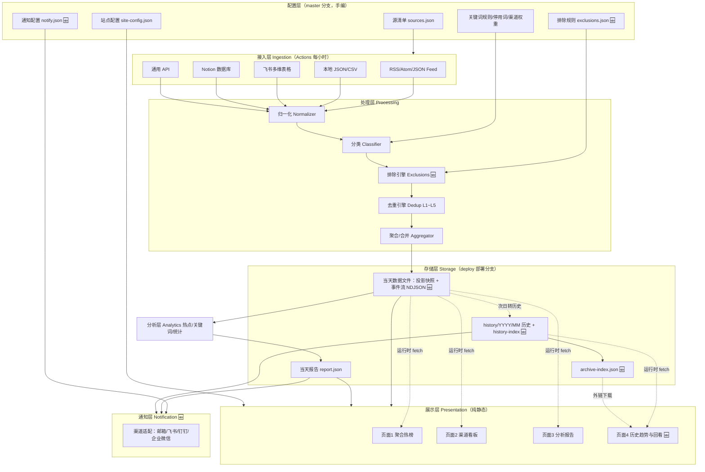
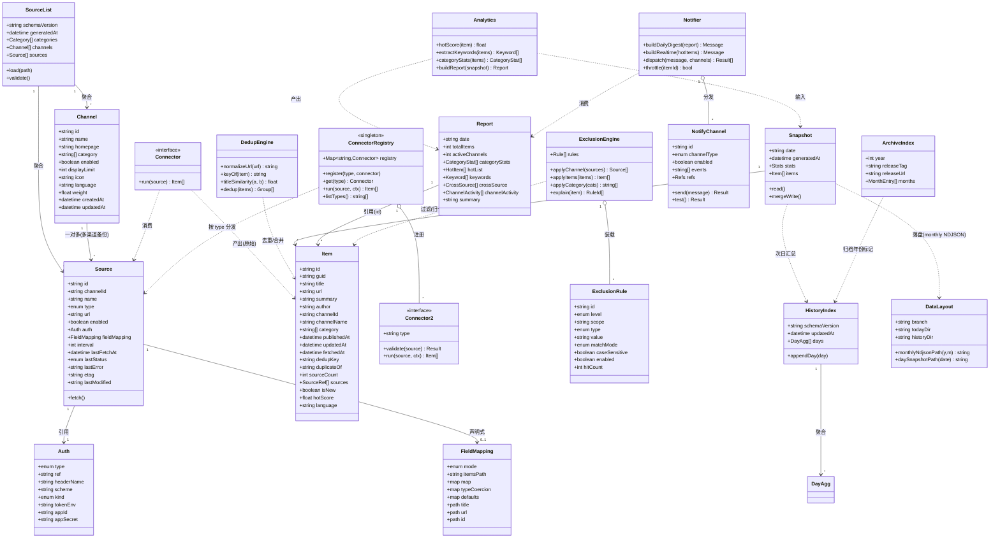
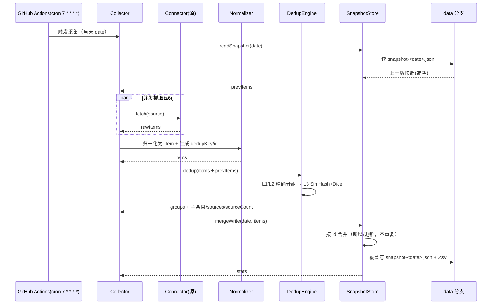
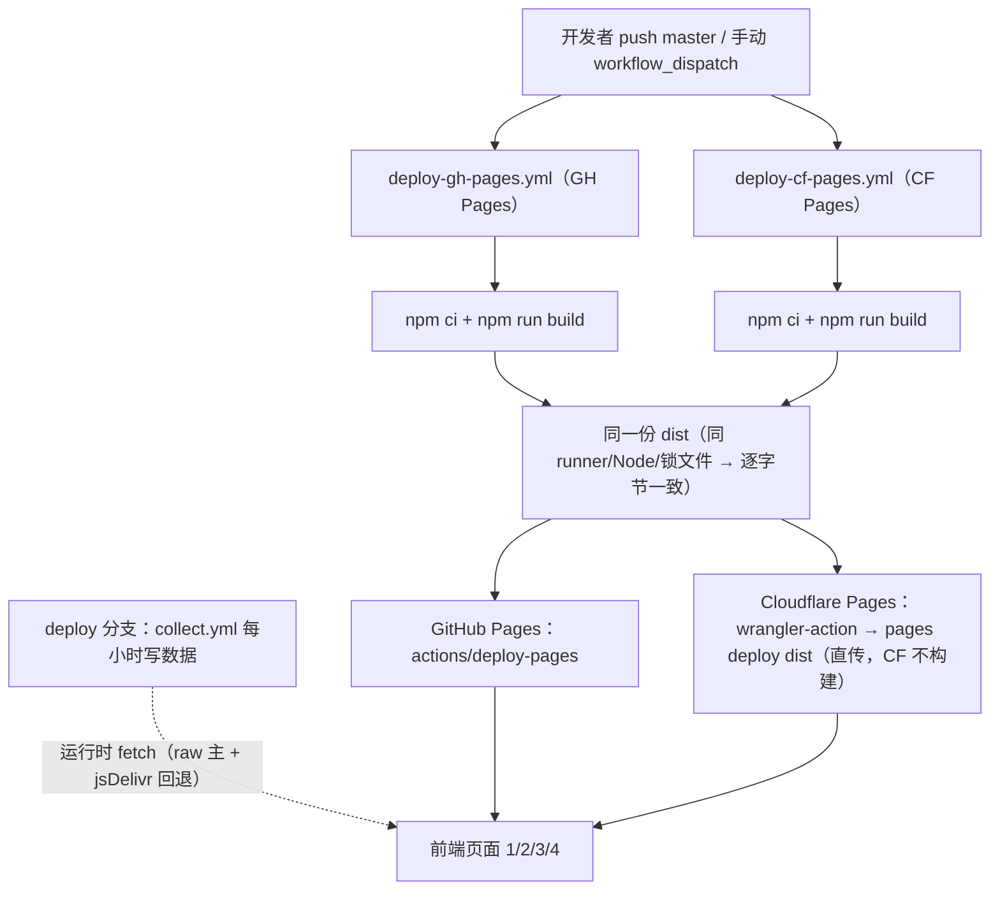
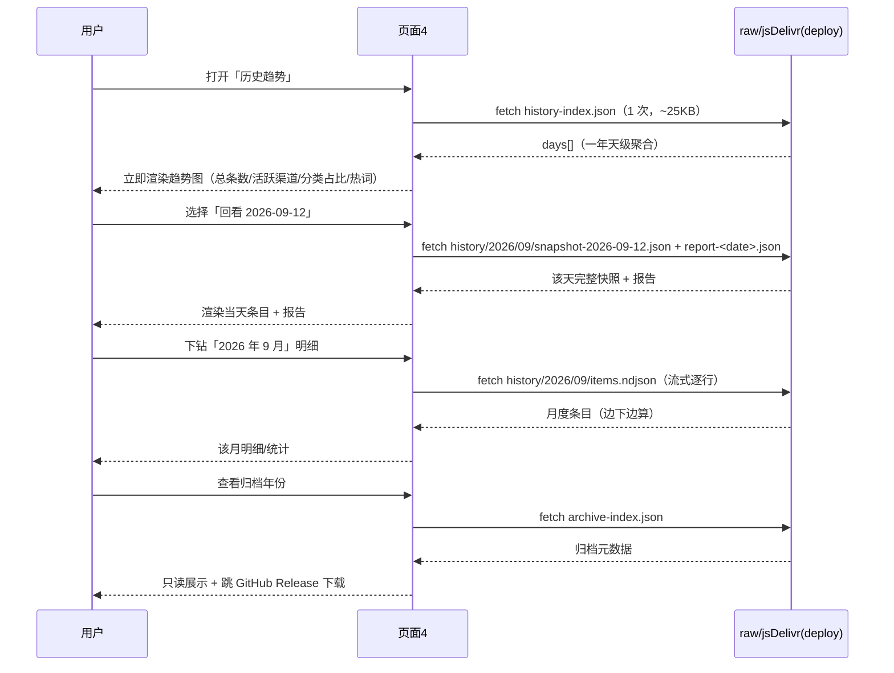

# RSS Radar 架构设计文档（ARCHITECTURE）

| 项目 | 内容 |
|---|---|
| 项目名称 | **RSS Radar**（`rss-radar`） |
| 文档性质 | 系统架构设计 + 技术方案（第二~十四章） |
| 上游输入 | `docs/PRD.md`（**v1.2**）、`docs/research/rss-ecosystem-research.md` |
| 数据格式 | 见 `docs/data-model/`（schema / examples / README）；NDJSON 答疑见 `docs/ndjson-faq.md` |
| 语言 | 简体中文 |
| 版本 | **v1.2**（增量版：**CF Pages 改由 GitHub Actions `wrangler` 直传部署**，部署双流程分离；配额经官方文档核实；v1.0 → v1.1 → v1.2 变更见 **§14 变更记录**） |

> 本文档**只做设计，不含可运行业务代码**；算法与流程用伪代码 / JSON Schema / Mermaid 表达。
> 术语严格沿用 PRD 第 2 章：**Source / Channel / Item / Feed / Snapshot / Report / 去重键 / 源清单 / 分类(Category)**；**v1.1 新增术语**：**主分支（master）/ 部署分支（deploy）/ 当天数据文件 / 历史数据 / 归档 / 通知渠道 / 排除规则**。
>
> **🆕 v1.1 涉改章节**：§2.1 / §2.2 / §2.4（选型与模型）、§5.5（报告时机）、§6（调度与落盘，**大改**）、§7（部署，**大改**）、§8（目录结构，**重写**）、§9（风险）、**新增 §10 可插拔连接器 / §11 排除引擎 / §12 通知模块 / §13 历史归档与页面4 数据契约**、§14 变更记录。
>
> **🆕 v1.2 涉改章节**：§6.1（workflow 拓扑，**部署双流程分离**）、§6.2（`[skip ci]` vs 部署，**CF 由直传替代控制台**）、§6.3（`500 次/月` 论述**替换**为 Direct Upload 真实配额）、**§7（部署方案，重写 §7.6 为 GH Actions 直传）**、§8（目录 `.github/workflows/`）、§9.5（G12 更新）、§14 变更记录。

---

## 2. 系统架构与实现方案

### 2.1 核心难点与实现思路

| 难点 | 描述 | 实现思路 |
|---|---|---|
| 异构多源归一 | 7 类来源（RSS/Atom/JSON Feed、本地 JSON/CSV、飞书、Notion、通用 API）字段各异 | 接入器（Connector）+ **连接器注册表**（§10）+ 统一归一化层（Normalizer），用 `fieldMapping` 声明式映射，见 §3 |
| 纯静态站的数据新鲜度 | 无后端，却要「无需重建即可看最新」 | 采集数据落**`deploy` 部署分支**（v1.1 改名），前端**运行时 fetch** raw CDN；构建产物内联兜底快照，见 §6.3 / §7 |
| 去重（尤其中文标题） | GUID/URL 之外还有「同文章多源转载」「标题近义」 | L1~L5 分级；URL 标准化 + sha256 去重键；中文用**字符二元组 Dice** + SimHash 分桶，见 §4 |
| 热点可解释 | 权重与归一化 PRD 未定 | 对数+最大值的稳健归一化 + 指数时间衰减 + 可复现权重表，见 §5 |
| 定时任务的现实约束 | cron 延迟、60 天不活跃禁用、CF Pages 构建次数上限 | workflow + 保活；数据更新走运行时 fetch 而非重建，见 §6 |
| 双端部署 base 冲突 | GH Pages 子路径 vs CF Pages 根路径 | 相对 base + HashRouter + 外部数据 URL，**同一产物双端可用**，见 §7 |
| **🆕 当天数据「追加」vs「去重」的语义冲突** | v1.0 的 `mergeWrite` 是「读-合并-写」，而老登要「追加」；二者语义打架 | **当天双写**：对外**投影快照**（覆盖写，给前端一次 `JSON.parse`）+ **当天事件流 NDJSON**（真·追加，last-write-wins 折叠去重），见 §6.7 |
| **🆕 历史归档后前端读不到** | GitHub Release 资产无稳定 raw/CORS 直读 URL | **分层**：一年内站内可查（`history-index.json` + 月度 NDJSON + 按天快照）；超一年站内只读元数据 + 跳 Release 下载，见 §13 |
| **🆕 可插拔源 + 排除** | 新增源免改代码；三级排除；正则来自配置有 ReDoS 风险 | 连接器注册表（§10）+ 排除规则引擎（§11，`re2` 免疫灾难性回溯） |
| **🆕 通知的「实时」现实边界** | Actions cron 最小 5 分钟且常延迟 5–30 分钟 | 明确为**准实时**（采集触发后 ≤35 分钟送达；源发布到采集的轮询等待最多另计 60 分钟），不承诺真实时；通知在 Actions 侧发送，见 §12 |

### 2.2 技术选型

| 层 | 选型 | 理由 |
|---|---|---|
| 构建 | **Vite 5** | 快、产物小、`base` 可配置（解决双端路径）；PRD 基线 |
| UI | **React 18 + MUI 5 + Tailwind CSS 3** | PRD 基线；MUI 提供表格/抽屉/主题，Tailwind 负责布局与响应式 |
| 路由 | **react-router-dom v6（HashRouter）** | HashRouter 免服务端 SPA fallback，GH Pages 刷新不 404，双端同一产物 |
| 图表 | **Recharts** | 轻量、React 原生、按需打包 |
| 词云 | **P1**（`d3-cloud` 或纯 CSS 布局） | 控制 MVP 复杂度 |
| 采集/分析脚本 | **Node.js 18+ ESM（`.mjs`）** | 与前端同仓库/同 CI，零额外运行时 |
| Feed 解析 | **`rss-parser`**（RSS/Atom）+ 手写 JSON Feed | 成熟、容错强；JSON Feed 结构简单 |
| HTML→文本 | **`sanitize-html` + `cheerio`** | 去标签、解码实体，summary 只留纯文本（合规） |
| CSV | **`papaparse`** | 流式、容错、表头映射 |
| 中文分词 | **`Intl.Segmenter`（Node 内建，默认）**；P1 可选 `nodejieba` | 零依赖、ICU 分词对 CJK 可用；精度要求高时再上 jieba |
| 相似度 | 自研：**字符二元组 Dice + SimHash64** | 无重依赖、跨中英、可控 |
| **正则（排除规则）** | **`re2`（Google RE2 绑定，v1.1 新增）** + `safe-regex` lint 兜底 | 用户配置的正则**必须防 ReDoS**；RE2 线性时间、免疫灾难性回溯，见 §11.4 |
| 校验 | **`ajv`**（跑 `docs/data-model/schema/*.schema.json`） | 采集后校验产物，失败即告警；NDJSON 走**行级 schema** |
| **通知（SMTP）** | **`nodemailer`（v1.1 新增）** | 成熟、支持 HTML/附件/STARTTLS，见 §12 |
| **通知（webhook 类）** | **Node 内建 `fetch` + `node:crypto`（HMAC 加签）** | 飞书/钉钉/企业微信群机器人零额外依赖，见 §12 |
| 部署 | **GitHub Actions**（GH Pages 默认禁用、仅手动）+ **Cloudflare Pages（v1.2：GitHub Actions `wrangler-action` 直传 / Direct Upload）** | 纯免费额度；**直传不消耗 CF 构建配额**、**双端同产物**，见 §7 |

### 2.3 架构模式与分层

采用 **「数据管线（批处理）+ 纯静态展示（读时渲染）」** 分层架构，无运行时后端：



**分层职责**：接入层只做「源格式 → Item 原始字段」；处理层做**归一化 → 分类 → 排除 → 去重 → 合并**（**v1.1 明确顺序**，见 §11.3）；存储层 JSON 主 + CSV 辅，**并新增「当天事件流 NDJSON」与「年/月历史目录」**；分析层只基于当天快照产出报告；展示层构建期内联兜底 + 运行时 fetch 刷新；**通知层在 Actions 侧消费报告/热点结果并投递到外部渠道（v1.1 新增）**。

### 2.4 领域模型（ER / classDiagram）



**关键关系**：`Channel 1 —— * Source`（一对多，支持一个渠道多渠道备份）；`Snapshot 1 —— * Item`；`Report` 通过 `id` 引用 `Item`（不复制全文）。

---

## 3. 多源接入方案（F-010 ~ F-018）

### 3.1 接入器总览

| 接入器 | 功能 | type 枚举 | 鉴权 | 分页/翻页 | 字段映射 | 限流注意 |
|---|---|---|---|---|---|---|
| FeedConnector | RSS 2.0 / Atom / JSON Feed | `rss` `atom` `json_feed` | 无（少数需 UA） | 单文档无分页 | 固定映射(§3.2) | 尊重 ETag/Last-Modified；加 UA |
| LocalJsonConnector | 仓库内 JSON | `local_json` | 无 | 无 | jsonpath | 无（本地文件） |
| LocalCsvConnector | 仓库内 CSV | `local_csv` | 无 | 无 | 表头映射 | 无 |
| FeishuConnector | 飞书多维表格 | `feishu_bitable` | `Bearer tenant_access_token` | **cursor(page_token)** | 列名映射 | 飞书 API QPS 限流 |
| NotionConnector | Notion 数据库 | `notion_db` | `Bearer token` + `Notion-Version` | **cursor(start_cursor)** | 属性名映射 | Notion ~3 req/s |
| GenericApiConnector | 通用 HTTP API | `api` | 头/查询串(env 引用) | none/page/offset/cursor/link_header | jsonpath | 每域限流、退避重试 |
| SourceListManager | 源清单管理 | — | — | — | — | 本地读写 + schema 校验 |

### 3.2 ~ 3.6 各接入器设计

**（1）FeedConnector（RSS / Atom / JSON Feed，F-010 / F-018）**
- 输入：`Source.url`；抓取带 `If-None-Match`/`If-Modified-Since`，命中 **304** 复用上次结果（增量）。
- 解析：RSS/Atom 用 `rss-parser`；JSON Feed 直接 `JSON.parse` 遍历 `items[]`。
- 映射：三格式 → Item 见 `data-model/README §3.1`。
- 重试：网络/5xx → 指数退避重试 2 次（1s/3s）；4xx 不重试记 `lastError`。

**（2）LocalJsonConnector（F-011）**：读仓库相对路径；`fieldMapping.itemsPath` 定位数组，`map` 用 JSONPath；缺文件→`empty`。

**（3）LocalCsvConnector（F-012）**：`papaparse` 读 UTF-8，首行表头；`map` 用列名。

**（4）FeishuConnector（F-013）**：`app_id/app_secret` 换 `tenant_access_token`（缓存至过期）；`GET .../records` 用 `page_token` 翻页至 `has_more=false` 或达 `maxPages`；单元格富文本/多值需解包。

**（5）NotionConnector（F-014）**：`POST /v1/databases/{id}/query`；`start_cursor`/`next_cursor` 翻页；属性按 `type` 解包（title/rich_text/date/select/multi_select）。

**（6）GenericApiConnector（F-015）**：见 `data-model/README §3.3、§3.6`；**顶层** `fieldMapping.<内部字段>=路径`（字符串取单层、数组取多层）+ `pagination.kind` 声明式配置；`auth.kind` 三态（none/bearer/api_key）。

### 3.6 归一化映射表（核心资产摘要）

> 完整对照表见 **`docs/data-model/README.md §3`**（RSS 2.0 / Atom / JSON Feed / 本地 JSON / CSV / 飞书 / Notion → Item）。

| 内部字段 | RSS 2.0 | Atom | JSON Feed | 飞书/Notion/CSV |
|---|---|---|---|---|
| `title` | `item.title` | `entry.title` | `items[].title` | 列名(map) |
| `url` | `item.link` | `link[rel=alternate]` | `items[].url` | 列名 |
| `guid` | `item.guid` | `entry.id` | `items[].id` | 列名 |
| `summary` | `item.description`/`content:encoded` | `entry.summary`/`content` | `summary`/`content_text` | 列名 |
| `author` | `item.author`/`dc:creator` | `entry.author.name` | `author.name` | 列名 |
| `publishedAt` | `pubDate`(RFC822→UTC) | `published` | `date_published` | 列名→date |
| `updatedAt` | `pubDate`(回退) | `updated` | `date_modified`(回退) | 列名→date |
| `tags` | `category[*]` | `category[*].term` | `tags[*]` | 列名→array |
| `language` | `channel.language` | `feed.lang` | `language` | 列名 |

### 3.7 调度、并发、超时、重试、限流（F-017）

```pseudocode
async function collectAll(channels, sources, cfg):
  enabled = sources.filter(s => s.enabled && channelEnabled(s.channelId))
  due     = enabled.filter(s => now - (s.lastFetchAt ?? 0) >= (s.interval ?? cfg.defaultInterval)*60s)
  results = await pool(due, cfg.concurrency=6, async (s) => {
      for attempt in 0..cfg.retries:
        try { return { ok: true, items: await connector[s.type].run(s) } }
        catch e { if (!retryable(e) || attempt == cfg.retries) return { ok:false, source:s.id, error: str(e) } }
        await sleep(backoff(attempt))         // 1s, 3s
      })
  return results
```

- **并发**：全局 6；同域额外串行，避免打爆单站。
- **超时**：单请求 `AbortController` 15s（`network.timeoutMs`）。
- **重试**：仅网络错误/5xx/429，最多 2 次指数退避；4xx 不重试。
- **不阻断**：`allSettled` 语义，单源失败只记 `lastStatus=error` + `lastError`，整体继续。
- **限流**：遵守 `Retry-After`；RSSHub 公共实例（约 200 req/IP/小时，**待核实**）默认**不内置**，自建才推荐。
- **统计落盘**：`stats.sourceTotal/sourceOk/sourceFailed`，并写 `data/stats/collect-*.json`。

### 3.8 源清单管理（F-001~F-006）

- 权威位置：`config/sources.json`（Q1：仓库 JSON 为主）。
- 校验：采集前用 `sources.schema.json` 校验，非法即 fail fast。
- 回写：脚本只更新 `sources[].lastFetchAt/lastStatus/lastError/etag/lastModified`，**不回写渠道展示字段**。
- 可视化/导出（P1/P2）：前端只读展示 + OPML/JSON 导出。

---

## 4. 去重算法设计（PRD §8）

### 4.1 URL 标准化规则（L1 的基础）

| 规则 | 说明 | 默认 |
|---|---|---|
| R1 去 fragment | 删除 `#...` | 开 |
| R2 去追踪参数 | 黑名单：`utm_*`、`from`、`ref`、`ref_src`、`spm`、`share_*`、`fbclid`、`gclid`、`igshid`、`mc_cid`、`mc_eid`、`_ga`、`yclid`、`weibo_id`、`share_token` | 开 |
| R3 大小写 | 协议、host 转小写；**path/query 保留大小写** | 开 |
| R4 去默认端口 | `:80`(http) / `:443`(https) | 开 |
| R5 去尾斜杠 | path 长度 > 1 时去结尾 `/` | 开 |
| R6 合并斜杠 | path 内 `//` → `/` | 开 |
| R7 query 排序 | 按 key 字典序重组 | 开 |
| R8 去空 query | 去掉结尾 `?` | 开 |
| R9 去 `index.*` | path 结尾 `index.html/.php/.htm` | 开 |
| R10 百分号编码规范 | 统一大写，解码非必要编码（保留 reserved） | 开 |
| R11 http→https | 归一（**默认关**，需同域 https 可达；按源开关） | 关 |
| R12 去 `www.` | （**默认关**，可能引发重定向差异） | 关 |

**R2 用黑名单而非白名单**：白名单会误删有语义参数（如 `id`、`p`、`v`）；黑名单更安全。

**标准化前后对照示例**：

| # | 标准化前 | 标准化后 |
|---|---|---|
| 1 | `https://Example.com/Post/123/?utm_source=rss&utm_medium=feed#comments` | `https://example.com/Post/123` |
| 2 | `http://www.example.com/a/b/index.html` | `http://www.example.com/a/b` |
| 3 | `https://site.com/x?b=2&a=1&ref=weibo` | `https://site.com/x?a=1&b=2` |
| 4 | `https://site.com//path///to/` | `https://site.com/path/to` |
| 5 | `https://site.com/p?id=9&utm_campaign=x&fbclid=abc` | `https://site.com/p?id=9` |

### 4.2 `dedupKey` 构成算法（L1 键 + 退化链）

```pseudocode
function keyOf(item, source):
  if isHttpUrl(item.url):   return sha256(normalizeUrl(item.url))              // 首选
  if isHttpUrl(item.guid):  return sha256(normalizeUrl(item.guid))             // guid 本身是 URL
  if isNonEmpty(item.guid): return sha256("guid:" + source.id + ":" + item.guid) // guid 仅源内唯一→加源前缀
  return sha256("title:" + normalizeTitle(item.title))                         // 退化为标题指纹
```

**为什么不用文章 `id` 做键**：源提供的 `id/guid` 只在**单个 feed 内**唯一，跨源时同一文章得到不同 id（各站自定格式），无法作为跨源 join 键。**URL 才是跨源的天然唯一标识**，故以标准化 URL 的 `sha256` 为主键。

### 4.3 L1~L5 分级策略

| 级别 | 判定 | 实现 |
|---|---|---|
| **L1 精确** | 同 `dedupKey`（标准化 URL / guid） | HashMap 按 key 分组，O(n) |
| **L2 标题完全一致** | `normalizeTitle` 后完全相同 | HashMap 按标题指纹分组 |
| **L3 标题相似** | 相似度 ≥ 阈值（默认 0.9） | SimHash 分桶候选 → Dice 精算 |
| **L4 跨源同文章** | 跨渠道且 L1/L2 命中 | L1/L2 组内来源数 > 1 即标记 |
| **L5 主题重合** | 关键词/主题相同 | **只做热点分析，不合并条目** |

> **L5 关键词 Jaccard 主题重合**：当前未实现；P2-A 以 L4 `sourceCount ≥ 2`（跨源数）体现主题语义。L5 推迟到 P3 阶段（页面 4 主题聚合时）再实现。

### 4.4 标题相似度算法选型（必须考虑中文）

| 算法 | 中文友好 | 依赖 | 复杂度 | 结论 |
|---|---|---|---|---|
| Levenshtein 编辑距离 | ❌ 差（中文无空格，整句近似当一"字"，轻微改写即距离爆炸） | 无 | O(n·m) | 不用 |
| 中文分词后余弦 | ✅ 好 | 需分词器 | O(n) | 备选 |
| Jaccard 词集合 | ⚠️ 依赖分词 | 需分词 | O(n) | 备选 |
| SimHash | ✅ 好（对字符 n-gram） | 无 | O(n) 哈希 | **用作预筛** |
| **字符二元组 Dice** | ✅ **最好**（无需分词，天然跨中英） | 无 | O(n) | **主算法** |

**推荐：字符二元组（bi-gram）Dice 系数为主 + SimHash64 预筛。**

**归一化预处理**（两者共用）：① 去 HTML/实体；② **NFKC 全/半角统一**；③ 大小写折叠；④ **繁→简**（OpenCC 可选）；⑤ 去标点/空白/emoji/控制字符；⑥ 压缩空白。

**Dice 系数**：
```
grams(s) = { s[i:i+2] }               # 字符二元组集合（长度 1 时用单字）
dice(a,b) = 2*|A∩B| / (|A|+|B|)       # A=grams(norm(a)), B=grams(norm(b))
```
中文「每两字≈一词」的语感下，二元组对「增删几字」的标题非常稳；英文同样适用（字符级），无需语言判定。

**阈值**：默认 **0.9**（PRD）；长标题下 Dice 偏严，建议可配、起步可试 0.85。

**性能（5000 条量级）**：
- 朴素两两比较 `C(5000,2) ≈ 12.5M` 次 → 代价过高。
- **分桶避免 O(n²)**（两阶段）：
  - **阶段1 预筛**：对每条算 **SimHash64**；按 **4 band × 16 bit LSH** 建表，只在**同 band 命中**的条目间生成候选对 → 近似 `O(n)`。
  - **守卫**：长度比 < 0.5 直接跳过。
  - **阶段2 精算**：仅候选对算 Dice，判定 ≥ 阈值。
- 预估：5000 条下候选对通常**数百~数千**，Dice 比较 < 10ms 级，整体秒级可接受。

```pseudocode
function dedup(items, threshold=0.9):
  buckets = groupBy(items, it => it.dedupKey)                 # L1
  buckets = mergeByKey(buckets, it => normTitle(it.title))    # L2
  rest = itemsNotInAnyGroup(buckets)
  lsh  = buildLSH(rest.map(computeSimHash64), bands=4)        # band -> [idx]
  for pair in candidatePairs(lsh, lenRatioGuard=0.5):
    if dice(normTitle(a), normTitle(b)) >= threshold: union(a,b)   # L3
  return groups
```

### 4.5 跨源同文章归并（PRD §8.2 细化）

```pseudocode
function pickMain(group, channelWeights):
  return group.sort(compare).at(0)

function compare(a, b):
  if a.updatedAt != b.updatedAt: return bNewerFirst        # 1) updatedAt 最新优先
  ca, cb = completeness(a), completeness(b)                # 2) 字段最完整
  if ca != cb: return cb - ca
  wa, wb = channelWeights[a.channelId], channelWeights[b.channelId]  # 3) 渠道权重高优先
  if wa != wb: return wb - wa
  return a.id.localeCompare(b.id)                          # 4) id 字典序→确定性

completeness(x) = countNonEmpty([x.summary, x.author, x.tags, x.guid])
```

**维护规则**：
- 主条目：`sourceCount = |group|`；`sources[]` = 组内**所有**来源 `{channelId, channelName, url, publishedAt}`；`category` = 并集去重。
- 非主条目：默认**不写入 `items[]`**（计入 `stats.mergedCount`）；仅 `keepDuplicates=true` 时保留并设 `duplicateOf=主条目.id`（审计）。
- 前端：主条目显示「+N 源」徽标，悬浮展开 `sources[]`；`sourceCount > 1` 是热点信号（§5）。

### 4.6 增量幂等：快照「读-合并-写」

```pseudocode
function runSnapshot(date, fetchedItems, cfg):
  prev      = readSnapshotIfExists(date)                 # 不存在则空快照
  prevIndex = indexBy(prev.items, it => it.id)           # id = "it_"+sha256(dedupKey)[0:12] 稳定
  merged    = new Map(prevIndex)

  for it in dedupAndMerge(fetchedItems):                 # §4.5 去重+归并
     old = merged.get(it.id)
     if old == null:                                     # 新条目
        it.isNew = true; merged.set(it.id, it)
     else:                                               # 已存在 → 更新（不重复）
        merged.set(it.id, { ...old,
          title: it.title, url: it.url, summary: it.summary, author: it.author,
          updatedAt:  max(old.updatedAt, it.updatedAt),   # 时间只前进
          publishedAt: old.publishedAt ?? it.publishedAt,
          fetchedAt: it.fetchedAt,
          sourceCount: max(old.sourceCount, it.sourceCount),
          sources: unionSources(old.sources, it.sources),
          isNew: old.isNew })                             # 首见判定保持

  snap = { schemaVersion, date, timezone:"Asia/Shanghai", generatedAt: now(),
           stats: computeStats(fetchedItems, merged), items: [...merged.values()] }
  writeJson(snap); writeCsv(snap)                         # 覆盖写 → 天然幂等
  return snap
```

**幂等保证**：`id = sha256(dedupKey)` 稳定 → 同文章永远同一 key；`merged` 以 id 去重 → 重复抓取只**更新**不**新增**；`isNew` 只在首次插入置 true。

### 4.7 跨天边界规则

- **归属判定**：`itemDay = toDateInTZ(publishedAt ?? updatedAt ?? fetchedAt, "Asia/Shanghai")`；仅 `itemDay == snapshot.date` 进入当天快照。
- **「昨天最后抓到、今天又抓到」**：`publishedAt` 仍属昨天 → **不计入今天**，也**不算今天新条目**。
- **宽容窗口 `gracePeriodHours`**（默认 0，可配 2h）：源时间不准/时区误判导致刚过午夜漏抓时，允许 `publishedAt >= 今日00:00 - grace` 的条目纳入今日，标 `isNew=true`；默认关闭保持规则最简。
- **切日时区**：固定 **`Asia/Shanghai`（UTC+8）**。

### 4.8 采集 → 去重 → 快照 时序图



---

## 5. 热点分析算法设计（PRD §10）

> **categoryStats 多分类计次语义**：`categoryStats[].itemCount = Σ|item.category|`（多分类计次，**不去重**——一条 item 同时属 tech+ai 计 2 次）。这条规则让 `Σ categoryStats.itemCount ≥ totalItems`，但保持每分类独立统计；与 L4 跨源数 `sourceCount` 不同维度互补。

### 5.1 公式与归一化

**归一化选型**：对**重尾**分量（`sourceCount`、`freq`、`kwHits`）用 **log 后最大值归一化**到 `[0,1]`；`decay` 与 `channelWeight` 本身已在 `[0,1]`。

- **不用 z-score**：`sourceCount` 分布高度偏斜（多数=1，少数很高），z-score 假设近似正态、会被极端值带偏且可能为负。
- **用 log + max**：`ln(1+x)/ln(1+x_max)` 压缩长尾、稳定落 `[0,1]`。
- **log 底数**：自然对数（比值归一化中底数会约掉）。

```
Z_source  = ln(1 + sourceCount) / ln(1 + maxSourceCount)   # 跨源重合度
Z_freq    = ln(1 + freq)        / ln(1 + maxFreq)          # 出现频次（同主题条目数）
decay     = 0.5 ^ (ageHours / halfLifeHours)               # 时间衰减 ∈(0,1]
Z_channel = channelWeight                                   # 渠道权重 ∈[0,1]
Z_kw      = kwHits / maxKwHits                              # 关键词热度 ∈[0,1]

hotScore  = w1*Z_source + w2*Z_freq + w3*decay + w4*Z_channel + w5*Z_kw
```

### 5.2 权重初始值建议表

| 分量 | 符号 | 初始权重 | 说明 |
|---|---|---|---|
| 跨源重合度 | `w1` | **0.40** | 最强热点信号（PRD"高"） |
| 时间衰减 | `w3` | **0.25** | 越新越热（PRD"中"，新闻场景上调） |
| 出现频次 | `w2` | **0.20** | 关键词/主题频次（PRD"高"，与重合度重叠略降） |
| 渠道权重 | `w4` | **0.10** | 权威渠道加权（PRD"中"） |
| 关键词热度 | `w5` | **0.05** | PRD"低" |

- 权重之和 = 1.0 → `hotScore ∈ [0,1]`。
- **调参**：写入 `site-config.json → analysis.weights`；报告回写 `report.weights` 以**复现**；建议离线用历史快照做小网格搜索（粗调）+ 人工 A/B（细调）。改权重只影响报告。

### 5.3 时间衰减函数

- **形式**：**指数衰减**，`decay = 0.5^(ageHours / halfLifeHours)`。
- **半衰期**：默认 **6 小时**（`analysis.halfLifeHours`）。
- **为什么指数而非线性**：信息价值随时间**非线性**下降（新闻 6 小时后关注度骤降），指数更贴近真实；线性会让上午的旧闻在晚上仍占高权重。
- `ageHours = (now - publishedAt)/1h`；用 `updatedAt` 亦可，建议取 `max(publishedAt, updatedAt)` 反映最新动态。

### 5.4 关键词提取方案

- **中文分词**：默认 **`Intl.Segmenter('zh', {granularity:'word'})`**（Node 18 内建、零依赖、ICU 支持 CJK 分词，够用）；P1 若精度不足可换 **`nodejieba`**（原生依赖、精度更高）。英文按空格+标点切分。
- **停用词**：维护 `config/stopwords-zh.txt` + `config/stopwords-en.txt`；过滤规则：中文词长 **≥2**（单字多为噪声）、去除纯数字/纯标点/URL/邮箱。
- **词频统计**：合并中英，`Map<word,count>` 累加（同一篇内可选去重计 1）；取 **Top N（默认 50）**；词云权重 `weight = count / maxCount`。
- **与热点联动**：`kwHits` = 条目命中**当天热词表**的次数，作为 `Z_kw` 输入；热词表可由「当天 TopK 词」动态生成。

### 5.5 报告生成时机（推荐）

**推荐：Actions 期生成**（采集完即算并落盘 `report-YYYY-MM-DD.json`），构建期**只读预渲染**。

理由：
1. 报告是快照的纯派生 → 与快照**同一事务**生成，天然一致（PRD F-060「报告与快照一致」）。
2. 前端**零算力**（移动端不吃力），首屏/SEO 好。
3. 避免「数据更新 → 重建」循环 → 产物（`dist`）稳定、部署零噪音（v1.2 下 CF 已改直传、不计构建配额，但「数据/部署解耦」仍是正确设计，见 §6.3）。
4. 与「每小时采集 + 报告只做当天」协同：每轮采集结束即产出**当天最新**报告并覆盖落盘；前端运行时 fetch 拿到的就是最新报告，无需重建。

**降级**：若首次构建早于首次采集（无 report），前端用 snapshot 做**同公式轻量兜底计算**（JS 版 `hotScore`），保证页面不空。

> **【v1.1 增补】报告生成时机与通知/历史的协同**：
> - 报告仍**在 Actions 期生成**，落盘路径由 v1.0 的 `reports/report-<date>.json` 调整为 **`deploy` 部署分支上的 `today/report-<date>.json`**（当天），次日移入 `history/YYYY/MM/`（见 §6.7/§6.8）。
> - **每轮采集结束**即刷新当天报告 → **实时通知的触发判定**（§12.3）与**每日日报的推送内容**（§12.2）都直接消费这份报告，无需二次计算。
> - 报告仍是**快照的纯派生**，与快照同事务生成，保证 F-060「报告与快照一致」。

### 5.6 「只做当天」的判定边界

- **切日时区**：固定 **`Asia/Shanghai`（UTC+8）**。
- `date = 当天`；`windowStart = 当天 00:00 Asia/Shanghai 的 UTC 表示`；`windowEnd = generatedAt`。
- 跨自然日后，前一日数据**不参与**当日报告（`items` 仅当日归属）；历史报告文件保留但不进当日计算（PRD Q8/MVP 不做历史趋势）。

---

## 6. GitHub Actions 调度与数据落盘方案

### 6.1 Workflow 拓扑（v1.2：6 个 workflow，部署双流程分离）

> **v1.2 变更**：老登明确 **① CF Pages 改由 GitHub Actions `wrangler` 直传（Direct Upload）部署**、**② CF Pages 部署与 GitHub Pages 部署的流程配置分开**。故把 v1.1 的单个 `deploy.yml` **拆为两个独立 workflow**——`deploy-gh-pages.yml` 与 `deploy-cf-pages.yml`；workflow 总数 4 → 6。

| Workflow | 触发 | 职责 | 默认启用 | 关键点 |
|---|---|---|---|---|
| `collect.yml` | `schedule: '7 * * * *'` + `workflow_dispatch` | 采集 → 归一化 → 分类 → **排除** → 去重 → **追加事件流 + 投影快照 + 报告** → 推 `deploy` 分支 → **实时通知判定** | ✅ 自动 | **避开整点**（7 分）降低延迟；提交带 `[skip ci]`；**当天 amend、跨天新建提交** |
| `notify.yml` | `schedule`（每日 08:00 Asia/Shanghai）+ `workflow_dispatch` | **每日报告推送**（读 `deploy` 分支昨日报告 → 分发通知渠道） | ✅ 自动（启用通知时） | 见 §12.3 |
| `archive.yml` 🆕 | `schedule`（每年 1 月 1 日）+ `workflow_dispatch` | **把上一年的历史打包进 GitHub Release**，写 `archive-index.json`，再从 `deploy` 移出旧年数据 | ✅ 自动 | 归档**先成功后删除**（可回滚）；见 §6.9 |
| **`deploy-gh-pages.yml`**（v1.1 的 `deploy.yml` 改名） | **`push`(master, 代码 paths)【默认注释】+ `workflow_dispatch`** | 构建 Vite → **GitHub Pages**（`actions/deploy-pages`） | ⚠️ **默认仅手动** | **不由数据提交触发**；触发段默认注释，见 §7.5 |
| **`deploy-cf-pages.yml`** 🆕 | **`push`(master, 代码 paths)【默认注释】+ `workflow_dispatch`** | 构建 Vite → **`cloudflare/wrangler-action@v3` 执行 `pages deploy dist` 直传 Cloudflare Pages（Direct Upload）** | ⚠️ **默认仅手动**（见 §7.6.5） | **直传 ≠ 构建 → 不消耗 CF 500 builds/月**；见 §7.6 |
| `keepalive.yml` | `schedule`（每周一次） | 推一个 trivial 提交保活 | ✅ 自动 | 防 60 天不活跃禁用（§6.5） |

> **与老登 5 项清单的对应**：老登列的「**采集 / 日报通知 / GH Pages 部署 / CF Pages 部署 / 保活**」= 上表 `collect / notify / deploy-gh-pages / deploy-cf-pages / keepalive`。**`archive.yml` 为额外的年度归档流程**（F-088 所需，v1.1 已引入）。

> **v1.2 说明**：Cloudflare Pages **恢复由 GitHub Actions 直传部署**（`cloudflare/wrangler-action@v3`），**取代 v1.1 的「CF 控制台 Git 集成」**。**两个部署 workflow 完全独立**（满足老登"流程配置分开"的要求），互不依赖、可各自单独触发。详见 §7.6。

数据流向：`collect` 写 **`deploy` 分支**（当天事件流 + 投影快照 + 报告）；`deploy-gh-pages.yml` / `deploy-cf-pages.yml` 各自读 `master` 代码 + 构建期内联**最近一次**数据作兜底，各产出**同一份 `dist`** 后分别发布到 GH Pages / CF Pages。前端运行时从 raw/CDN 拉 `deploy` 分支最新文件。

### 6.1.1 触发段「先注释掉不启用」的合法写法（关键）

> 老登要求：**GitHub Pages 部署流程先注释掉不启用，只保留手动执行能力**。**v1.2 延伸**：**两个部署 workflow（`deploy-gh-pages.yml` / `deploy-cf-pages.yml`）都采用同一写法**——默认只留 `workflow_dispatch`，自动触发的 `push:` 段整块注释。

⚠️ **YAML 陷阱**：若把 `on:` 写空、或写成非法结构，**整个 workflow 文件会解析失败、在 Actions 页报错**。所以**绝不能**留下空的/注释掉的 `on:`。正确做法是——**保留一个合法的 `on: workflow_dispatch`，把自动触发的 `push:` 段落整块注释**：

```yaml
# deploy-gh-pages.yml（GitHub Pages 部署工作流；deploy-cf-pages.yml 触发段写法相同）
name: deploy-gh-pages
on:
  # ⛔ 自动触发默认禁用（老登要求：先注释掉不启用，只留手动）。
  #    需要启用时，取消下面 4 行注释即可（同时记得删掉 job 上的 if 守卫）。
  # push:
  #   branches: [master]
  #   paths:
  #     - 'src/**'
  #     - 'config/**'
  #     - 'package.json'
  #     - 'index.html'
  workflow_dispatch:        # ✅ 始终保持合法，保证「手动可触发」且文件不报错
    inputs:
      target:
        description: '部署目标'
        type: choice
        options: [gh-pages]
        default: gh-pages
jobs:
  build-and-deploy:
    if: github.event_name == 'workflow_dispatch'   # 🛡 双保险：非手动不跑
    runs-on: ubuntu-latest
    permissions: { contents: read, pages: write, id-token: write }
    steps:
      # ... build + actions/deploy-pages ...
```

**做法取舍对照表**：

| 做法 | 是否合法 | 默认是否自动部署 | 手动可用 | 取舍 |
|---|---|---|---|---|
| **A（推荐）`on:` 只写 `workflow_dispatch`** | ✅ | ❌ 否 | ✅ | 最简，语义清晰 |
| **B（推荐·上文采用）注释掉 `push:` + 保留 `workflow_dispatch`** | ✅ | ❌ 否 | ✅ | 「取消注释即启用」，自文档化最好 |
| C 把文件改名为 `deploy.yml.disabled` | ✅（Actions 忽略非 `*.yml/.yaml`） | ❌ 否 | ❌ 无法手动触发 | 连手动能力也没了，**不符老登要求** |
| D 把整个文件用 `#` 全注释 | ❌ **可能报错**（无 `on:` 的 workflow 非法） | — | ❌ | **禁止** |
| E `on:` 留空 / `on: []` | ❌ **报错** | — | ❌ | **禁止** |

> **结论**：采用 **方案 B**（注释 `push` + 保留合法 `workflow_dispatch` + job 级 `if` 守卫）。既满足「默认不启用」，又保留「手动执行」，还**不让 Actions 报错**；启用时取消注释即可。

### 6.2 关键冲突解决：`[skip ci]` vs Pages 部署

**冲突**：数据提交带 `[skip ci]` 防循环 → 部署不被触发、页面数据永远旧；不带 → 死循环。

**解法（推荐）**：**数据与站点解耦 + 运行时 fetch**，冲突自然消解：
1. 采集提交到**独立 `deploy` 分支**（v1.1 改名，见 §6.4），提交信息含 `[skip ci]`。
2. `deploy-gh-pages.yml` / `deploy-cf-pages.yml` **都只监听 `master` 分支的 push**（`paths` 过滤 `src/**`、`config/**`、`package.json`、`index.html` 等，**排除数据路径**）+ 手动触发；**两处自动触发段默认注释**（§6.1.1）。
3. 因此**数据提交根本不触发部署**，无循环；页面新鲜度由**运行时 fetch** 保证（§6.3），而非重建。
4. **CF Pages（v1.2）由 `deploy-cf-pages.yml` 直传（Direct Upload）**：数据提交在 `deploy` 分支、**不触发该 workflow**（它只监听 `master` 代码路径）→ 数据更新同样**不触发 CF 部署**；且直传**不消耗 CF 500 builds/月**（§7.6）。

**其它方案取舍对比**：

| 方案 | 机制 | 取舍 |
|---|---|---|
| **workflow_run** | `deploy` 由 `collect` 完成事件触发（绕过 `[skip ci]`） | 可行，但每小时触发一次部署 → **Actions 免费（公开仓库）尚可，但毫无必要**（数据走运行时 fetch 即可），且徒增部署噪音 |
| **paths filter** | push 时按路径过滤 | 与 `[skip ci]` 冲突（跳过则完全不触发） |
| **chatops** | 评论 `/deploy` 手动触发 | 灵活但需人工，不适合自动新鲜度 |
| **repository_dispatch** | collect 调 API 派发部署事件 | 可行、显式，但同样存在**构建次数**问题；需 token 权限 |
| **采用方案** | 数据独立分支 + 运行时 fetch + 仅代码变更部署 | **构建次数可控、无循环、新鲜度最优** |

### 6.3 静态站在「不重新构建」下读最新数据（关键决策）

PRD F-073 要求运行时刷新。**v1.2 校准**：CF Pages 改由 **Direct Upload 直传**后，**"500 次/月构建限额"不再是约束**（直传不发生构建，见 §7.6）。但**运行时 fetch 仍是正确设计**——它把**数据更新**与**站点部署**彻底解耦：数据每小时变一次，前端的**构建产物（`dist`）却无需为此重新部署**，产物稳定、部署零噪音。若每次数据更新都重建部署（24 次/天），则 Actions 分钟白白浪费、产物反复刷、无任何收益。故**继续走运行时 fetch**。

| 方案 | 机制 | 构建次数 | 新鲜度 | CORS | 缓存 | 结论 |
|---|---|---|---|---|---|---|
| A 同分支内联 | 构建期打进产物 | 需重建 | ≤30 分钟滞后 | — | — | **兜底/SEO 用** |
| **B raw.githubusercontent.com** | 前端 fetch 原始文件 | **0** | 好（CDN `max-age=300`） | ✅ `ACAO:*` | 短 | **推荐主方案** |
| C jsDelivr / Statically | CDN 加速仓库文件 | 0 | 一般（**分支引用缓存可达数小时**，须用 commit/tag） | ✅ | 长 | **回退方案** |
| D 数据分支 + 每次重建 | workflow_run 触发重建 | 24/天（≈720/月） | 好 | — | — | ❌ **无收益**（产物反复刷、Actions 分钟浪费；v1.2 下 CF 直传虽不计构建配额，但仍无必要） |

#### 6.3.1 「拿到最新数据」的完整链路与延迟上界（实证）

老登最关心「每小时更新」的体感。我们把**端到端链路**拆开，给出**每一跳的延迟上界**：

```
① 源站发布新文章
   ↓  （轮询间隔，最多 60 分钟）
② collect.yml 触发（cron 第 7 分）      ← Actions 调度延迟：整点前后 5–30 分钟（偶发 60+）
   ↓  （抓取+处理+提交+push ≤ 1 分钟）
③ deploy 分支被 amend + force-push（当日内）
   ↓  （raw CDN 边缘缓存 TTL）
④ raw.githubusercontent.com 边缘缓存     ← Cache-Control: max-age=300（≈5 分钟）
   ↓
⑤ 浏览器 fetch（可带 ?t= 绕浏览器缓存）  ← 浏览器缓存：用 cache:'no-store' 可绕
   ↓
⑥ 页面渲染出最新数据
```

| 跳 | 延迟上界 | 说明 |
|---|---|---|
| ①→② 采集触发 | **5–90 分钟**（轮询等待最多 60 分钟 + GitHub 调度延迟 5–30 分钟，整点高峰更久，偶发 120+） | GitHub 官方明说 schedule 高峰可能延迟、甚至丢弃 |
| ②→③ 处理+push | ≤ 1 分钟 | 我们的脚本 |
| ③→④ raw CDN 刷新 | **≤ 5 分钟**（`max-age=300`） | **不可用 query 参数绕过**（见下） |
| ④→⑤ 浏览器 | ~0（`no-store`） | 浏览器缓存可绕 |
| **合计（最坏）** | **≈ 96 分钟（偶发 120+）** | 典型 **≈ 50 分钟** |

> **结论**：端到端「最坏 ≈ 96 分钟（偶发 120+），典型 ≈ 50 分钟」。（PRD §11.7 已按此口径把「实时」定义为**准实时**。）

#### 6.3.2 force-push 之后，旧 commit 的 raw URL 会怎样？（必须澄清）

| 问题 | 答案 |
|---|---|
| 用**分支名** URL（`.../deploy/today/snapshot-2026-09-12.json`） | **始终解析到分支当前末端**；force-push 后，raw 边缘缓存**≤5 分钟**内刷新到新内容 |
| 用**commit SHA** URL（`.../<sha>/...`） | **永久指向那个 commit 的内容**（immutable）；force-push 后旧 SHA 的内容**不变**（旧数据仍可访问） |
| force-push 会不会让 raw 报 404？ | 会短暂出现「旧 SHA 的 URL 404」（对象已被 GC），但**分支名 URL 不受影响**；我们的前端**只用分支名 URL**，规避此问题 |
| 会不会把没更新的旧数据一直读下去？ | 不会超过 **5 分钟**（raw 的 `max-age=300`） |

#### 6.3.3 到底要不要缓存破除参数 `?t=timestamp`？（结论：对 raw 不靠谱）

**实测事实**：`raw.githubusercontent.com` 的 `Cache-Control: max-age=300` 是**边缘缓存**，且**加 `?t=` 查询参数无法绕过它**（社区实测：`--no-cache`、随机 query 都无效；只有 `?token=` 这种登录态令牌才有效，匿名的用不了）。

| 缓存层 | `?t=` 能否绕过 | 对策 |
|---|---|---|
| **浏览器本地缓存** | ✅ **能**（不同 URL = 不同缓存键） | `fetch(url, {cache:'no-store'})` 或 `?t=` 即可 |
| **raw CDN 边缘缓存** | ❌ **不能** | 只能**接受 ≤5 分钟 TTL**；或用 jsDelivr（用 **commit SHA / tag**） |
| **jsDelivr 分支引用缓存** | ❌（分支引用缓存可达数小时） | **改用 commit SHA / tag**（版本化 URL，永久正确） |

**我们的策略**：

- **主**：运行时 fetch **`raw.githubusercontent.com/<owner>/<repo>/deploy/today/latest.json`**（**小指针文件**，含 `{date, generatedAt, snapshotPath, reportPath, eventPath, commit}`）+ 其指向的当天投影快照与报告。**接受 raw ≤5 分钟 TTL**。
  - 📌 **`<owner>` / `<repo>` 可配置**：默认指向本仓库（`<owner>`= 当前账号、`<repo>`=`rss-radar`，`deploy` 分支）。其中 `<owner>` / `<repo>` 可用**构建期**环境变量 `VITE_DATA_OWNER` / `VITE_DATA_REPO` 覆盖（`src/vite-env.d.ts` 已声明，`src/config/site.ts` 读取，前端零改动）。
    - **当前生产形态（2026-09-15 起）**：代码仓库已转为 **public** → raw 匿名可读，**保持默认值即可，不需要任何环境变量**。
    - **备用保险**：独立公开数据仓库 `Shonee/rss-radar-data`（`deploy` 分支）由 `mirror-data.yml` 镜像搬运，**仅在主仓库改回 private 时才启用**。启用顺序：① 建好公开数据仓库 → ② 配 `DATA_REPO_TOKEN` → ③ 手动跑一次 `mirror-data` 确认推送成功 → ④ **最后**才设 `VITE_DATA_OWNER` / `VITE_DATA_REPO`。**顺序反了会把站点打回内联 fixture。** 详见 `DEPLOYMENT.md` §3.1.5。
- **前端绕浏览器缓存**：`fetch(url, { cache: 'no-store' })` 或加 `?t=Date.now()`（**只对浏览器层有效**）。
- **回退**：raw 失败 → 尝试 **jsDelivr**（**用 commit SHA 或 tag**，规避分支缓存）；再失败 → 用**构建期内联**的最近快照（展示「数据可能非最新」横幅）。
- **降级提示**：`now - latest.generatedAt > 120 分钟` → 顶部黄条「数据更新延迟」。**阈值语义 = 两个采集周期未更新**：采集为每小时一次（cron `7 * * * *`），正常运行时数据年龄本就会走到 60~90 分钟（轮询等待 ≤60 分钟 + Actions 调度延迟 5~30 分钟），故取 2 × 60 = 120 分钟；原值 60 分钟在每小时采集下会**持续误报**黄条。
- **不做**：**不用 `?t=` 去对抗 raw 边缘缓存**（做不到，且会给人"已绕开"的错觉）。

**前端 fetch 逻辑（伪代码，v1.1）**：
```pseudocode
async function loadLatest():
  get = (u) => fetch(u, { cache: 'no-store' })         # 绕浏览器缓存（非 CDN 边缘）
  try {
    ptr = await get(BASE + "/today/latest.json").json()  # 定位当天文件（≤5min TTL）
    snap = await get(BASE + ptr.snapshotPath).json()      # 投影快照（一次 JSON.parse）
    rep  = await get(BASE + ptr.reportPath).json()
    return { snap, rep, fresh: Date.now() - parse(ptr.generatedAt) < 60*60*1000 }
  } catch {
    try { return await loadViaJsDelivr(ptr.commit) }      # 回退：按 commit SHA 拉
    catch { return { ...BUILTIN_FALLBACK, stale: true } } # 兜底：构建期内联
  }
```

### 6.4 分支策略：master（代码/配置） + deploy（数据）（F-034 / F-080 / F-081）

> **v1.1 变更**：原 v1.0 的「`data` 分支」命名**作废**，统一改称 **`deploy` 部署分支**（沿用老登叫法）。

| 分支 | 内容 | 是否含代码 | 谁写 | 说明 |
|---|---|---|---|---|
| **`master`** | `src/`、`scripts/`、`config/`（sources/site-config/exclusions/notify）、`.github/`、`docs/`、`package.json` 等 | ✅ 全部代码与配置 | 人（PR）+ 少量脚本 | **不含任何数据文件** |
| **`deploy`**（部署分支，orphan，无代码） | `today/`（当天数据）+ `history/YYYY/MM/`（历史）+ `history-index.json` + `archive-index.json` + `stats/` | ❌ 无代码、无构建 | Actions `collect.yml` / `archive.yml` | 专供**页面运行时读取** |

> 📌 **v1.2 数据可达性方案补注**：私有代码仓库的 `deploy` 分支**保留为私有备份与 `archive` / `notify` 工作分支**；其数据经 `mirror-data.yml`（`workflow_run` 触发，`--force` 推送）同步到**独立公开数据仓库 `Shonee/rss-radar-data`** 的同名 `deploy` 分支。页面运行时实际读取的是公开数据仓库（由 `VITE_DATA_OWNER` / `VITE_DATA_REPO` 指向，见 §6.3.3），因此私有仓库是否公开**不影响**前端取数。细节见 `DEPLOYMENT.md` §3.1.5。

**deploy 分支的提交策略（承 `format-decision.md §5.3` 策略 B）**：

| 策略 | 当日内 commit | 跨天 provenance | 仓库膨胀 | 结论 |
|---|---|---|---|---|
| A 纯 force-push（v1.0 原设计） | 1（可变形） | ❌ 无 | 最低 | 简单，但丢 provenance |
| **B amend + 每日提交（v1.1 采用）** | **1（amend，可变）** | ✅ 有（1 commit/天） | 低（≈1 commit/天） | **兼顾低噪音与可追溯** |
| C 每次采集都提交 | 24/天 | ✅ 有 | ❌ 高 | 不用 |

- **一天内的 24 次采集**：`git commit --amend` + `git push --force-with-lease`（当天只有 1 个可变提交，无 24 次噪音）。
- **跨天**：不再 amend，**新建提交**追加到 `deploy` 分支（每天 1 个 commit，`git log` 可追溯）。
- 提交信息统一含 **`[skip ci]`**（防循环，且 CF 也识别该标记）。
- **量化**：单日 ≈ 0.6 MB 裸 / ≈0.13 MB(zlib)；**保留一年 ≈ 220 MB 裸 / 仓库实际 ≈ 48 MB**（详见 §13.4），远低于 GH 1 GB 软限与单文件 100 MB 上限。
- **清理**：见 §6.9（按年归档 + 只删一年前），v1.0 的「保留最近 N 天」表述**由 §13 取代**（F-037 已升级作废）。

### 6.5 Actions cron 真实约束与保活

| 约束 | 数值 | 应对 |
|---|---|---|
| 最小间隔 | 5 分钟 | 用 60 分钟（`7` 分避整点） |
| 免费额度 | 公开仓库**无限分钟** | 满足 |
| 延迟 | 高峰 5–30 分钟 | 本项目可容忍；避整点 |
| **60 天不活跃自动禁用 schedule** | 会导致项目"凉了" | **保活**：`keepalive.yml` 每周推 trivial 提交；且采集每小时提交 data 分支本身即"活动"（双保险） |
| 权限 | 默认只读 | `permissions: contents: write` |
| 分支限制 | 只跑默认分支(master)的 workflow | workflow 文件放 master |

> ⚠️ 注意：即使 `deploy` 分支每小时有数据提交，**GitHub 对 schedule 的禁用是"仓库 60 天无活动"**；本仓库 master 的开发活动 + deploy 的持续提交都算"活动"。但仍建议 `keepalive.yml` + 监控（失败告警）双保险。
>
> **【v1.1 校准】cron 延迟实测口径**：GitHub 官方与社区实测——**整点前后是高峰，schedule 常延迟 5–30 分钟，偶发 60+ 分钟甚至被丢弃**。因此：① 我们用 `7`（**避开整点**）降低平均延迟；② **通知与历史归档不承诺"准点"**（见 §12.1）；③ 端到端新鲜度上界见 §6.3.1。

### 6.6 失败处理

- 单源失败**不阻断整体**（`allSettled`）。
- 单请求超时 15s；并发 6；重试 2 次指数退避。
- **日志**：写 `stats/collect-*.json`（deploy 分支；源数/成功/失败/条数/耗时/**排除命中数**），并输出到 Actions Step Summary。
- 采集脚本异常 → 退出码非 0 → workflow 标红 → 可配通知（§12.6）。
- **【v1.1】通知发送失败不阻断主采集**：通知是采集**完成之后**的独立步骤，失败只记 `stats/notify-*.json` 并（可选）经备用渠道告警（见 §12.6）。

### 6.7 当天数据组织：「追加」与「去重」的冲突与解法（方案 C 双写）

老登要求：**「当天的所有数据都追加到一个 json 数据文件中」**。而 v1.0 的 `mergeWrite` 是「读旧 → 按 id 合并 → 覆盖写」（因为要跨源去重、条目 `updatedAt` 会变）。**"追加"是 append-only 语义，与"读-合并-写"直接冲突。** 三个候选方案：

| 方案 | 形态 | 满足"追加"？ | 去重正确？ | 前端首屏 | 写放大 | 结论 |
|---|---|---|---|---|---|---|
| A 事件日志 LWW | 当天 NDJSON 事件流，每次**追加**本次新增/变更行；读取按 `id` 取**最后一行**（last-write-wins） | ✅ 真·追加 | ✅ 折叠后正确 | ⚠️ 前端要自己折叠 | **无**（O(1)） | 机制采用 |
| B 纯 JSON 数组覆盖 | 每小时读-合并-写整个数组 | ❌ 不满足 | ✅ | ✅ 一次 parse | **高**（O(n)/轮） | 不满足"追加" |
| **C 双写（采用）** | **对外投影快照**（覆盖写，给前端一次 `JSON.parse`）+ **当天事件流 NDJSON**（真·追加，给归档/审计） | ✅ | ✅ | ✅ | 低（仅小快照 O(n)） | **✅ 采用** |

**采用方案 C**：它是 **A + B 的组合**——既用**事件流 NDJSON 满足"追加"**（老登原话诉求），又用**投影快照满足前端首屏**（一次 parse），两者数据一致（快照由事件流折叠而来）。

**当天目录产出（deploy 分支 `today/`）**：

```
today/
├─ events-<date>.ndjson    # 🆕 事件流：每轮 append 一次本次条目行（一行一条），永不改写老行
├─ snapshot-<date>.json    #   投影快照：折叠事件流 + 去重归并后的对外数据（覆盖写，紧凑单行）
├─ snapshot-<date>.csv     #   辅格式
├─ report-<date>.json      #   当天报告
└─ latest.json             #   指针
```

**事件流行格式（append-only）**：

```ndjson
{"op":"upsert","runId":"20260912T0930","fetchedAt":"2026-09-12T09:30:05Z","item":{ ...完整 Item... }}
{"op":"upsert","runId":"20260912T0930","fetchedAt":"2026-09-12T09:30:05Z","item":{ ...完整 Item... }}
{"op":"upsert","runId":"20260912T1000","fetchedAt":"2026-09-12T10:00:07Z","item":{ "id":"it_9f2c...","updatedAt":"2026-09-12T10:00:06Z", ... }}   # 同一 id 再次出现 → last-write-wins
```

- 每次采集：对本次抓到的每条（归一化+排除后）条目 `>>` 追加一行 `{"op":"upsert",...}`（**O(1)，不读老数据**）。
- **逻辑去重 = 折叠（fold）时按 `id` 取最后一行**（last-write-wins）；`id = sha256(dedupKey)` 稳定，同一文章永远同一 `id`。
- `op` 预留 `remove`（若将来支持"撤回"某条）。

**修正后的伪代码**（取代 v1.0 §4.6 的 `runSnapshot` 读-合并-写）：

```pseudocode
function ingestRound(date, fetchedRaw, cfg):
  # 1) 接入 + 归一化
  items = fetchedRaw.map(normalize)                         # 生成 dedupKey/id，时间→UTC
  # 2) 分类 → 排除（顺序见 §11.3）
  items = classify(items); items, hits = exclude(items, loadExclusions(cfg))
  # 3) 追加事件流（O(1)，满足"当天追加到一个文件"）
  appendNdjson(EVENTS(date), items.map(it => ({ op:"upsert", runId:cfg.runId, fetchedAt:now(), item:it })))
  # 4) 折叠事件流（last-write-wins by id）→ 当前状态
  state = foldByLastWrite(EVENTS(date))                     # Map<id, item>
  # 5) 跨源去重 + 归并（§4.5）
  merged = dedupAndMerge([...state.values()])
  # 6) 投影快照（覆盖写，给前端一次 JSON.parse）
  snap = { schemaVersion, date, timezone:"Asia/Shanghai", generatedAt:now(),
           stats: computeStats(fetchedRaw, merged, hits), items: merged }
  writeJsonCompact(SNAPSHOT(date), snap); writeCsv(snap)
  # 7) 报告
  rep = buildReport(snap); writeJsonCompact(REPORT(date), rep)
  # 8) 指针 + 提交（当天 amend / 跨天新建）
  writePointer(LATEST, { date, generatedAt:now(), snapshotPath, reportPath, eventPath:EVENTS(date), commit:null })
  commitDeployBranch(amendIfSameDay=true, msg="chore(data): <date> [skip ci]")
  return { snap, rep }
```

**为什么这样更好**：

| 维度 | v1.0 读-合并-写 | v1.1 双写 |
|---|---|---|
| 满足"追加" | ❌ | ✅ 事件流 append |
| 每轮写成本 | O(n) 读 + O(n) 写整个快照 | **事件流 O(1)** + 小快照 O(n) |
| 崩溃恢复 | 残缺快照 = 全废 | 事件流最多丢**最后一行** |
| git diff | 整个快照变 | 事件流**只增若干行** |
| 审计/provenance | 无中间态 | 事件流保留**当天每次采集的痕迹** |
| 跨天转换 | 读昨天快照 | 读昨天事件流（**不丢任何中间更新**） |

### 6.8 次日转换与历史组织（F-086 / F-087）

**次日（Asia/Shanghai 切日）首次采集时**执行「封口」：

```pseudocode
function rolloverIfNewDay(today):
  y = previousDay(today)                                     # 昨天
  if exists(EVENTS(y)) and not sealed(y):
    rows = foldByLastWrite(EVENTS(y)).values()               # 昨天的最终状态
    # ① 把昨天的条目追加进「月度 NDJSON」
    appendNdjson(MONTHLY(today), rows.map(toHistoryRow))     # history/YYYY/MM/items.ndjson
    # ② 昨天的按天快照/报告移入历史目录（源真相，供回看）
    move(SNAPSHOT(y) -> DAY_SNAP(y)); move(REPORT(y) -> DAY_REPORT(y))
    # ③ 更新天级滚动聚合索引
    historyIndex.appendDay(aggregateOf(y))                   # history-index.json
    # ④ 标记封口 + 清理当天事件流（可选保留 N 天）
    seal(y); maybePruneEvents(keepDays=7)
```

**历史目录（deploy 分支 `history/`）**：

| 文件 | 作用 | 生成时机 |
|---|---|---|
| `history/YYYY/MM/items.ndjson` | 该月**全部条目**（月度 NDJSON，一行一 Item，"追加"写入） | 每天封口时 append |
| `history/YYYY/MM/_meta.json` | 月文件元信息（行数/字节/生成范围/校验和） | 封口时更新 |
| `history/YYYY/MM/snapshot-<date>.json` | 按天快照（完整字段，回看用） | 封口时 move |
| `history/YYYY/MM/report-<date>.json` | 按天报告（回看用） | 封口时 move |
| `history/history-index.json` | **天级滚动聚合**（趋势用） | 每天 append 一行 `days[]` |

- **保留一年**（`history.visibleDays`）：`deploy` 分支最多持有 12 个月的历史 + 当月。
- **年/月目录**：`history/2026/09/`（老登要求"分好年-月目录存放"）。

### 6.9 年度归档到 GitHub Release + 旧数据删除（F-088 / F-090）

**目标**：每年把**上一年全部数据**打包进 **GitHub Release**，并从 `deploy` 移出，使 `deploy` **最多只保留一年**。

**归档动作怎么做**（`archive.yml`）：

| 项 | 设计 |
|---|---|
| 触发 | **`schedule`：每年 1 月 1 日**（如 `cron: '23 0 1 1 *'`，避整点）+ **`workflow_dispatch`** 手动兜底 |
| 输入 | 上一年 `history/<year>/**`（快照 + 报告 + 月度 NDJSON） |
| 产出 | ① 打包为 `rss-radar-archive-<year>.tar.zst`（或按需分卷）→ 上传为 **Release 资产**（tag `archive-<YYYY>`）；② 写 `history/archive-index.json` 条目（年份 / releaseTag / releaseUrl / months[]） |
| **安全删除** | **先归档成功 → 校验 Release 资产存在且可下载 → 才删除** `history/<year>/**`（见下） |

**archive-index.json**（前端可发现性）：

```jsonc
{
  "schemaVersion": "1.0",
  "archives": [
    { "year": 2025, "releaseTag": "archive-2025",
      "releaseUrl": "https://github.com/<owner>/rss-radar/releases/tag/archive-2025",
      "months": [ { "month": "2025-09", "itemCount": 7421, "bytes": 1832444, "sha256": "..." } ],
      "generatedAt": "2026-01-01T00:05:00Z" }
  ]
}
```

#### 6.9.1 ⚠️ 前端影响：Release 资产**不能被前端直接 fetch**

| 事实 | 说明 |
|---|---|
| Release 资产**无稳定 raw/CORS 直读 URL** | 资产下载 URL 会 **302 重定向**且**不带 CORS 头** |
| 走 **`api.github.com`** | 有**速率限制**（未鉴权 60 次/小时）、需鉴权 |
| 资产是**打包大文件** | 前端要么整包下载、要么无法按需取，不适合"在页面里分析" |

> **结论（与 PM 提议一致）**：**一年内 = 站内可交互查询**（`history-index.json` + 月度 NDJSON + 按天快照）；**超过一年 = 站内只读展示归档**元数据（年份/月/条数/Release 链接）+ **跳转 GitHub Release 下载**，**不在站内解析大文件**。（PRD Q15 已采纳。）

#### 6.9.2 删除旧数据的时机与安全性

| 保障 | 做法 |
|---|---|
| **先归档后删除** | `archive.yml` 中，**只有** Release 资产创建成功 + `archive-index.json` 写入 + sha256 记录后，才进入删除步骤 |
| **dry-run 优先** | 删除前列出「将被删除的文件清单」到 Actions Step Summary，人工可核 |
| **保留宽限** | 删除对象 = **严格早于 `today - 365 天`** 的 `history/<year>/**`；边界日不删 |
| **可回滚** | 删除是 `git rm` + 提交到 `deploy` 分支 → **随时 `git revert` 恢复**；且原始数据仍在 Release 里 |
| **清单驱动** | 按 `history-index.json` / `_meta.json` 计算应有文件集，**差集即删除集**，避免误删在用文件 |

> **一句话**：**归档是"先备份后清理"，删除是"可 dry-run、可 revert、且原始数据永远在 Release 里"。**

---

## 7. 部署方案（v1.1 大改）

### 7.1 GitHub Pages vs Cloudflare Pages 差异

| 维度 | GitHub Pages | Cloudflare Pages（**v1.2 改**） |
|---|---|---|
| 访问路径 | `https://<owner>.github.io/rss-radar/`（**子路径**） | `https://<proj>.pages.dev/`（**根路径**） |
| **部署方式（v1.2）** | Actions（`actions/deploy-pages`），**默认注释禁用、仅手动** | **Actions（`cloudflare/wrangler-action@v3` 直传 / Direct Upload）**，默认仅手动 |
| **CF 是否构建** | — | **否**：GitHub Actions 构建，把已构建好的 `dist` 直传 CF；CF 只托管 |
| **production branch（v1.2）** | 由 Actions 触发，不涉及 | **直传项目无"监听分支"概念**——不存在"数据 push 触发 CF 构建"的问题；生产/预览由 workflow 用 `--branch` 显式指定 |
| 构建命令 | `npm run build`（Actions 侧） | `npm run build`（Actions 侧，**与 GH Pages 同一次构建**） |
| 输出目录 | `dist` | `dist`（**同一份**） |
| 构建执行方 | GitHub Actions | **GitHub Actions**（CF 只托管、不构建） |
| 构建次数 | 公开仓库 Actions **免费无限** | **不消耗 CF `500 builds/月`**（直传非构建，✅ 已核实，见 §7.6.2） |
| **Direct Upload 配额** | — | 单项目文件数 ≤ **20,000**、单文件 ≤ **25 MiB**、账户项目 ≤ 100、带宽 **无限**（见 §7.6.2） |
| 带宽 | 100 GB/月（软限） | 无限 |
| 自定义域名 | CNAME | Dashboard 配置，最多 100/项目 |
| 国内访问 | 较慢 | 较快（300+ 节点） |

### 7.2 base path / 路由冲突解决（关键，v1.1 沿用 v1.0 结论）

**问题**：GH Pages 在子路径 `/rss-radar/`，CF Pages 在根 `/`；若 `base` 写死会 404。

**解法（同一产物双端可用）**：
1. **Vite `base: './'`（相对路径）** → 资源用相对引用，**在任意子路径/根路径都能加载**，一份产物通吃。
2. **路由用 `HashRouter`**：`/#/channels` 形式，无需服务端 SPA fallback，GH Pages **刷新/深链不 404**。
3. **数据 URL 与 base 无关**：数据走 `site.deploy.dataBaseUrl` 的**绝对外部 URL**（raw/CDN），不受站点路径影响。

| 冲突点 | 方案 |
|---|---|
| 静态资源路径 | `base: './'` |
| 前端深链刷新 404 | `HashRouter` |
| 数据读取 | 绝对外部 URL（`site.deploy.dataBaseUrl`） |

### 7.3 自定义域名与缓存策略

- **GH Pages**：仓库写入 `CNAME` 文件（如 `radar.example.com`）。
- **CF Pages**：Dashboard 绑定自定义域。
- **缓存**：
  - `index.html`：`no-cache`（保证拿到最新入口）。
  - 带 hash 的静态资源：`max-age=31536000, immutable`。
  - 数据文件：由 raw/CDN 控制的短 TTL（raw ≈5 分钟）。

### 7.4 双端同一产物可行性评估

**可行**（且 v1.2 后更强）。前提：`base: './'` + `HashRouter` + 外部数据 URL。两端都用**同一份 `dist/`**：
- **GH Pages**：`deploy-gh-pages.yml` 手动触发，`npm run build` 后上传 `dist/` 至 Pages 环境。
- **CF Pages**：`deploy-cf-pages.yml` 手动触发，**在 GitHub Actions 里用同一套 `npm run build` 构建**，再把 `dist/` 直传 CF。
- **v1.2 关键改进（双端同产物被强化）**：两份 `dist` 由**同一个 runner、同一 Node 版本、同一 `package-lock.json`** 产出 → **产物逐字节一致**。v1.1 的"CF 自己 build"存在**两端 Node/依赖/缓存不一致导致产物漂移**的隐患，v1.2 用「同一 Actions 构建」从根上消除。
- 差异仅在托管平台与访问路径，产物零差异。

### 7.5 GitHub Pages：默认禁用 + 仅手动（F-070 / F-082）

- **workflow 写法**：见 §6.1.1（注释 `push:` + 保留合法 `workflow_dispatch` + job `if` 守卫）。
- **默认行为**：**不自动部署**；维护者在 Actions 页手动点「Run workflow」才发布。
- **取舍**：这样在**需要时**（如首次上线、改版）仍能一键发布到 GH Pages，但**不会因每次代码提交都触发**，也不会因数据提交而误触发。
- **启用方式**：取消 `push:` 段注释并移除 job 的 `if` 守卫即可。

### 7.6 Cloudflare Pages：GitHub Actions 直传（Direct Upload）（F-083 / F-084，**v1.2 重写**）

> **v1.2 重写**：老登确认「**用 GitHub Actions 部署到 CF Pages**」，**取代 v1.1 的「CF 控制台 Git 集成」**。本节含**配额核实（附官方来源）**、**完整 workflow 设计**与**选型结论**。

#### 7.6.1 老登原问题：用 Actions 直传 CF Pages 会不会有次数限制？

**结论：CF Pages 侧「基本没有次数限制」——因为 `wrangler pages deploy` 是 Direct Upload（直传），不发生构建，不消耗那 500 次/月的构建配额。**（Direct Upload 自身有很宽松的边界，见 §7.6.2。）

**官方依据（均来自 Cloudflare 官方文档）**：

| # | 官方原文 | 出处 | 说明了什么 |
|---|---|---|---|
| 1 | 「**Builds** — Each time you push new code to your Git repository, Pages will build and deploy your site.」 | [CF Pages Limits](https://developers.cloudflare.com/pages/platform/limits/) | **构建次数由「Git 仓库 push 触发构建」产生**；配额绑定的是「构建」这一行为 |
| 2 | 「**Direct Upload** enables you to upload your **prebuilt assets** to Pages… You should choose Direct Upload over Git integration if you want to **integrate your own build platform**… Before you deploy your project with Direct Upload, **run the appropriate build command to build your project**.」 | [CF Pages Direct Upload](https://developers.cloudflare.com/pages/get-started/direct-upload/) | 直传是**上传已构建好的产物**，CF **不执行构建** |
| 3 | （CI 指南）「Publish created project：`CLOUDFLARE_ACCOUNT_ID=<ACCOUNT_ID> npx wrangler pages deploy <DIRECTORY> --project-name=<PROJECT_NAME>`」 | [Use Direct Upload with continuous integration](https://developers.cloudflare.com/pages/how-to/use-direct-upload-with-continuous-integration/) | 官方支持的 CI 直传用法 |

> **判定**：官方 Limits 页把配额明确定义在「**git push → Pages 构建**」链路上；Direct Upload 官方定义为「**上传 prebuilt assets、由你自己的构建平台构建**」，**CF 全程不构建**，故**不计入 500 builds/月**。（*说明：CF 官方未给出一句字面「direct upload does not count toward builds」的否定式原话，但由上述两页定义联立可唯一得出；若日后 CF 改口径，以 Limits 页为准。*）
>
> **GitHub Actions 侧**：**公开仓库**使用标准（GitHub 托管）runner 的分钟数**免费且无上限**。官方计费文档原文：*"The use of standard GitHub-hosted runners is free: **In public repositories** / For GitHub Pages / For Dependabot"*（[GitHub Actions billing](https://docs.github.com/en/billing/concepts/product-billing/github-actions)）。→ **两端均无次数/分钟限制**。

#### 7.6.2 Direct Upload 的真实配额边界（官方数字，Free 计划）

| 项 | 限额 | 对本项目影响 |
|---|---|---|
| **每次部署文件数** | Wrangler ≤ **20,000**（拖拽仅 1,000） | 静态站 `dist` 通常几百个文件，✅ 远不触及 |
| **单文件大小** | ≤ **25 MiB** | 产物+数据兜底均 < 数 MB，✅ |
| **每月部署次数** | **官方未设"直传次数/月"上限** | ✅ 无限制（正是老登想要的） |
| 账户项目数 | ≤ **100**（Free，非例行上调） | 只需 1 个，✅ |
| 自定义域 | ≤ 100/项目 | ✅ |
| 带宽 | **无限** | ✅ |
| 预览部署 | **无限** | ✅ |
| 构建超时 | 20 分钟 | **不适用**（直传不构建） |
| Pages Functions | 计入 Workers 配额（Free **10 万请求/天**） | 本项目**不用 Functions**（纯静态），✅ |
| 并发构建 | 1 | **不适用**（直传不构建） |

> **对比 Git 集成项目**：受 **500 builds/月、1 并发构建**约束，且**默认对所有非生产分支自动建预览**——`deploy` 分支每小时一 push 会产生预览构建（≈720/月）从而超限。**这正是 v1.1 需要一堆 Branch control/`[skip ci]` 规避的原因；v1.2 改用直传后，此问题从根上消失。**

**增量上传（决定部署耗时）**：`wrangler pages deploy` **按文件内容哈希比对，只上传变更文件**（未变更文件复用）。依据：
- *「wrangler … hashes every file in public/, uploads only the changed ones… The first deploy uploads everything, subsequent deploys only push the diff so they are quick.」*（[jamieede.com](https://jamieede.com/posts/deploying-a-hugo-site-on-gitea-to-cloudflare-pages-with-gitea-actions)）
- *「Only changed files are uploaded, and yes it's based on hash.」*（Cloudflare 开发者在 [Answer Overflow](http://www.answeroverflow.com/m/1211085711093272677) 的答复；控制台会打印 `Uploaded N files (M already uploaded)`）
- 实操佐证：[computingforgeeks](https://computingforgeeks.com/deploy-static-site-cloudflare-pages/)（*"On subsequent deploys, this caching becomes more significant as most files remain unchanged"*）、[xumingblog](http://www.xumingblog.com/2026/01/wrangler-clicloudflare-pages.html)（*"修改单个文件后再次部署，自动检查文件仅上传修改后的文件"*）。

> **对本项目的意义**：前端 `dist` 的**带 hash 静态资源**在代码不变时不会变，故后续部署只需上传极少量文件 → **每次部署 = 一次 `npm ci` + `build`（约 1–3 分钟）+ 秒级增量上传**。

#### 7.6.3 工具现状 + 安全红线（已核实，2026）：`pages-action` 弃用且有未修复 RCE，**必须**用 `wrangler-action`

| 工具 | 状态 | 依据 |
|---|---|---|
| `cloudflare/pages-action` | ❌ **已弃用（DEPRECATED）并归档**，末版 **v1.5.0**；⚠️ **存在未修复 RCE 漏洞 `CVE-2026-11325`（CVSS 3.1 = 8.8 HIGH，CWE-78 命令注入 / CWE-1104 未维护组件）**，可经某些 GitHub Actions workflow 配置触达 `src/index.ts`，**可能泄露 `CLOUDFLARE_API_TOKEN` / `GITHUB_TOKEN`**；**无补丁**（自 2024 弃用，Cloudflare 明确不再发修复）；🚫 **仓库将于 `2026-09-18` 被删除** | README/GitHub Marketplace 原文：*"[DEPRECATED] Cloudflare Pages GitHub Action — pages-action has been deprecated… migrate to **wrangler-action**…"*（[GitHub Marketplace](https://github.com/marketplace/actions/cloudflare-pages-github-action)、仓库 [cloudflare/pages-action](https://github.com/cloudflare/pages-action) 已 `archived`）；**漏洞/删除**：[NVD CVE-2026-11325](https://nvd.nist.gov/vuln/detail/CVE-2026-11325)（CNA: Cloudflare, Inc.）、[CVE.org](https://www.cve.org/CVERecord?id=CVE-2026-11325) |
| `cloudflare/wrangler-action` | ✅ **官方推荐**，统一管理 Workers + Pages | CF 官方 [Direct Upload with CI](https://developers.cloudflare.com/pages/how-to/use-direct-upload-with-continuous-integration/) 示例即用它 |

> 🚫 **硬结论：本项目禁止使用 `cloudflare/pages-action`**——它不只是"已弃用"，而是**有未修复 RCE（CVSS 8.8，可泄露 CI 令牌）**且**仓库 6 天后（2026-09-18）消失**。必须用 **`cloudflare/wrangler-action@v3`**。（依据官方 CVE 记录原文：*"…a remote code execution issue in `src/index.ts` reachable from certain GitHub Actions workflow configurations… may expose workflow secrets such as CLOUDFLARE_API_TOKEN and GITHUB_TOKEN… will not be issuing patches… **The cloudflare/pages-action repository will be removed on 2026-09-18.** Consumers must complete migration before 18th September to avoid CI disruption."*）

**当前正确的官方用法（`uses: cloudflare/wrangler-action@v3`）**：

```yaml
# ✅ 建议固定到 commit SHA（防 tag 被改写/投毒）；示例用 v3 便于阅读
- uses: cloudflare/wrangler-action@v3        # 生产建议：@<full-commit-sha>
  with:
    apiToken: ${{ secrets.CLOUDFLARE_API_TOKEN }}     # Account › Cloudflare Pages › Edit
    accountId: ${{ secrets.CLOUDFLARE_ACCOUNT_ID }}
    command: pages deploy dist --project-name=rss-radar
    gitHubToken: ${{ secrets.GITHUB_TOKEN }}          # 可选：在 GH 生成 Deployment 记录
```

- **需要的 secrets**：`CLOUDFLARE_API_TOKEN`、`CLOUDFLARE_ACCOUNT_ID`（官方原文要求）。
- **token 权限（最小化）**：仅 **Account → Cloudflare Pages → Edit**（官方 "Generate an API Token" 步骤原文）。
- **job 权限**：`permissions: { contents: read, deployments: write }`（官方示例）。
- **注意**：`wrangler-action` 目前**不提供** `pages-action` 的部署 URL/ID 等 outputs（官方 roadmap 计划中）；本项目**不依赖这些 outputs**，无影响。

#### 7.6.4 CF 侧一次性准备（Direct Upload 项目）

| 步骤 | 操作 |
|---|---|
| 1 | CF 控制台 → Workers & Pages → **Create application → Pages → "Upload assets"**（Get started → **Drag and drop your files**） |
| 2 | 输入项目名（如 `rss-radar`）→ 建一个 **Direct Upload** 项目（**不连 Git**） |
| 3 | 生成 **API Token**（Account › Cloudflare Pages › Edit）→ 存为 GitHub Secrets `CLOUDFLARE_API_TOKEN`；账户 ID 存 `CLOUDFLARE_ACCOUNT_ID` |
| 4 | （可选）绑自定义域；默认已获 `<proj>.pages.dev` |

> ⚠️ **不可逆**：Direct Upload 项目**事后无法切换为 Git 集成**（官方明确：*"You cannot switch to Git integration later"*）。若日后想改回 Git 集成，需**新建项目**。→ 这使「A vs B」成为**需一次拍板的决策**（见 §7.6.6）。

#### 7.6.5 部署 workflow 设计（老登要求：与 GH Pages **分开配置**）

两个**完全独立**的 workflow（文件、触发、部署目标互不相干）：

**① `.github/workflows/deploy-gh-pages.yml`（GitHub Pages）**

| 项 | 设计 |
|---|---|
| 触发 | `workflow_dispatch`（手动）；`push: branches:[master] + paths:[src/**,config/**,package.json,package-lock.json,index.html,vite.config.ts]` **默认整段注释**（§6.1.1） |
| 默认启用 | **仅手动**（老登既有要求不变） |
| 步骤 | checkout → `actions/setup-node@v4`（Node 20 + `cache: npm`）→ `npm ci` → `npm run build` → `actions/configure-pages` + `actions/upload-pages-artifact`（`dist`）+ `actions/deploy-pages` |
| 权限 | `contents: read, pages: write, id-token: write` |
| secrets | 无（用内置 `GITHUB_TOKEN`） |
| 是否被数据提交触发 | ✅ 否（只监听 `master` 代码 paths；`deploy` 分支数据提交不涉及；数据提交带 `[skip ci]`） |

**② `.github/workflows/deploy-cf-pages.yml`（Cloudflare Pages，🆕 v1.2）**

| 项 | 设计 |
|---|---|
| 触发 | `workflow_dispatch`（手动）；`push: branches:[master] + paths:[src/**,config/**,package.json,package-lock.json,index.html,vite.config.ts]` **默认整段注释** |
| 默认启用 | **建议先手动**（见 §7.6.6 待确认 Q20） |
| 步骤 | checkout → `actions/setup-node@v4`（Node 20 + `cache: npm`）→ `npm ci` → `npm run build` → **`cloudflare/wrangler-action@v3`**（`command: pages deploy dist --project-name=rss-radar`） |
| 权限 | `contents: read, deployments: write` |
| secrets | `CLOUDFLARE_API_TOKEN`、`CLOUDFLARE_ACCOUNT_ID`（`GITHUB_TOKEN` 自动提供） |
| 是否被数据提交触发 | ✅ 否（同上；且直传**根本不发生 CF 构建**，无"被数据 push 烧构建"之虞） |

**workflow 骨架（`deploy-cf-pages.yml`）**：

```yaml
name: deploy-cf-pages
on:
  # ⛔ 自动触发默认禁用（与 GH Pages 一致：先手动，稳定后再开）。
  # push:
  #   branches: [master]
  #   paths:
  #     - 'src/**'
  #     - 'config/**'
  #     - 'package.json'
  #     - 'package-lock.json'
  #     - 'index.html'
  #     - 'vite.config.ts'
  workflow_dispatch:            # ✅ 始终保留，保证手动可触发且文件合法
jobs:
  build-and-deploy:
    if: github.event_name == 'workflow_dispatch'     # 🛡 非手动不跑（开自动后删除本行）
    runs-on: ubuntu-latest
    permissions: { contents: read, deployments: write }
    steps:
      - uses: actions/checkout@v4
      - uses: actions/setup-node@v4
        with: { node-version: '20', cache: 'npm' }
      - run: npm ci
      - run: npm run build
      - name: Publish to Cloudflare Pages
        uses: cloudflare/wrangler-action@v3        # 生产建议固定到 @<full-commit-sha>
        with:
          apiToken: ${{ secrets.CLOUDFLARE_API_TOKEN }}
          accountId: ${{ secrets.CLOUDFLARE_ACCOUNT_ID }}
          command: pages deploy dist --project-name=rss-radar
          gitHubToken: ${{ secrets.GITHUB_TOKEN }}
```

> **两个 workflow 可复用同一套 build 步骤**（建议抽 composite action 或可复用 workflow 去重），但**文件、触发、部署目标三者分开**——严格满足老登"流程配置分开"的要求。

**部署流程（Mermaid）**：



> **要点**：数据更新（左下）**不经过任何构建 workflow**；部署（上方）**只由代码变更/手动触发**。两者通过**运行时 fetch**交汇于前端。

#### 7.6.6 方案选型：**推荐方案 A（Actions 构建 + `wrangler` 直传）**（架构师结论）

老登的表述把**两件事**混在了一起，先拆清楚：

- **方案 A = 由 GitHub Actions 构建，并 `wrangler pages deploy` 把 `dist` 直传 CF Pages（Direct Upload）。**
- **方案 B = CF 控制台 Git 集成（CF 自己构建）**，前端**运行时**从 GitHub 读数据。

> **必须先澄清的一点（避免误解）**：老登把「**前端 js 运行时从 GitHub 读数据文件**」写进了方案 B 的描述，但**这一条与 A/B 选型无关**——**无论选 A 还是 B，前端都必须运行时从 GitHub raw 读数据**。因为数据在 `deploy` 分支、**不进构建产物**（构建发生在 `master`）。选 B **同样要**运行时读数据；选 A **也一样**。"数据读取方式"**不能**作为区分 A/B 的理由。

**对比（每维度给结论 + 依据）**：

| 维度 | 方案 A：Actions 构建 + wrangler 直传 | 方案 B：CF 控制台 Git 集成（CF 构建） |
|---|---|---|
| **CF 构建次数限额** | **不消耗** CF `500 builds/月`（直传非构建，§7.6.1/§7.6.2） | 消耗 CF `500 builds/月`、1 并发；且需防 `deploy` 预览构建超限 |
| **Actions 配额** | 公开仓库**免费无限**分钟；每次部署 ≈ **1–3 分钟** + 秒级增量上传 | 部署不占 Actions 分钟；但构建配额转移到 **CF 的 500/月** |
| **产物一致性（杀手锏）** | ✅ **与 GH Pages 同一份 `dist`**（同一 runner/Node/锁文件构建）→ **双端逐字节一致** | ⚠️ CF 自己 build → 与 GH Pages 构建**环境不同**，**存在两端产物漂移**风险（需手动对齐 Node 版本，仍非零风险） |
| **部署控制权** | **完全在 workflow**：可只跑单平台、失败重试、手动/自动切换、`wrangler pages deployment` 可回滚 | 控制权在 **CF 控制台**；GH 侧不可控；失败排查在 CF 侧 |
| **凭据与安全** | secrets 全在 **GitHub**（`CLOUDFLARE_API_TOKEN` 仅 Pages:Edit，最小权限） | 授权 CF 读 GitHub 仓库（GitHub App/OAuth），凭据管理面更大 |
| **构建环境一致性** | **一个 workflow、一个 Node、一个 `package-lock.json`** → 两平台产物必然一致 | CF 构建环境独立 → 需显式设 `NODE_VERSION`，仍可能与 Actions 不一致 |
| **预览部署** | 直传下预览 = 显式 `pages deploy dist --branch=<name>`（需时再加，简洁可控） | 默认自动建预览（`deploy` 每次 push 都建）→ **正是超限根因**，需 Branch control 排除 |
| **数据新鲜度** | 运行时链路 = **raw 主 + jsDelivr 回退 + 构建期内联兜底**（§6.3） | **完全相同**（同一条运行时链路）——**不构成 A/B 差异** |
| **维护复杂度** | **一处**（workflow）；CF 侧仅一次性建项目 | **两处**（GH workflow + CF 控制台构建设置 + Branch control） |
| **失败排查** | 日志在 Actions；**本地可复现**（本地 `npm run build && npx wrangler pages deploy dist`） | 日志在 CF 控制台；**本地无法完全复现** CF 构建环境 |

**推荐：方案 A（GitHub Actions 构建 + `wrangler pages deploy` 直传）。理由**：

1. **双端同产物是决定性优势**——本项目已确立"双端同产物"原则（`base:'./'` + `HashRouter` + 外部数据 URL）。方案 A 让两端由**同一次构建**产出，**从根上杜绝"两端不一致"的诡异 bug**；方案 B 做不到。
2. **彻底绕开 500 builds/月限额**——直传不构建、不计构建配额，老登担心的"次数限制"**不复存在**，也不再需要维护 Branch control / `[skip ci]` 等繁琐规避配置。
3. **部署逻辑统一在一处**、两平台对称、可复用同一套 build 步骤，心智负担与维护成本最低。
4. **本地可复现、失败可复跑**：直传的产物就是本地 `npm run build` 的产物，排障直观。
5. **成本为零**：公开仓库 Actions 分钟无限；CF 直传带宽无限。
6. **天然满足老登"两个流程分开配置"**：A 恰好就是「两个独立 workflow」。

**何时才考虑方案 B**：若**不用 GitHub 托管代码**、或**没有 Actions 额度**（如私有仓库且想省分钟），且**能接受两端产物可能不一致**。本项目是**公开仓库 + 需双端同产物** → **不适用**。

> **待确认（Q20）**：Direct Upload 项目**不可逆**（无法事后切 Git 集成），且 A/B 涉及 CF 侧一次性操作 → **请老登确认采用方案 A**（推荐：**A**）；并确认 CF Pages 部署 workflow **先手动、稳定后再开自动**。

---

## 8. 目录结构设计（v1.1：master / deploy 双分支）

### 8.1 `master` 主分支（代码 + 配置）

```
rss-radar/  (branch: master)          # ★只放代码与配置，不含数据
├─ .github/
│  └─ workflows/
│     ├─ collect.yml              # 采集(第 7 分) → 落 deploy 分支 + 实时通知判定
│     ├─ notify.yml               # 每日报告推送(08:00) + workflow_dispatch（§12.3）
│     ├─ archive.yml              # 年度归档(1/1) + workflow_dispatch
│     ├─ deploy-gh-pages.yml      # 🆕(v1.2改名) 构建 → GitHub Pages（自动触发默认注释禁用，仅手动）
│     ├─ deploy-cf-pages.yml      # 🆕(v1.2) 构建 → wrangler-action 直传 CF Pages（自动触发默认注释，仅手动）
│     └─ keepalive.yml            # 每周保活提交（防 60 天禁用）
├─ config/                        # ★配置层（全部在 master）
│  ├─ sources.json                #   源清单（权威）
│  ├─ site-config.json            #   站点配置（含 deploy/history/notify 段，v1.1 扩展）
│  ├─ exclusions.json             # 🆕 排除规则（三粒度）
│  ├─ notify.json                 # 🆕 通知配置（渠道/事件/阈值，密钥只存引用名）
│  ├─ categories.json             #   分类字典
│  ├─ keyword-rules.json          #   关键词→分类规则
│  ├─ stopwords-zh.txt / stopwords-en.txt
│  └─ local/                      #   本地 JSON/CSV 源样例（若启用 local_* 源）
├─ scripts/                       # ★采集/分析脚本（Node ESM）
│  ├─ collect/
│  │  ├─ index.mjs                #   编排入口
│  │  ├─ connectors/              #   ★连接器（每个 type 一个文件）
│  │  │  ├─ registry.mjs          # 🆕 连接器注册表（type → connector）
│  │  │  ├─ feed.mjs              #     rss/atom/json_feed
│  │  │  ├─ local-json.mjs
│  │  │  ├─ local-csv.mjs
│  │  │  ├─ feishu-bitable.mjs
│  │  │  ├─ notion-db.mjs
│  │  │  └─ generic-api.mjs
│  │  ├─ normalize.mjs            #   归一化映射
│  │  ├─ classify.mjs             #   分类（关键词规则）
│  │  ├─ exclude.mjs              # 🆕 排除引擎（三级粒度 + 命中记录）
│  │  ├─ dedup.mjs                #   去重引擎 L1~L5
│  │  ├─ append-events.mjs        # 🆕 追加当天事件流（append-only）
│  │  ├─ project-snapshot.mjs     # 🆕 折叠事件流 → 投影快照（覆盖写）
│  │  ├─ analyze.mjs              #   热点/关键词/统计
│  │  ├─ report.mjs               #   生成 report
│  │  ├─ history.mjs              # 🆕 次日转历史 / 月度 NDJSON / history-index
│  │  ├─ archive.mjs              # 🆕 年度归档（打包 Release + 写 archive-index）
│  │  ├─ write.mjs                #   JSON + CSV 落盘
│  │  └─ lib/                     #   http / time / text / hash / regex(re2)
│  ├─ notify/                     # 🆕 通知子系统
│  │  ├─ index.mjs                #   编排：构建消息 → 分发渠道
│  │  ├─ channels/                #   渠道适配器
│  │  │  ├─ email.mjs             #     SMTP（nodemailer）
│  │  │  ├─ feishu.mjs            #     飞书 webhook / 应用消息
│  │  │  ├─ dingtalk.mjs          #     钉钉 webhook（HMAC 加签）
│  │  │  └─ wecom.mjs             #     企业微信 webhook / 应用消息
│  │  ├─ template.mjs             #   日报 / 实时消息模板（Markdown）
│  │  └─ throttle.mjs             #   去重 / 限频 / 每日上限
│  └─ validate-schema.mjs         #   用 schema 校验产物（含 NDJSON 行级）
├─ public/                        # ★Vite 静态资源
│  └─ data/                       #   ☆构建期拷入最近快照作兜底（.gitignore 生成物）
├─ src/                           # ★前端源码
│  ├─ main.tsx  App.tsx  router.tsx
│  ├─ pages/                      #   Page1HotStream / Page2Channels / Page3Report
│  │                              #   Page4History 🆕（历史趋势与回看）
│  ├─ components/                 #   ItemCard / ChannelCard / HotList / CategoryChart
│  │                              #   WordCloud / FilterBar / ConfigDrawer / EmptyState
│  │                              #   DatePicker 🆕 / TrendChart 🆕 / ArchivePanel 🆕
│  ├─ hooks/                      #   useSnapshot / useReport / useSiteConfig / useUserPrefs
│  │                              #   useHistory 🆕 / useNotifyStatus 🆕
│  ├─ services/                   #   dataClient.ts / historyClient.ts 🆕 / time.ts / hotScore.ts
│  ├─ types/                      #   models.ts（据 schema 手写/生成）
│  └─ theme/
├─ docs/                          # ★文档
│  ├─ PRD.md  ARCHITECTURE.md
│  ├─ ndjson-faq.md               # 🆕 NDJSON 答疑专文
│  ├─ sequence-diagram.mermaid  class-diagram.mermaid
│  ├─ research/
│  └─ data-model/                 #   schema / examples / README.md
├─ package.json  tsconfig.json  vite.config.ts  tailwind.config.ts  index.html
└─ README.md
```

### 8.2 `deploy` 部署分支（仅数据，无代码、无构建）

```
deploy-branch:/  (branch: deploy, orphan)      # ☆只有数据，供页面运行时读取
├─ today/                                       # 当天数据文件（封口前持续更新）
│  ├─ events-2026-09-12.ndjson                  # 🆕 当天事件流（append-only，真·追加）
│  ├─ snapshot-2026-09-12.json                 #   投影快照（覆盖写，前端一次 JSON.parse）
│  ├─ snapshot-2026-09-12.csv                  #   辅格式（Excel/外部）
│  ├─ report-2026-09-12.json                   #   当天报告
│  └─ latest.json                               #   指针 {date,generatedAt,snapshotPath,reportPath,eventPath,commit}
├─ history/
│  ├─ history-index.json                        # 🆕 天级滚动聚合（趋势用，一年≈91KB）
│  ├─ archive-index.json                        # 🆕 归档索引（>1 年，元数据 + Release 链接）
│  └─ 2026/                                      #   年目录
│     ├─ 08/                                     #   月目录
│     │  ├─ items.ndjson                         # 🆕 本月全部条目（月度 NDJSON，月末封口只读）
│     │  ├─ _meta.json                           #   NDJSON 缺"文档头"的补丁（行数/大小/校验）
│     │  ├─ snapshot-2026-08-31.json             #   按天快照（回看某天，完整字段）
│     │  └─ report-2026-08-31.json               #   按天报告
│     └─ 09/
│        ├─ items.ndjson
│        ├─ _meta.json
│        ├─ snapshot-2026-09-12.json
│        └─ report-2026-09-12.json
└─ stats/
   ├─ collect-2026-09-12T0930.json               #   采集日志（源数/成功/失败/条数/排除命中）
   ├─ exclusions-2026-09-12T0930.json            # 🆕 排除命中明细（排障）
   └─ notify-2026-09-12T0930.json                # 🆕 通知发送结果
```

**图例**：`★提交`=进版本管理（**master**）；`☆生成`=脚本/采集生成，进 **deploy 分支**或 `dist`（.gitignore），**不进 master 历史**；`🆕`=v1.1 新增。

---

## 9. 非功能与风险

### 9.1 数据体量与前端加载策略

- 估算：5000 条 × ~300B ≈ **1.5MB**（JSON）；CDN gzip 后 ≈ **300~400KB**，一次 fetch 可接受（PRD 单日 ≤2MB 目标满足）。
- **策略**：
  - **默认**：单文件 `snapshot-<date>.json`（内联兜底 + 运行时刷新）。
  - **首屏**：分页/懒加载（页面1 每批 20）+ 虚拟列表；报告与快照**分开 fetch**，报告先出首屏。
  - **降级（>5MB 时启用）**：**索引 + 分片**——`index-<date>.json`（轻量：id/title/channel/时间/url）+ `parts/snapshot-<date>-pNN.json`（每片 500 条），前端按需拉片；详情不单拆（避免数千小文件）。
- 前端**不用**在 GPU/内存上做重活；热点计算已在 Actions 完成，前端只消费。

### 9.2 反爬与限流风险

- 部分站点无 feed/反爬；RSSHub 公共实例有限速且历史有 CVE（建议**自建**或**不内置**）。
- 应对：默认内置**稳定官方 feed**；尊重 `robots.txt`（`network.respectRobots`）；固定 UA；串行同域 + 全局并发 6；指数退避；失败只记不阻断。

### 9.3 版权合规（只存元数据）

- **只存**标题/摘要(截断)/链接/时间/来源，**不存全文**（PRD F-075）。
- `summary` 去 HTML → 纯文本 → 按 `analysis.summaryMaxChars`（默认 **200 字符**）截断。
- 条目一律给**原文链接**；页脚含版权与来源声明。
- 微信等封闭生态源**默认不内置**（合规风险），仅提供接入说明。

### 9.4 风险清单

| 风险 | 影响 | 缓解 |
|---|---|---|
| Actions cron 延迟/丢任务 | 数据更新间歇 | 可容忍；避整点（7 分）；运行时 fetch 幂等 |
| 60 天不活跃禁用 | 采集停摆 | `keepalive.yml` + 监控 |
| ~~CF Pages 500 次/月~~ | ~~重建受限~~ | **【v1.2 已消解】** CF 改 **Direct Upload 直传**，**不消耗构建配额**（§7.6.2）；数据更新本就走运行时 fetch（§6.3） |
| **🆕(v1.2) Direct Upload 项目不可逆** | 选定后无法切回 Git 集成 | **一次性拍板决策**（§7.6.4/§7.6.6）；本项目选**直传** |
| **🆕(v1.2) Actions 直传凭据泄露风险** | `CLOUDFLARE_API_TOKEN` 被滥用 | 存 **GitHub Secrets**；token **最小权限**（仅 Account›Cloudflare Pages›Edit）（§7.6.3） |
| **🆕(v1.2) 第三方 Action 供应链风险** | 引用被弃用/被投毒/被删除的 Action → 令牌泄露或 CI 中断（实例：`pages-action` 的 `CVE-2026-11325`） | **① 只用官方推荐 Action**（`cloudflare/wrangler-action@v3`，**禁用 `pages-action`**）；**② 固定到 commit SHA 而非浮动 tag**（如 `uses: cloudflare/wrangler-action@<full-sha>`）；**③ 最小化 job/token 权限**（`contents: read` + `deployments: write`；CF token 仅 Pages:Edit）；**④ 定期审视依赖**（dependabot / 人工巡查） |
| **🆕 raw CDN 缓存导致数据滞后** | 最多 ~5 分钟看不到最新 | 接受 raw TTL；`latest.json` 指针 + 降级横幅；**不指望 `?t=` 绕边缘缓存**（§6.3.3） |
| **🆕 归档后前端读不到（>1 年）** | 站内无法查更早数据 | 一年内站内可查；超一年站内只读元数据 + 跳 Release 下载（§13.3） |
| **🆕 误删历史数据** | 不可逆的数据丢失 | 归档**先成功后删除** + 删除前 dry-run + git 可 revert（§6.9） |
| **🆕 排除正则 ReDoS** | 单条正则卡死采集 | 用 `re2`（线性时间）+ `safe-regex` lint + 输入长度上限（§11.4） |
| **🆕 通知失败/刷屏** | 漏推或打扰 | 退避重试 + 失败不阻断 + 去重/限频/每日上限 + 静默时段（§12.5/§12.6） |
| 源死链/改版 | 部分失败 | 单源隔离、健康状态、前端提示 |
| 时区/切日 | 归属错乱 | 固定 `Asia/Shanghai`，统一 UTC 存储 |
| 仓库膨胀 | 维护成本 | deploy 分支 amend + 年/月目录 + 一年归档（§13.4） |
| 相似度误杀 | 漏条目 | 阈值可配 + 保留原始数据可回退 |
| CDN 缓存 | 数据不新 | raw 短 TTL + `latest.json` 指针 + 降级横幅 |

### 9.5 待明确事项（请老登拍板）

| # | 决策点 | 推荐 | 理由 |
|---|---|---|---|
| G1 | 数据存储：orphan **`deploy` 分支** / Releases / Artifacts？ | **orphan `deploy` 分支**（v1.1 改名） | 无历史膨胀、前端可直接 raw 读取、成本最低 |
| G2 | 运行时数据源：raw / jsDelivr / 双路？ | **raw 主 + jsDelivr 回退** | raw TTL 短（新鲜），jsDelivr 作容灾 |
| G3 | 中文分词：`Intl.Segmenter` / `nodejieba`？ | **MVP 用 Segmenter，P1 可换 jieba** | 零依赖、CI 免编译；精度不足再升级 |
| G4 | 标题相似度阈值：0.9 / 0.85？ | **先 0.9，压测后按误杀率调**，可配 | 与 PRD 一致、保守起步 |
| G5 | 是否引入 LLM 打标/摘要？ | **MVP 不做，V2 可选** | 保持零成本、可解释、无网络不确定性 |
| G6 | 是否内置 RSSHub 公共实例源？ | **不内置公共实例**，自建才推荐 | 限速 + 历史 CVE + 稳定性 |
| G7 | 路由：HashRouter / BrowserRouter？ | **HashRouter** | GH Pages 子路径刷新不 404，双端同产物 |
| G8 | 首页/报告默认是否显示词云？ | **默认关（P1 开）** | 控复杂度，先做可解释热点榜 |
| **G9** 🆕 | 当天数据「追加」与「去重」如何兼得？ | **方案 C 双写**（事件流 NDJSON + 投影快照） | 满足老登"追加"诉求，又保证去重正确与前端一次 `JSON.parse`（§6.7） |
| **G10** 🆕 | 历史明细粒度：按天 JSON / 月度 NDJSON？ | **月度 NDJSON**（`history/YYYY/MM/items.ndjson`） | 请求数 365→12；满足"年/月目录"；追加友好（§13.1） |
| **G11** 🆕 | 归档动作触发方式？ | **每年 1 月 1 日 `schedule` + 手动 `workflow_dispatch`** | Actions 定时不受"准点"要求约束；手动兜底（§6.9） |
| **G12**（v1.2 更新） | CF Pages 部署方式？production branch？ | **GitHub Actions `wrangler` 直传（Direct Upload）**；直传项目**无 production branch 概念** | **直传不构建 → 不消耗 500 builds/月**；取代 v1.1 的「控制台 Git 集成 + Branch control 排除」（§7.6） |
| **G15** 🆕 | CF Pages 部署 workflow 默认自动还是手动？ | **先手动（`workflow_dispatch`），稳定后再开自动** | 与 GH Pages 一致，稳妥可控（§7.6.5；待确认 Q20） |
| **G16** 🆕 | 第三方 GitHub Action 如何防供应链风险？ | **禁用 `pages-action`**（有未修复 RCE `CVE-2026-11325` 且 2026-09-18 删除）；**Action 固定到 commit SHA**（不用浮动 tag）；最小化 job/token 权限；定期审视依赖 | 自建项目长期安全；见 §7.6.3 / §9.4 |
| **G13** 🆕 | 「实时」通知的真实边界？ | **准实时：采集后 ≤35 分钟**（端到端最坏 ≈36–45 分钟） | Actions cron 最小 5 分钟且常延迟（§12.1） |
| **G14** 🆕 | 排除正则如何防 ReDoS？ | **`re2`**（线性时间）+ `safe-regex` lint | 用户配置正则不可信（§11.4） |

---

## 10. 可插拔连接器架构（v1.1 新增，F-091 / F-092）

> 老登诉求④：「RSS 信息的来源是多渠道的，这个需要设计成**可配置可拔插**的，方便排除已有的来源和新增新的来源。」

### 10.1 连接器注册表（Connector Registry）

**统一接口**：

```ts
interface Connector {
  type: string;                                   // 唯一标识，如 "rss" / "feishu_bitable"
  validate(source: Source): Result;               // 校验配置是否合法（缺字段/URL 格式）
  run(source: Source, ctx: RunContext): Promise<Item[]>;  // 抓取 + 映射 → 原始 Item[]
}
```

**注册表**（`scripts/collect/connectors/registry.mjs`）：

```js
const registry = new Map();                       // type → Connector
export function register(c) {
  if (!c?.type || typeof c.run !== 'function') throw new Error('invalid connector');
  if (registry.has(c.type)) throw new Error(`duplicate connector type: ${c.type}`);
  registry.set(c.type, c);
}
export function get(type) {
  const c = registry.get(type);
  if (!c) throw new Error(`unknown source.type: "${type}"（请在 registry 注册该连接器）`);
  return c;
}
export const listTypes = () => [...registry.keys()];
```

**按 `source.type` 分发**（编排入口）：

```js
// connectors/index.mjs —— 显式注册（可插拔的关键：加一行）
import { register } from './registry.mjs';
import feed from './feed.mjs';
import feishu from './feishu-bitable.mjs';
// ...
[feed, localJson, localCsv, feishu, notion, genericApi].forEach(register);

// collect/index.mjs —— 分发
for (const s of dueSources) {
  const c = get(s.type);                          // 未知 type → 明确报错，不静默跳过
  const raw = await c.run(s, ctx);
}
```

**未知 `type` 的处理**：`get()` 抛出**明确错误**（`unknown source.type`），采集器记 `lastStatus=error` + `lastError`，**单源隔离、不阻断整体**。

### 10.2 新增一个「来源类型」的标准步骤（目标：只加一个文件 + 注册一行）

> 场景：老登想接入一类新数据源（例如「Telegram 频道」「Bilibili 动态」）。

1. **建文件**：`scripts/collect/connectors/<new-type>.mjs`，实现 `type / validate / run` 三件套：
   ```js
   export default {
     type: 'telegram_channel',
     validate(source) { return source.url ? { ok: true } : { ok: false, reason: 'missing url' }; },
     async run(source, ctx) {
       // 抓取 → 用 source.fieldMapping 映射 → 返回内部 Item 原始字段[]
       return rawItems;
     }
   };
   ```
2. **注册一行**：在 `connectors/index.mjs` 的数组里加 `telegramChannel`（**唯一的核心改动**）。
3. **（可选）加 schema 枚举**：在 `sources.schema.json` 的 `type` 枚举里加 `telegram_channel`（让配置校验通过）。
4. **（可选）加映射文档**：在 `docs/data-model/README.md §3` 补一行映射。
5. **配一个源**：在 `config/sources.json` 加一条 `{"type":"telegram_channel", ...}`（见 10.3）。
6. **本地验证**：`node scripts/collect/index.mjs --only <source-id> --dry-run`。

> **一句话**：**新增类型 = 1 个连接器文件 + registry 注册 1 行**（+ 可选 schema 枚举）。**核心采集/去重/报告代码零改动。**

### 10.3 新增一个「具体源」（不是新类型）——只改配置

**零代码**。在 `config/sources.json` 增加一条 Source：

```jsonc
{
  "id": "openai-blog-feed",                 // kebab-case 唯一
  "channelId": "openai-blog",               // 外键 → channels[]
  "name": "OpenAI Blog",
  "type": "rss",                            // 必须是已注册的连接器 type
  "url": "https://openai.com/blog/rss.xml",
  "enabled": true,
  "language": "en",
  "interval": 30,
  "createdAt": "2026-10-01T00:00:00Z",
  "updatedAt": "2026-10-01T00:00:00Z"
}
```

> 若该 `channelId` 还不存在，需同时在 `channels[]` 加一条（name/homepage/category/enabled）。**仅编辑 `config/sources.json` 并提交 master 即可，无需改任何代码。**

**字段路径速查**：`config/sources.json` → `channels[]`（展示属性）+ `sources[]`（采集属性，含 `type/url/auth/fieldMapping/pagination`）。

> ⚠️ `fieldMapping` / `auth` / `pagination` 在连接器实现里都是**两套形状并存**（`local_json`/`local_csv` 一套，
> `feishu_bitable`/`notion_db`/`generic_api` 另一套），按 `source.type` 选。权威说明见
> [`docs/SOURCES.md` §6](./SOURCES.md)，错写由 `npm run validate` 的语义守卫拦截。

---

## 11. 排除规则引擎（v1.1 新增，F-093 ~ F-096）

> 老登诉求④：「方便**排除**已有的来源和新增新的来源」。⚠️ 原文"**排出**"疑为"**排除**"笔误（PRD Q17 已请老登确认）。

### 11.1 三级排除粒度

| 粒度 | 对应 | 作用对象 | 示例 |
|---|---|---|---|
| ① **整源/渠道停用** | F-093 | `Source.enabled` / `Channel.enabled` | 整站不想看了，一键停 |
| ② **条目级排除** | F-094 | 单条 Item（关键词 / 域名 / URL / 标题正则） | 屏蔽"招聘""广告"、某垃圾域名 |
| ③ **分类级排除** | F-095 | Channel 的 `category` | 不想看 `podcast` 分类 |

### 11.2 排除规则数据结构（新资产 `config/exclusions.json`）

```jsonc
{
  "schemaVersion": "1.0",
  "updatedAt": "2026-09-12T09:30:00Z",
  "rules": [
    { "id": "ex-block-jobs", "level": "item", "scope": "global",
      "type": "keyword", "value": ["招聘", "求职", "内推"], "matchMode": "contains",
      "caseSensitive": false, "enabled": true, "note": "屏蔽招聘贴", "hitCount": 0 },
    { "id": "ex-block-spam-domain", "level": "item", "scope": "global",
      "type": "domain", "value": ["spam.example.com", "*.ads.com"],
      "enabled": true, "note": "垃圾域名黑名单", "hitCount": 0 },
    { "id": "ex-title-regex", "level": "item", "scope": "channel:v2ex",
      "type": "title_regex", "value": "^\\[?(广告|AD)\\]?", "matchMode": "regex",
      "enabled": true, "note": "V2EX 广告标题", "hitCount": 0 },
    { "id": "ex-cat-podcast", "level": "category", "scope": "global",
      "value": ["podcast"], "enabled": true, "note": "隐藏播客分类", "hitCount": 0 },
    { "id": "ex-channel-off", "level": "channel", "scope": "channel:weibo-mirror",
      "enabled": true, "note": "整渠道停用", "hitCount": 0 }
  ]
}
```

### 11.3 匹配时机（**结论：归一化 + 分类之后，去重之前**）

**处理顺序（必须遵守）**：

```
抓取 → ①归一化 → ②分类 → ③排除 → ④去重 → ⑤聚合 → ⑥热点统计 → ⑦报告
                     ↑ 我们在这里过滤
```

| 为什么在**归一化后** | 为什么在**去重前** |
|---|---|
| 关键词/域名/正则要匹配**规范化后的字段**（title/url/category），原始字段格式各异，无法可靠匹配 | 若先去重，被排除源的行可能"提升为"主条目或虚增 `sourceCount`；**先去重后排除会污染热点信号** |

- **整源停用**发生在**最前**（抓取前直接跳过该 Source/Channel，省流量）。
- **分类级排除**在**分类之后**（`category` 已就绪）。
- **条目级排除**在分类后、去重前。

### 11.4 命中记录（排障：某条为什么没出现）

每次采集写 `stats/exclusions-<ts>.json`，并把命中数回填到规则：

```jsonc
{
  "date": "2026-09-12", "runId": "20260912T0930",
  "totalExcluded": 37,
  "byRule": [ { "ruleId": "ex-block-jobs", "hitCount": 21 }, { "ruleId": "ex-title-regex", "hitCount": 16 } ],
  "samples": [ { "ruleId": "ex-block-jobs", "itemId": "it_ab12...", "title": "【招聘】后端工程师", "field": "title" } ]
}
```

- 规则对象回填 `hitCount`（供 `config/exclusions.json` 展示与调优，F-096）。
- **`--explain <itemId>`** 调试模式：逐条给出「是否被排除 / 被哪条规则 / 命中哪个字段」，直接回答"这条为什么没出现"。

### 11.5 正则的性能与安全（ReDoS 防护，**必须**）

用户配置的正则**不可信**，可能含灾难性回溯（如 `(a+)+$`）→ 单条标题就能卡死采集。

| 措施 | 说明 |
|---|---|
| **① 用 `re2`（Google RE2 绑定）** | **线性时间**，**免疫灾难性回溯**；配置里的 `title_regex` 一律走 `re2`（主对策） |
| **② `safe-regex` lint** | 加载配置时静态检查，危险正则在**配置加载阶段**就报错/告警，不进运行期 |
| **③ 输入长度上限** | 匹配前把待测字段截断（title ≤ 512 字符），缩小爆炸面 |
| **④ 编译一次复用** | 每条规则的正则**预编译**并缓存，避免逐条 `new RegExp` |
| **⑤ 不支持的语法降级** | 若某环境无法装 `re2`，退化为「`safe-regex` 通过才允许 + worker 超时」兜底，并在配置校验时警告 |

> **结论**：**正则一律过 `re2` + `safe-regex` 双闸**，杜绝 ReDoS。

### 11.6 排除与「去重 / 分类 / 热点统计」的先后顺序（总结）

```
归一化 → 分类 → [整源停用(最前)/条目级排除/分类级排除] → 去重(跨源归并) → 聚合 → 热点统计(§5) → 报告
```

- 排除**在去重前**：保证 `sourceCount`（跨源数）**只统计未被排除的来源**，热点分不被垃圾源污染。
- 排除**在热点统计前**：被排除条目**不参与**关键词/频次/占比统计。
- 被排除条目**不进入**快照/报告的 `items[]`；仅在 `stats/exclusions-*.json` 留命中痕迹。

---

## 12. 通知模块（v1.1 全新，F-100 ~ F-107）

> 老登诉求⑤：「通过配置邮箱、飞书、钉钉、企业微信相关信息，实现**每日报告**或**实时结果总结**推送通知。」
> **通知在 Actions 侧发送**（PRD 已定）：密钥只在 Secrets、有定时器与事件、浏览器端无密钥无定时 → **前端不发送**。

### 12.1 ⚠️ GitHub Actions「实时」的真实边界（必须先讲清楚）

| 硬事实 | 数值 |
|---|---|
| Actions **最小 cron 间隔** | **5 分钟** |
| Actions schedule **实际延迟** | 高峰期 **5–30 分钟**，偶发 **60+ 分钟**，极高负载下**可能被丢弃** |
| 采集本身有 **60 分钟轮询**周期 | 新条目最多在发布后 60 分钟才被采集到 |

**因此我们对「实时」的定义（诚实版）**：

> **「实时结果总结」= 准实时**：**采集完成之后 ≤ 1 分钟发出**；**端到端**（源发布 → 收到提醒）**典型 ≈ 30–35 分钟，最坏 ≈ 36–45 分钟**。
> **不承诺"真实时"**（那需要 WebSub/推送协议或外部高频调度器，均超范围，见 PRD §1.4）。

**两套定时的协同**：

| 定时 | 载体 | 做法 |
|---|---|---|
| **采集** | `collect.yml`（cron `7 * * * *`） | 每小时采集；**采集末尾**做**实时阈值判定**（同一 workflow，避免多一套调度） |
| **每日报告** | **独立 `notify.yml`**（cron，默认 08:00 Asia/Shanghai） | **不**塞进 collect（两者 SLA 与失败处理不同）；**到点**构建并推送**前一天**的完整报告 |

> ⚠️ **"每天早 8 点准点推"做不到准点**：Actions schedule 也受 5–30 分钟延迟影响。**做法**：`notify.yml` 用 `cron: '3 0 * * *'`（= 08:03 Asia/Shanghai，避开整点降低延迟），**不追求准点**；文案与 PRD §11.7 一致（**08:00 ± 5 分钟**为目标，实际可能更晚）。
> **日报推「昨天」还是「今天」**：默认推**昨天的完整报告**（PRD Q19）——08:00 时当天数据尚少，日报语义=已结束一天的总结；当天增量由**实时提醒**补位。

### 12.2 渠道适配对照表（四类差异速查）

| 渠道 | 接入方式 | 鉴权 | 消息体形态 | 最小请求示例 |
|---|---|---|---|---|
| **邮箱** | SMTP（`nodemailer`） | 用户名 + 密码/授权码（**Secrets**） | RFC5322（text / HTML） | SMTP 握手 → `MAIL FROM`/`RCPT TO`/`DATA` |
| **飞书 · 群机器人** | 自定义机器人 **webhook** | 可选**签名校验**（secret） | `{"msg_type":"text","content":{"text":"..."}}` 或交互卡片 | `POST <webhook>` JSON |
| **飞书 · 应用消息** | 开放平台 API | `tenant_access_token` | `{"receive_id","msg_type":"text","content":"<JSON 字符串>"}` | `POST /open-apis/im/v1/messages?receive_id_type=...` |
| **钉钉 · 群机器人** | 自定义机器人 **webhook** | **加签**（HMAC-SHA256）/ 关键词 / IP | `{"msgtype":"markdown","markdown":{"title":"...","text":"..."}}` | `POST <webhook>&timestamp=..&sign=..` |
| **企业微信 · 群机器人** | 群机器人 **webhook** | key 在 URL 中 | `{"msgtype":"markdown","markdown":{"content":"..."}}` | `POST <webhook key=...>` |
| **企业微信 · 应用消息** | 开放平台 API | `corpid`+`corpsecret`→`access_token` | `{"touser","msgtype":"markdown","markdown":{"content":"..."}}` | `POST /cgi-bin/message/send?access_token=..` |

**各渠道最小请求示例（关键差异）**：

```jsonc
// 飞书·群机器人（文本）
{ "msg_type": "text", "content": { "text": "RSS Radar 日报\n热点 Top3：..." } }
// 飞书·群机器人（开启签名校验时，追加 timestamp + sign 到 body）
{ "timestamp": "1757654400", "sign": "<base64>", "msg_type": "text", "content": { "text": "..." } }
```
```jsonc
// 钉钉·群机器人（markdown）；签名在 URL 上
// POST https://oapi.dingtalk.com/robot/send?access_token=XXX&timestamp=1757654400123&sign=<urlencoded base64>
{ "msgtype": "markdown", "markdown": { "title": "RSS Radar 日报", "text": "### 今日热点\n- ..." } }
```
```jsonc
// 企业微信·群机器人（markdown）
{ "msgtype": "markdown", "markdown": { "content": "**RSS Radar 日报**\n> 今日 262 条 / 11 渠道活跃\n- ..." } }
```
```js
// 邮箱（nodemailer 概念示意）
await transporter.sendMail({ from, to, subject: 'RSS Radar 日报 · 2026-09-11', html });
```

**加签算法（差异点，**以官方文档为准**）**：

| 渠道 | 算法 | 位置 |
|---|---|---|
| **钉钉** | `stringToSign = timestamp(ms) + "\n" + secret`；`sign = urlEncode(base64(HmacSHA256(key=secret, data=stringToSign)))` | **URL 查询参数** `&timestamp=&sign=` |
| **飞书** | key=`timestamp(s)+"\n"+secret`，message=`""`；`sign = base64(HmacSHA256(key, ""))` | **JSON body** 的 `timestamp`/`sign` 字段 |

> ⚠️ 二者**算法形似但不同**：钉钉把 `stringToSign` 当**数据、secret 当密钥**；飞书把 `timestamp+"\n"+secret` 当**密钥、空串当数据**。**实现时分开写，勿复用。**

### 12.3 两种推送形态

| 形态 | 触发 | 内容 | 载体 |
|---|---|---|---|
| **每日报告推送**（F-101） | `notify.yml` 定时（默认 08:00 Asia/Shanghai，推昨天） | 概要数字 + 热点 TopN + 分类分布 + 站点链接 | 独立 workflow |
| **实时结果总结**（F-102） | `collect.yml` 采集结束后按**阈值**判定 | 触发条目的单条/几条 + **为什么触发** + 链接 | 复用采集 workflow |

**实时触发阈值（默认，可配，PRD Q16）**：`hotScore ≥ 0.8` **或** 跨源 `sourceCount ≥ 3`；叠加**去重 + 限频 + 每日上限**。

### 12.4 消息模板（Markdown）

**日报模板**：

```markdown
## 📡 RSS Radar 日报 · 2026-09-11（Asia/Shanghai）

**概要**：今日共采集 **262** 条，**11** 个渠道活跃，涉及 **5** 个分类。

**🔥 热点 Top 5**
1. <标题>（来源：A、B｜热度 0.92）<链接>
2. ...
**📊 分类分布**：AI 88 · 技术博客 51 · 新闻 43 · 开发者社区 40 · 其他 40
**🔗 完整报告**：<站点页面3 链接> · <页面4 历史趋势>
```

**实时模板**：

```markdown
## ⚡ 实时热点 · 12:30

**<标题>**（来源：V2EX、Hacker News、少数派｜跨源 3｜热度 0.91）
**为什么推**：跨源 sourceCount=3 达阈值
**原文**：<链接>
```

- 各渠道**共用一个 Markdown 源**，适配器负责按渠道转成「飞书 text / 钉钉 markdown / 企微 markdown / 邮件 HTML」。
- 消息体长度做**截断**（TopN 上限、单条标题截断），避免超限。

### 12.5 配置（`config/notify.json`）——密钥只存引用名

```jsonc
{
  "schemaVersion": "1.0",
  "defaults": { "timezone": "Asia/Shanghai", "dailyReportTime": "08:00",
                "retry": { "max": 2, "backoffMs": [1000, 3000] } },
  "channels": [
    { "id": "email-main", "channelType": "email", "enabled": true,
      "events": ["dailyReport"],
      "smtpHost": "smtp.example.com", "smtpPort": 465, "secure": true,
      "from": "radar@example.com", "to": ["me@example.com"],
      "refs": { "password": "SMTP_PASSWORD" } },            // ← 只存引用名
    { "id": "feishu-ops", "channelType": "feishu", "enabled": true,
      "events": ["dailyReport", "realtime"],
      "refs": { "webhook": "FEISHU_WEBHOOK", "signSecret": "FEISHU_SIGN_SECRET" } },
    { "id": "dingtalk-ops", "channelType": "dingtalk", "enabled": false,
      "events": ["realtime"],
      "refs": { "webhook": "DINGTALK_WEBHOOK", "signSecret": "DINGTALK_SIGN_SECRET" } },
    { "id": "wecom-ops", "channelType": "wecom", "enabled": true,
      "events": ["dailyReport"],
      "refs": { "webhook": "WECOM_WEBHOOK" } }
  ],
  "realtime": { "enabled": true, "hotScoreThreshold": 0.8, "sourceCountThreshold": 3, "maxPerDay": 10 },
  "quietHours": "23:00-07:00"
}
```

- `refs.*` 是**GitHub Secrets 变量名**；运行时 `process.env[ref]` 读取，**配置文件内无明文密钥**。
- 须在仓库 Secrets 配置：`SMTP_PASSWORD`、`FEISHU_WEBHOOK`、`FEISHU_SIGN_SECRET`、`DINGTALK_WEBHOOK`、`DINGTALK_SIGN_SECRET`、`WECOM_WEBHOOK`、`WECOM_APP_SECRET` …（按启用渠道取用）。

### 12.6 可靠性与失败处理

| 关注 | 设计 |
|---|---|
| **重试** | 发送失败按 `defaults.retry`（默认 2 次，退避 1s/3s）重试 |
| **不阻断主流程** | 通知在**采集完成之后**执行，**任一渠道失败不影响**采集/落盘/部署 |
| **失败可观测** | 每次写 `stats/notify-<ts>.json`（渠道/事件/结果/耗时/错误），并输出到 Step Summary |
| **失败告警给谁** | 可选：**经备用渠道**告警（如主渠道飞书失败 → 用邮箱发一条"通知发送失败"）；若**所有渠道都失败** → workflow 标红（Actions 本身即告警面） |
| **幂等** | 每条**消息**带 `idempotencyKey`（如 `daily:<date>` / `realtime:<itemId>`）；**已成功发送的 key 不重发**（记录在 `stats/` 或 `deploy` 分支一个小状态文件） |

### 12.7 去重与限流（防刷屏）

| 机制 | 规则 |
|---|---|
| **条目级去重** | 同一条目 `id` 在**一天内只推一次**（`realtime:<itemId>` 幂等键） |
| **事件级去重** | 日报按 `daily:<date>` 幂等；同一天不重复推 |
| **限频** | 同类实时提醒设定**最小间隔**（如 10 分钟合并一次） |
| **每日上限** | `realtime.maxPerDay`（默认 10）；超限则**合并**为一条汇总或丢弃并记日志 |
| **静默时段** | `quietHours`（默认 23:00–07:00）内**实时提醒静默**，合并到次日日报（F-104） |
| **条数上限** | 单次推送 `TopN` 上限（如 5）；消息体截断 |

---

## 13. 页面4 数据契约与历史归档可访问性（v1.1 新增，F-089 / F-090）

> 承接 PRD §6.4 页面4「历史趋势与回看」。**页面3 只做当天**（不承载历史）；历史能力**独立成页**（页面4）。

### 13.1 消费的文件与视图映射

| 视图 | 消费文件 | 需要字段 | 请求数 | 数据量级（一年） |
|---|---|---|---|---|
| **趋势**：总条数/活跃渠道 | `history-index.json → days[]` | `date,totalItems,activeChannels` | **1** | 索引一年 ≈ **91KB**（gzip ~25KB） |
| **趋势**：分类占比随时间 | `history-index.json → days[].categoryStats` | `categoryStats` | 0（复用） | — |
| **趋势**：关键词热度 | `history-index.json → days[].topKeywords` | `topKeywords` | 0（复用） | — |
| **明细下钻**：某月全部条目 | `history/YYYY/MM/items.ndjson` | 见 `history-item.schema.json` | 1/月 | 月 ≈ 2.3MB 裸 / ~0.68MB gzip |
| **回看某天**：条目列表 | `history/YYYY/MM/snapshot-<date>.json` | 完整 Item | 1 | 单天 ≈ 209KB（gzip ~40KB） |
| **回看某天**：当天报告 | `history/YYYY/MM/report-<date>.json` | 见 `report.schema.json` | 1 | 单天小 |
| **归档区** | `history/archive-index.json` | `year,releaseTag,releaseUrl,months[]` | 1 | 极小 |

### 13.2 加载与缓存策略

| 数据 | 时机 | 缓存 | 降级 |
|---|---|---|---|
| `history-index.json` | 进入页面4 立即（**先出趋势**） | 短 TTL / `sessionStorage` | 「历史数据生成中」空态 |
| 月度 `items.ndjson` | 用户下钻某月（**懒加载**） | 已拉月份不重复拉 | 该月占位 + 重试 |
| 按天 `snapshot-<date>.json` | 日历选某天 | 同天不重复拉 | 区分「无数据」与「已归档，去 Release 下载」 |
| `archive-index.json` | 进入归档区 | 长 TTL 可接受 | 隐藏归档区 |

**要点**：**趋势先出（1 请求 ~25KB）→ 交互式懒加载明细**；移动端默认只画 1 张趋势图。

### 13.3 一年内 vs 一年外（分层，回应 PRD Q14/Q15）

| 范围 | 站内能力 | 原因 |
|---|---|---|
| **一年内** | **站内可交互查询**（趋势 + 回看某天） | 数据就在 `deploy` 分支，raw/CDN 可直读 |
| **超过一年** | **站内只读展示归档元数据**（年份/月/条数）+ **跳 GitHub Release 下载** | Release 资产**无稳定 raw/CORS URL**、走 API 有速率限制、且是打包大文件，不适合站内解析（§6.9.1） |

### 13.4 仓库体积（引用 `format-decision.md §5.4` 实测）

| 指标 | 数值 | 结论 |
|---|---|---|
| 单日体积 | ≈ 0.6MB 裸 / ≈ 0.13MB(zlib) | git 实际占用接近后者 |
| 保留一年 | ≈ 220MB 裸 / 仓库实际 ≈ **48MB** | ✅ 远低于 GH 1GB 软限 |
| 单文件峰值 | 几百 KB | ✅ 远低于 100MB 上限 |
| 归档后 `deploy` | 最多**一年** | ✅ 长期可控 |

**结论**：「历史保留一年 + 年度归档」是**产品决策**（非技术约束）——体积无风险。

### 13.5 页面4 时序图（新增）



---

## 14. 变更记录（v1.1 / v1.2 / v1.4）

> 原则同 PRD：**就地更新 + 标注变更，不重写**；原章节编号稳定，受影响处行内标注 **【v1.1 …】** / **【v1.2 …】** / **【v1.4 …】**。

### 14.A v1.4 变更点（本轮：URL 健康检查与失效降级）

> 背景：v1.4 原型打磨中发现 mock 数据 URL 大量失效（404），老登拍板「URL 修正 + 健康检查方案」两件都做。本轮**只落文档与数据契约**，不落实现代码。

| # | 章节 | 变更 | 类型 | 对应 PRD |
|---|---|---|---|---|
| 1 | **§15** 🆕 | **URL 健康检查与失效降级**：HEAD 校验时机与状态码归类、urlStatus 状态机、跨源备用 URL 优先级（`success_time DESC + weight DESC`）、前端降级展示、重试策略（dead 每日 / blocked 每周） | 新增 | F-108~F-110 |
| 2 | data-model | snapshot Item 新增 **`urlStatus`**（ok/dead/moved/blocked）与 **`urlCheckedAt`** 字段（schema + example + 字段字典） | 新增 | F-108 |
| 3 | PRD 同步 | PRD §5.12（F-108/F-109/F-110，均 P1）、§13 新增 Q21/Q22 | 新增 | — |
| 4 | prototype | `mock-data.js` 全部 items URL 修正为真实可访问地址（WebFetch 实测 200/301/302），title/summary 对齐真实文章 | 修改 | — |

**v1.4 一句话**：**条目 URL 从「采集时信任」升级为「可观测、可降级」——新增 `urlStatus`/`urlCheckedAt` 数据契约与 §15 健康检查方案；前端对失效链接降级展示并自动切换跨源备用 URL。**

### 14.0 v1.2 变更点（本轮：CF Pages 部署改直传）

> 对应老登两点新确认：**① CF Pages 改由 GitHub Actions 部署**（经核实：直传不消耗 CF 500 次/月构建配额）；**② 接受 Actions 非实时/可能延时**（无需变更设计）。

| # | 章节 | 变更 | 类型 | 对应 PRD |
|---|---|---|---|---|
| 1 | 文档头 | 版本 v1.1 → **v1.2**；新增 v1.2 涉改章节指引 | 修改 | 附录 C |
| 2 | §2.2 | 部署行：CF 由「控制台 Git 集成」→ **「GitHub Actions `wrangler-action` 直传」** | 修改 | Q13/F-083 |
| 3 | §5.5 | 报告时机理由③：去掉「规避 CF 500 次/月」，改为「产物稳定 / 数据-部署解耦」 | 修改 | — |
| 4 | §6.1 | workflow 由 4 个 → **6 个**（`deploy.yml` **拆为** `deploy-gh-pages.yml` + `deploy-cf-pages.yml`；补 `notify.yml`）；新增「老登 5 项清单」对应表 | 修改 | F-082/F-083 |
| 5 | §6.1.1 | 触发段注释写法：扩为**两个部署 workflow 共用** | 修改 | F-082 |
| 6 | §6.2 | `[skip ci]` 解法第 4 点：CF 由「控制台/Branch control」→ **直传（不受数据提交影响、不计构建配额）** | 修改 | F-083 |
| 7 | §6.3 | 去「500 次/月是硬约束」，改「直传后不再受构建配额限制，运行时 fetch 仍是最优」 | 修改 | F-073 |
| 8 | §7.1 | 差异表：CF 部署方式 / 构建执行方 / 构建次数 / Direct Upload 配额 全部更新 | 修改 | F-083/F-084 |
| 9 | §7.4 | 双端同产物：强化为「同一次 Actions 构建 → 逐字节一致」 | 修改 | — |
| 10 | **§7.6** | **整节重写**：直传 vs 构建的配额核实（附官方来源）、Direct Upload 真实配额、增量上传、`wrangler-action` 现状（`pages-action` 已弃用）、CF 侧准备、**两 workflow 设计**、**A/B 选型结论 + 推荐 A** | 重写/新增 | Q13/F-083/F-084 |
| 11 | §8.1 | `.github/workflows/` 清单：`deploy.yml` → `deploy-gh-pages.yml` + `deploy-cf-pages.yml`，补 `notify.yml` | 修改 | — |
| 12 | §9.4 | 风险清单：删「CF 500 次/月」「preview 偷吃构建」，新增「Direct Upload 不可逆」「直传凭据」 | 修改 | — |
| 13 | §9.5 | `G12` 更新为「直传」；新增 `G15`（CF 部署 workflow 先手动） | 修改/新增 | Q13/Q20 |
| 14 | PRD 同步 | PRD §5.8（F-083/F-084）、Q13（改「已定」）、附录 A、附录 C 同步 | 修改 | Q13 |
| 15 | README 同步 | README §2/§3.2/§5.1/§5.2（A1 改「已定」、A8 标「老登已确认接受准实时」）/§5.4（C2 作废）/§7 同步 | 修改 | — |
| 16 | §7.6.3 补录 | `pages-action` 增补 **`CVE-2026-11325`（CVSS 8.8 HIGH，RCE，可泄露 `CLOUDFLARE_API_TOKEN`/`GITHUB_TOKEN`，无补丁）** 与 **仓库 2026-09-18 删除**；节名升级为「工具现状 + 安全红线」，加「**本项目禁用 `pages-action`**」硬结论 | 修改/补录 | Q20 |
| 17 | §9.4 / §9.5 补录 | 风险清单新增「**第三方 Action 供应链风险**」；§9.5 新增 **G16**（Action 固定到 commit SHA、最小权限、定期审视） | 新增/补录 | — |

**v1.2 一句话**：**CF Pages 从「控制台 Git 集成」改为「GitHub Actions `wrangler` 直传」，配额经官方文档核实（直传不消耗 500 次/月构建配额）；部署 workflow 与 GH Pages 分开配置；推荐方案 A。**

### 14.1 逐条变更点（v1.1）

| # | 章节 | 变更 | 类型 | 对应 PRD |
|---|---|---|---|---|
| 1 | 文档头 | 版本 v1.0 → **v1.1**；新增涉改章节指引 | 修改 | §12 |
| 2 | §2.1 | 核心难点新增 5 行（追加vs去重/归档/可插拔/通知/实时边界） | 新增 | — |
| 3 | §2.2 | 选型新增 `re2`、`nodemailer`、webhook fetch；部署行改为 GH Pages 手动 + CF 控制台 | 修改 | §5.8 |
| 4 | §2.3 | 配置层新增 exclusions/notify；处理层新增排除引擎；存储层改 deploy 分支；新增通知层与页面4 | 修改 | §4.1/§4.3 |
| 5 | §2.4 | 领域模型新增 ConnectorRegistry/Connector2/ExclusionEngine/ExclusionRule/NotifyChannel/Notifier/HistoryIndex/ArchiveIndex/DataLayout | 新增 | §7.4~§7.6 |
| 6 | §4.6（伪代码） | `runSnapshot`（读-合并-写）→ **`ingestRound`（追加事件流 + 折叠 + 投影快照）** | 修改 | F-085 |
| 7 | §5.5 | 报告落盘路径改 `today/`；新增与通知/历史协同说明 | 修改 | F-060/F-101 |
| 8 | §6.1 | workflow 由 3 个 → **4 个**（新增 `archive.yml`）；新增 **§6.1.1 触发段"先注释不启用"合法写法** | 修改/新增 | F-070/F-082 |
| 9 | §6.2 | 数据分支 `data` → **`deploy`**；CF 改控制台，补「数据不触发 CF 构建」 | 修改 | F-034/F-071 |
| 10 | §6.3 | 重写：新增 **延迟上界（§6.3.1）**、**force-push 后 raw 行为（§6.3.2）**、**缓存破除参数结论（§6.3.3）** | 修改 | F-073 |
| 11 | §6.4 | 分支策略重写：**master / deploy 双分支** + amend/每日提交（策略 B） | 修改 | F-080/F-081 |
| 12 | §6.5 | 补 cron 延迟实测口径；分支名 `data` → `deploy` | 修改 | — |
| 13 | §6.6 | 日志路径改 `stats/`（deploy 分支）；补排除命中与通知失败不阻断 | 修改 | — |
| 14 | **§6.7** 🆕 | **当天数据组织：方案 C 双写（事件流 NDJSON + 投影快照）** 与修正后的 `ingestRound` 伪代码 | 新增 | F-085 |
| 15 | **§6.8** 🆕 | 次日转换与历史组织（年/月目录 + history-index） | 新增 | F-086/F-087 |
| 16 | **§6.9** 🆕 | 年度归档 + Release 可访问性 + 安全删除 | 新增 | F-088/F-090 |
| 17 | §7.1 | GH Pages 默认禁用；CF production = `master` | 修改 | F-084 |
| 18 | §7.4/§7.5/§7.6 🆕 | 双端同产物说明；**GH Pages 默认禁用写法**；**CF 控制台集成 + preview 构建次数陷阱与规避** | 修改/新增 | F-083/F-084 |
| 19 | §8 | 目录结构**重写**为 master / deploy 双分支树 | 重写 | — |
| 20 | §9.4 | 风险清单新增 5 条（preview 构建/raw 缓存/归档不可读/误删/ReDoS/通知刷屏） | 修改 | — |
| 21 | §9.5 | 决策点新增 **G9~G14** | 新增 | Q13~Q19 |
| 22 | **§10** 🆕 | 可插拔连接器架构（注册表 / 接口 / 加类型步骤 / 加源步骤） | 新增 | F-091/F-092 |
| 23 | **§11** 🆕 | 排除规则引擎（三粒度 / 数据结构 / 匹配时机 / 命中记录 / ReDoS / 顺序） | 新增 | F-093~F-096 |
| 24 | **§12** 🆕 | 通知模块（实时边界 / 渠道对照 / 两形态 / 模板 / 配置 / 可靠性 / 去重限流） | 新增 | F-100~F-107 |
| 25 | **§13** 🆕 | 页面4 数据契约 + 归档可访问性 + 体积 + 时序图 | 新增 | F-089/F-090 |
| 26 | 独立文件 | 新增 `docs/ndjson-faq.md`（老登第 3 点三问专文） | 新增 | Q14 |

### 14.2 作废/更名清单（v1.1 / v1.2）

| 旧 | 新/作废 | 说明 |
|---|---|---|
| `data` 分支 | **`deploy` 部署分支** | 老登叫法，全文档统一 |
| `snapshots/snapshot-<date>.json` 路径 | `today/snapshot-<date>.json` | 配合 deploy 目录重组 |
| `mergeWrite`（读-合并-写） | **`ingestRound`（追加 + 折叠 + 投影）** | 解决"追加"与"去重"冲突 |
| 「data 分支保留最近 N 天」（F-037） | **保留一年 + 年/月目录 + 年度归档** | PRD F-037 升级作废 |
| v1.0 的「运行时数据源 = `site.baseUrl`」 | **`site.deploy.dataBaseUrl`** | 配置键细化（见 data-model） |
| `deploy.yml`（单一部署 workflow） | **`deploy-gh-pages.yml` + `deploy-cf-pages.yml`**（v1.2） | 老登要求两平台流程分开 |
| 「CF 控制台 Git 集成」（v1.1 部署方式） | **【v1.2 作废】** → **GitHub Actions `wrangler` 直传（Direct Upload）** | 直传不消耗 CF 500 次/月构建配额；见 §7.6 |
| `cloudflare/pages-action` | **【v1.2 作废】** → **`cloudflare/wrangler-action@v3`** | 官方已弃用 pages-action（末版 v1.5.0） |

### 14.3 统计

| 项 | v1.0 | v1.1 新增 | v1.2 变更 | 合计 |
|---|---|---|---|---|
| 架构章节 | §2~§9 | §10~§14（+§6.1.1/§6.7~§6.9/§7.5/§7.6/§13.5） | §7.6 重写、§6.1 扩、§14.0 新增 | — |
| workflow | 3 | +1（`archive.yml`） | `deploy.yml` **拆为 2**、补 `notify.yml` | **6** |
| 部署目标 | GH Pages + CF（Actions） | GH Pages（手动）+ CF（控制台） | **CF 改 Actions 直传** | 2 |
| 独立新增文档 | — | `ndjson-faq.md` | — | 1 |
| 新增 schema | 4 | +5（history-index/history-item/notify/exclude-rules；site-config 更新） | — | 9 |

---

## 15. URL 健康检查与失效降级（v1.4 新增，F-108 / F-109 / F-110）

> 动机：RSS 条目链接天然会腐烂（文章删除、站点改版、反爬拦截）。v1.4 之前系统对 `item.url` 采取「采集时信任」策略，用户点到 404 才发现失效。本节定义**最小成本**的健康检查与降级方案：不改变采集主流程，只在采集后异步校验、在前端兜底展示。

### 15.1 HEAD 校验：时机、方法与状态码归类

**时机**：每轮采集落盘（`ingestRound` 投影快照）之后，对**本轮新增/更新条目**做异步校验；不阻塞采集与落盘。校验结果回写 `urlStatus` / `urlCheckedAt` 后随下一次数据提交上 `deploy` 分支。

**方法**：

```
checkUrl(url):
  1. HEAD { User-Agent: 桌面浏览器 UA, timeout: 10s, redirect: manual }
  2. 若返回 405 / 501 / 无响应头 → 降级为 GET（Range: bytes=0-0，只取首字节，不下载正文）
  3. 按状态码归类（见下表）；网络超时/连接拒绝单独记为「本轮未知」，不改写既有 urlStatus
```

| 状态码 | 归类 | 说明 |
|---|---|---|
| 200 / 204 | `ok` | 可访问 |
| 301 / 308 | `moved` | 永久跳转；记录 Location，建议下轮跟进新地址重写 `url` |
| 302 / 303 / 307 | `ok` | 临时跳转视为可访问（跟随一次确认终态非 404） |
| 404 / 410 | `dead` | 内容已失效 |
| 403 / 429 | `blocked` | 反爬/限流拦截；**内容大概率仍存在**，仅机器不可达 |
| 5xx | 本轮未知 | 可能是对方临时故障，不直接判 dead（防误杀） |

**并发与礼貌**：全局并发 ≤ 4，同域名串行且间隔 ≥ 1s；校验流量远小于采集流量，不新增反爬风险（呼应 §9.2）。

### 15.2 `urlStatus` 状态机

```
                 ┌──────────────────────────────────────────┐
                 ▼                                          │
  (未检查/缺省) ──校验──▶ ok ──404/410──▶ dead ──复查 200──▶ ok
                 │        │                                  ▲
                 │        ├──301/308──▶ moved ──跟进新地址───┘
                 │        │                   （重写 url 后归 ok）
                 │        └──403/429──▶ blocked ──周复查 200──▶ ok
                 ▼
            （校验失败/超时：保持原状态，仅更新 urlCheckedAt）
```

- **缺省语义**：`urlStatus` 缺省 = 未检查，前端按 `ok` 展示（向后兼容旧数据）。
- **单向防抖动**：同一状态连续两轮确认才生效（首轮 404 不立即判 dead，记 `pendingDead` 内部计数，下轮仍 404 才落 `dead`），避免对方临时故障造成误杀。
- `blocked` 不参与「防抖动」：403 是明确信号，即时生效，但语义上**不等于失效**。

### 15.3 跨源备用 URL 优先级（主 URL 失效时）

跨源归并条目（`sourceCount ≥ 2`）主 `url` 失效时，从 `sources[]` 中选备用链接替换展示，选择规则：

```
候选 = sources[] 中 urlStatus != 'dead' 的来源
排序 = 最近校验成功时间 DESC（success_time DESC）
       → 渠道权重 DESC（weight DESC，复用 §5.2 权重表）
       → publishedAt DESC（稳定兜底）
```

- 优先选「最近一次校验为 ok」的来源；全部未校验时退化为纯权重排序。
- 被选中替换的备用 URL 只做**展示层替换**，不回写 `item.url`（保留原始溯源信息，避免去重键漂移——`dedupKey` 已含原始 url 成分，见 §4.2）。
- 全部来源均 `dead`：条目保留在列表中但按 §15.4 最强档降级，**不物理删除**（历史数据完整性优先）。

### 15.4 前端降级展示（F-109）

| `urlStatus` | 展示策略 |
|---|---|
| 缺省 / `ok` | 正常展示，无感知 |
| `moved` | 正常展示；链接指向跟进后的新地址（若已跟进），角标提示「已迁移」 |
| `blocked` | 保留可点击（用户浏览器通常能过反爬），标题旁加「⚠ 可能需验证」弱提示，样式不降权 |
| `dead` | 标题置灰 + 删除线、外链按钮替换为「已失效」禁用态；跨源条目先按 §15.3 尝试备用链接，有备用则按备用地址正常展示并加「原链接已失效」提示 |

- 页面1/2/4 统一走同一降级渲染函数；页面3 热点榜统计**不剔除** dead 条目（当天热度是历史事实），仅在链接行为上降级。
- 「⚠/已失效」提示的文案与图标集中在组件层一处定义，便于后续调整。

### 15.5 重试与复查策略

| 状态 | 复查频率 | 说明 |
|---|---|---|
| `dead` | **每日**一次（随当日首轮采集后的校验批次） | 防误杀恢复：站点临时 404 后恢复即回升 `ok` |
| `blocked` | **每周**一次 | 反爬策略变化缓慢，高频复查无意义且徒增拦截风险 |
| `moved` | 不复查；跟进新地址重写 `url` 后即归 `ok` 走正常流程 | — |
| `ok` | 不主动复查；仅当条目因更新重新进入「新增/更新」集合时顺带校验 | 控制校验总量 |

- 复查上限：单轮校验总条数设硬上限（默认 200，可配），超出部分顺延到下轮，保证 Actions 单轮耗时可预期（呼应 §6.5 cron 约束）。
- 校验结果（状态码、耗时）追加写入 `stats/` 日志，与采集日志同位置，便于排障（呼应 §6.6）。

---

*本文档为架构设计阶段产物，不含可运行代码（算法用伪代码/JSON Schema/Mermaid 表达）。数据格式定义见 `docs/data-model/`；NDJSON 答疑见 `docs/ndjson-faq.md`。**v1.1 已落地老登 5 点澄清；v1.2 已把 CF Pages 部署改为 GitHub Actions `wrangler` 直传并核实配额（附官方来源）；v1.4 新增 §15 URL 健康检查与失效降级方案（数据契约 `urlStatus`/`urlCheckedAt` 已同步 data-model）**；经老登确认（尤其 **CF Pages 部署选型（方案 A）** 与 Q20）后进入实现阶段。*
