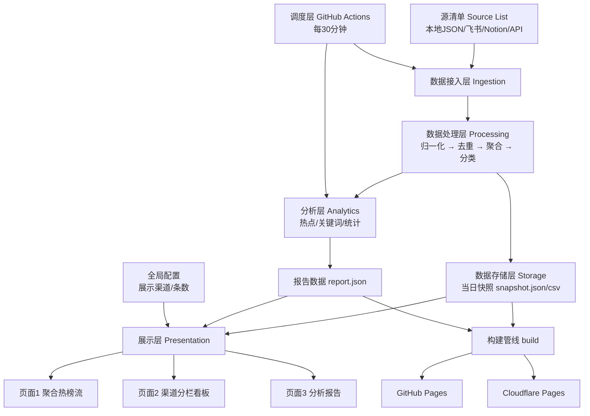
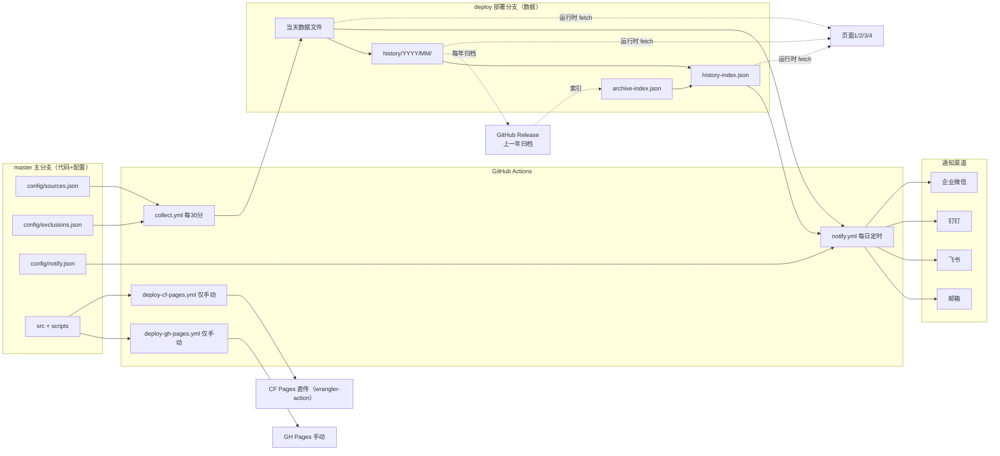

# RSS Radar 产品需求文档（PRD）

| 项目信息 | 内容 |
|---|---|
| 项目名称 | **RSS Radar**（代号 `rss-radar`） |
| 一句话定位 | 「把散落在各处的 RSS 源，汇聚成一份每天更新的信息雷达与热点报告」 |
| 文档版本 | **v1.2**（增量版：CF Pages 改由 GitHub Actions 直传部署 + 配额核实，待老登确认） |
| 上一版本 | v1.1（5 点澄清版）／v1.0（立项版）；变更见 **附录 C** |
| 语言 | 简体中文 |
| 技术基线 | Vite + React + MUI + Tailwind CSS（静态站点，无服务端运行时） |
| 部署基线 | **v1.2 调整**：代码/配置在 `master` 主分支；RSS 数据在 **`deploy` 部署分支**；GitHub Pages 部署流程**默认注释禁用**（仅 `workflow_dispatch` 手动）；Cloudflare Pages **改由 GitHub Actions（`cloudflare/wrangler-action@v3`）直传部署（Direct Upload）**，与 GH Pages 的部署流程**分开配置**（两个独立 workflow） |
| 数据调度 | GitHub Actions（每 30 分钟抓取；当天数据汇总为**一个文件**，次日转**历史数据**，按年/月目录保留**一年**，年初归档到 **GitHub Release**） |
| 通知能力 | **v1.1 新增**：邮箱 / 飞书 / 钉钉 / 企业微信 四类渠道；**每日报告推送** + **实时结果总结推送** |
| 产出阶段 | 第一阶段：只做分析、调研、功能规划，**不含任何原型与代码** |

### 原始需求复述（老登原话要点）

> 分析设计一个 RSS 解析、分析、报告的网页，可以搜索互联网内容和开源项目，分析梳理学习 RSS 内容特点和能力，以及当前热门的 RSS 源，以及有哪些可以获取 RSS 源的地方，并设计一个 RSS 分析报告页面，需要实现：
> 1. 获取给定 RSS 源并解析，源可能是本地 JSON/CSV、飞书多维表格、Notion 表格、API 接口等多种来源，整合分析并去重，把最新汇总数据沉淀到项目中；先设计合适的 RSS 信息 JSON 格式（保存源信息用于对比分析、脚本解析获取最新数据）；
> 2. 设计类似热榜页面：页面1 聚合展示所有渠道最新 RSS 数据（按更新/创建时间倒序，列表展示来源渠道、创建更新时间、渠道地址、渠道首页地址等）；页面2 按渠道分开展示（每渠道独立卡片，倒序排列，自适应布局，可配置展示哪些渠道与每卡片条数，默认 10 条）；页面3 RSS 信息报告（按渠道分类：新闻资讯/博客/技术文章/AI 等，并对最新数据做热点分析）；
> 3. 项目基于 GitHub 仓库，支持 GitHub Pages 与 Cloudflare Pages 部署，GitHub Action 每半小时获取最新数据，每天数据沉淀为 JSON 或 CSV，去重，实时热点分析基于当天数据，只做当天分析。

### v1.1 澄清与变更需求（老登原话，逐条落实）

> 关于分支和数据的问题我再澄清一下：
> 1. github 仓库 master 主分支放代码和配置；新的部署分支存放 rss 数据，并给页面使用；github action 只提供 github pages 部署的流程，但是先注释掉不启用，只启用手动执行部署能力；cloudflare pages 不用 github action 部署，而是使用控制台导入 github 仓库来部署；
> 2. 每30分钟获取一次最新数据，当天的所有数据都追加到一个 json 数据文件中，第二天的时候把前一天的 json 数据文件转成历史数据，历史数据按照保存一年来处理（分好年-月目录存放），并且增加一个每年把上一年的所有数据归档到 github release 中去，这样部署分支上最多只有一年的数据；
> 3. 我还是不太理解为什么要用 NDJSOn，有什么好处吗？刚刚说静态文件中不能使用NDJSON数据会不会有影响，是需要在部署的页面中分析历史数据的；
> 4. RSS 信息的来源是多渠道的中，这个需要设计成可配置可拔插的，方便排出已有的来源和新增新的来源；
> 5. 增加通知的能力，可以通过配置邮箱、飞书、钉钉、企业微信相关信息，实现每日报告或实时的结果总结推送通知；

> **【v1.2 更新】** 上述第 1 点中「**cloudflare pages 不用 github action 部署，而是使用控制台导入 github 仓库来部署**」**已被老登本轮新确认推翻**：CF Pages **改由 GitHub Actions 直传部署**（见 §5.8 F-083 与 Q13）。其余 4 点不变。

**逐条对应的需求落点（详见后续章节）**

| 序号 | 老登诉求 | 本节落点 | 对应新增功能 | 对应变更 |
|---|---|---|---|---|
| ① | 分支与部署策略 | §4.1 模块树 6.x、§5.8、§6.5/§6.6、§14 | F-080~F-084 | 修改 F-034、F-070、F-071；作废「data 分支」命名 |
| ② | 数据组织与历史归档 | §4.1 模块树 3.x、§5.9、§11.6、§14 | F-085~F-090 | 修改 F-032、F-034、F-037；升级 Q8 |
| ③ | NDJSON 疑问 + **前端分析历史数据** | §5.9、§6.4、§11.6 | F-089、F-090 | **作废** §1.4「不做跨天历史趋势」；§6.3 边界解除；Q8 作废重写为 Q14 |
| ④ | 多来源可配置可插拔 + 排除 | §4.1 模块树 1.7/2.x、§5.10、§6.6、§14 | F-091~F-096 | 修改 F-001、F-002、F-005、F-006；新增排除规则资产 |
| ⑤ | 通知能力（四类渠道 + 两种推送） | §4.1 模块树 7.x、§5.11、§6.5、§14 | F-100~F-107 | 全新模块，无对应旧编号 |

> **说明（第 ③ 点的分工）**：「NDJSON 的好处」「浏览器能否读 NDJSON」「前端分析历史数据的技术可行性」由**架构师**在增量设计文档 `docs/data-model/format-decision.md` 及后续 ARCHITECTURE 修订中**正面论证**。本 PRD 只负责把老登明确提出的「**需要在部署页面中分析历史数据**」转为**产品需求**（见 F-089/F-090 与新增页面4）。
>
> **说明（第 ④ 点歧义）**：老登原文「方便**排出**已有的来源和新增新的来源」中的「**排出**」**疑为「排除」的笔误**（"排除已有来源"更贴合"管理来源"的语境）。本 PRD **按「排除已有来源 + 新增新来源」两个动作**设计，并已在待确认问题 **Q17** 中请老登拍板确认。若确为「排列/罗列」，则 F-094/F-095 的排除能力可降级为 P2，仅保留排序/归类能力。

---

## 1. 产品概述

### 1.1 一句话定位

> **RSS Radar** 是一个纯静态、零后端、自动更新的 RSS 聚合分析与热点报告站点——让你在**一个页面**看到所有关注渠道的最新内容，并用**一份当天报告**看懂今天什么在热。

### 1.2 目标用户

| 用户画像 | 描述 | 核心诉求 |
|---|---|---|
| **信息极客 / 老登本人** | 自建源清单、关注 AI/技术/资讯，拒绝算法推荐 | 一处聚合、可控源配置、原汁原味的排序 |
| 技术从业者 / 研究者 | 需跟踪行业动态、AI 前沿、开源项目 | 分类看板、热点报告、快速扫描 |
| 内容创作者 | 找选题、追热点 | 当天热点榜、跨源重合度 |
| 项目贡献者 | 想新增源、修数据 | 简单的源配置格式、清晰的仓库约定 |

### 1.3 解决的核心痛点

| 痛点 | 现状 | RSS Radar 的方案 |
|---|---|---|
| 信息分散 | 几十个站点/社交平台要来回切换 | 三页面聚合，按渠道/分类统一呈现 |
| 时间成本高 | 手动刷各站，容易漏 | Actions 每 30 分钟自动抓取，倒序展示最新 |
| 源管理混乱 | 源散落在浏览器书签、笔记、多维表格 | 多源接入（本地/飞书/Notion/API）统一成一套 Source 模型 |
| 重复信息噪音 | 同一篇文章被多源转载，刷屏 | 去重引擎 + 跨源同文章归并标注 |
| 不知道「今天什么最重要」 | 缺乏热点判断 | 当天报告：热点榜、分类分布、关键词 |
| 部署麻烦 | 自建阅读器要跑服务器/数据库 | 纯静态，GitHub Pages + Cloudflare Pages 一键部署，零成本 |

### 1.4 产品边界

**做什么（In Scope）**
- 多来源 RSS 源的接入、整合、去重、落盘
- 当天数据的聚合展示（页面1）、渠道分栏看板（页面2）、分析报告（页面3）
- 源与站点的配置化（展示哪些渠道、每卡片条数等）
- 当天热点分析（只做当天，每天重置）
- 静态部署 + Actions 定时采集
- **【v1.1 新增】分支与部署策略**：代码/配置在 `master`；RSS 数据在 `deploy` 部署分支；GitHub Pages 默认禁用仅手动；**【v1.2 改】Cloudflare Pages 由 GitHub Actions（`wrangler-action`）直传部署，与 GH Pages 流程分开配置**
- **【v1.1 新增】数据组织与历史归档**：当天数据汇总单文件 → 次日转历史 → 按「年/月」目录保留**一年** → 年初归档到 GitHub Release
- **【v1.1 新增】历史数据前端分析**：前端可查看跨天趋势、回看某天数据（页面4）
- **【v1.1 新增】源可配置可插拔 + 排除**：新增来源免改代码；支持整源/条目级/分类级三种粒度排除
- **【v1.1 新增】通知能力**：邮箱/飞书/钉钉/企业微信四类渠道的**每日报告推送**与**实时结果总结推送**

**不做什么（Out of Scope）**
- ❌ 不做用户账号体系 / 登录 / 云端同步
- ❌ 不做 RSS 阅读器的「已读/未读/收藏/稍后读」完整阅读器功能
- ❌ 不做全文存储与转载（**只存元数据 + 原文链接**）
- ~~❌ 不做跨天历史趋势 / 长期归档分析（V2 再评估）~~ → **【v1.1 作废】** 改为纳入：**前端可看跨天趋势与历史回看**（见 F-089/F-090、页面4）
- ❌ 不做 WebSub 实时订阅推送（仍采用 30 分钟轮询）—— **【v1.1 澄清】** 此为「**源端实时推送协议**」；与 v1.1 新增的「**通知推送**」（F-100~F-107，把结果主动推给人）**不是同一件事**，通知能力**纳入范围**
- ❌ 不做服务端数据库 / 动态后端
- ❌ 不做前端直接写仓库（纯静态站无后端）→ 前端源编辑仅产出**可下载的配置文件**，需人工提交（见 §6.6）
- ❌ 不做在浏览器端发送通知（密钥与定时不可行）→ 通知**只在 Actions 侧发送**（见 §6.5）

### 1.5 与竞品差异

| 竞品 | 强项 | RSS Radar 差异化 |
|---|---|---|
| NewsNow | 中文热榜聚合、静态部署 | 除热榜外，**支持任意 RSS 源 + 多渠道分类 + 当天报告** |
| RSSHub | 万物可 RSS 的路由生成 | 我们**消费** feed 而非生成 feed；专注聚合与报告 |
| FreshRSS / Miniflux | 完整阅读器 | 我们**无需服务端**，零部署成本，专注「雷达+报告」 |
| DailyHotApi | 平台热榜 API | 我们以**RSS 为一等公民**，多源接入、去重、报告 |
| Folo | AI 阅读器 | 我们轻量、静态、可自建、数据完全自主 |

---

## 2. 核心概念与术语表

> **全文统一术语，后续架构师直接引用。**

| 术语 | 英文 | 定义 |
|---|---|---|
| **源** | **Source** | 一个可采集的数据来源配置。类型包括：RSS/Atom/JSON Feed URL、本地 JSON、本地 CSV、飞书多维表格、Notion 数据库、通用 API。一个 Source 对应一条「去哪里拿数据」的配置记录。 |
| **渠道** | **Channel** | 逻辑上的内容发布方（一个站点/一个公众号/一个榜单）。一个 Channel 可挂载多个 Source（多渠道备份），是页面2「分栏卡片」和页面3「分类」的基本单位。 |
| **条目** | **Item** | 从各 Source 解析出的**单条内容**（一篇文章/一条帖子/一条 Release）。是展示、排序、去重、分析的最小单元。 |
| **Feed** | Feed | 单个 RSS/Atom/JSON Feed 文档本身。解析其得到 Channel 元信息 + 一批 Item。 |
| **快照** | **Snapshot** | 某个**自然日**内所有 Channel/Item 的汇总数据文件（JSON/CSV），当天持续更新、次日新建。去重后的最终落盘产物。 |
| **报告** | **Report** | 基于**当天 Snapshot** 生成的派生分析结果（热点榜、分类分布、关键词、摘要）。只做当天，每天重置。 |
| **去重键** | Dedup Key | 判断两条 Item 是否重复的标识（GUID / URL / 标题指纹等）。 |
| **源清单** | Source List | 全站可用的 Source 配置集合，是用户可编辑的数据文件。 |
| **栏目 / 分类** | Category | 渠道的归类标签（新闻资讯 / 技术博客 / AI / 开发者社区 等），用于页面3 组织。 |
| **热榜流** | Hot Stream | 页面1 的全渠道聚合时间流。 |
| **活跃度** | Activity | 渠道/条目在当天的更新强度（条数、更新频率），是热点判定的输入之一。 |
| **主分支** | Master Branch | `master`，存放**代码与配置**（`src/`、`config/`、`.github/`、`docs/`）。**不含数据文件**。 |
| **部署分支** | Deploy Branch | **【v1.1 新增】**`deploy` 分支（老登称"部署分支"），存放 RSS 数据（当天快照/报告/历史），专供页面运行时读取。**无代码、无构建**。（原 ARCHITECTURE 的 `data` 分支命名**作废**，统一改称 `deploy`） |
| **当天数据文件** | Daily File | **【v1.1 新增】**某个自然日内、每 30 分钟采集结果**汇总到的同一个文件**（当天持续合并更新）。次日冻结为历史。 |
| **历史数据** | History | **【v1.1 新增】**已冻结的往日数据，按**「年/月」目录**（如 `2026/09/`）组织，保留**一年**。 |
| **归档** | Archive | **【v1.1 新增】**每年把**上一年**全部数据打包到 **GitHub Release**，并从 `deploy` 分支移出，使其最多保留一年数据。 |
| **通知渠道** | Notify Channel | **【v1.1 新增】**一种消息投递通道：邮箱 / 飞书 / 钉钉 / 企业微信。可独立开关与配置。 |
| **每日报告推送** | Daily Digest | **【v1.1 新增】**定时（默认 08:00 Asia/Shanghai）把日报结果推送到已启用通知渠道。 |
| **实时结果总结** | Realtime Alert | **【v1.1 新增】**采集结束后按阈值（热点分/跨源数/关键词）触发的结果总结推送。 |
| **排除规则** | Exclusion Rule | **【v1.1 新增】**过滤不想看的来源/条目的规则，三种粒度：整源停用、条目级（关键词/域名/正则）、分类级。 |

---

## 3. 用户故事（User Stories）

> 编号 **US-01** 起，覆盖主要浏览、渠道对比、报告阅读、源配置、数据贡献等场景。
> **【v1.1】** 新增 **US-16 ~ US-23**（通知订阅、源管理/排除、历史分析、部署与归档），承接 5 点澄清需求。

| 编号 | 用户故事 |
|---|---|
| US-01 | 作为**信息浏览者**，我希望在一个页面看到所有渠道的最新条目并按时间倒序排列，以便快速掌握「现在有什么新内容」。 |
| US-02 | 作为**信息浏览者**，我希望每条内容能显示来源渠道、创建时间、更新时间、渠道地址和首页地址，以便判断这条内容来自哪里、值不值得点开。 |
| US-03 | 作为**渠道关注者**，我希望按渠道分栏、每个渠道一张卡片，以便专注看某一个渠道最近发布了什么。 |
| US-04 | 作为**渠道关注者**，我希望自定义展示哪些渠道、每张卡片显示多少条（默认 10 条），以便页面符合我的阅读习惯。 |
| US-05 | 作为**分析型用户**，我希望有一份当天报告，把渠道按新闻资讯/技术博客/AI 等分类，并列出今天的热点，以便高效了解全局。 |
| US-06 | 作为**分析型用户**，我希望报告能告诉我哪些内容被多个渠道同时报道（跨源重合），以便识别真正的热点。 |
| US-07 | 作为**源配置者**，我希望用一份可读可编辑的清单管理我的源（含分类、启用状态、显示条数），以便随时增删渠道。 |
| US-08 | 作为**源配置者**，我希望支持从本地 JSON/CSV、飞书多维表格、Notion、API 等多种来源导入源或内容，以便复用我已有的数据。 |
| US-09 | 作为**源配置者**，我希望能识别同一渠道的多个重复来源并自动合并去重，以便避免重复内容刷屏。 |
| US-10 | 作为**数据贡献者**，我希望系统自动每 30 分钟抓取、每天沉淀一份去重后的数据文件，以便站点数据始终新鲜且可追溯。 |
| US-11 | 作为**移动端用户**，我希望页面在手机/平板上自适应降级，以便随时随地查看。 |
| US-12 | 作为**内容创作者**，我希望看到当天关键词与热词，以便快速找到选题方向。 |
| US-13 | 作为**部署者**，我希望站点能同时部署到 GitHub Pages 和 Cloudflare Pages，以便按国内/国外访问择优使用。 |
| US-14 | 作为**维护者**，我希望数据落盘不撑爆仓库、不产生海量 commit 噪音，以便项目长期可维护。 |
| US-15 | 作为**新用户**，我希望看到来源信息与错误状态提示（空态/异常态），以便理解数据为何缺失。 |
| US-16 | 作为**通知订阅者**，我希望每天定时收到一份日报推送（概要 + 热点 Top N + 分类分布 + 链接），以便不用打开网页也能知道今天什么最热。 |
| US-17 | 作为**通知订阅者**，我希望出现真正的高热事件时能收到实时提醒，以便第一时间跟进，但又不希望被琐碎内容刷屏。 |
| US-18 | 作为**源管理者**，我希望能排除不想看的来源（整源停用 / 关键词或域名黑名单 / 按分类隐藏），以便页面只留下我关心的内容。 |
| US-19 | 作为**源管理者**，我希望新增一个来源时只改配置、不用改代码，以便低门槛地持续扩充源。 |
| US-20 | 作为**历史分析者**，我希望在部署的前端页面里看到跨天趋势（总条数、活跃渠道、分类占比、关键词走势），以便判断长期变化而不是只看今天。 |
| US-21 | 作为**历史分析者**，我希望能回看某一天的完整数据与当天报告，以便复盘与追溯。 |
| US-22 | 作为**部署者**，我希望数据与代码分离（数据在 `deploy` 部署分支、代码在 `master`），且部署可手动控制（GitHub Pages 默认不自动构建），以便可控、可回滚、不刷构建次数。 |
| US-23 | 作为**维护者**，我希望历史数据按年/月组织、只保留一年、并每年归档到 Release，以便仓库体积长期可控且更早的数据仍可追溯下载。 |

---

## 4. 功能架构总览

### 4.1 功能模块树

```
RSS Radar
├── 1. 数据接入层 (Ingestion)
│   ├── 1.1 RSS/Atom/JSON Feed 抓取器
│   ├── 1.2 本地 JSON 读取器
│   ├── 1.3 本地 CSV 读取器
│   ├── 1.4 飞书多维表格连接器
│   ├── 1.5 Notion 数据库连接器
│   ├── 1.6 通用 API 连接器
│   ├── 1.7 源清单(Source List)管理
│   ├── 1.8 连接器注册表（可插拔，v1.1 新增）
│   └── 1.9 源排除规则引擎 (Exclusions，v1.1 新增)
│
├── 2. 数据处理层 (Processing)
│   ├── 2.1 统一字段归一化 (Normalizer)
│   ├── 2.2 去重引擎 (Dedup)
│   ├── 2.3 聚合引擎 (Aggregator)
│   ├── 2.4 分类引擎 (Classifier)
│   └── 2.5 校验与异常处理 (Validator)
│
├── 3. 数据存储层 (Storage)
│   ├── 3.1 源配置数据 (sources)
│   ├── 3.2 当天数据文件 (当日汇总单文件，v1.1 调整)
│   ├── 3.3 历史数据与归档 (年/月目录 + Release，v1.1 新增)
│   ├── 3.4 数据落盘策略 (落 JSON/CSV + deploy 分支提交策略)
│   └── 3.5 历史趋势索引 (history-index，v1.1 新增)
│
├── 4. 展示层 (Presentation)
│   ├── 4.1 页面1 聚合热榜流
│   ├── 4.2 页面2 渠道分栏看板
│   ├── 4.3 页面3 分析报告
│   ├── 4.4 全局配置中心 (展示哪些渠道/条数)
│   ├── 4.5 响应式与主题
│   ├── 4.6 页面4 历史趋势与回看 (v1.1 新增)
│   ├── 4.7 通知配置界面 (只读/说明，v1.1 新增)
│   └── 4.8 源管理界面 (只读可视化 + 导出，v1.1 新增)
│
├── 5. 分析层 (Analytics)
│   ├── 5.1 热点判定 (频次/重合/衰减)
│   ├── 5.2 关键词提取
│   ├── 5.3 分类统计
│   └── 5.4 报告生成
│
├── 6. 调度与部署层 (Ops)
│   ├── 6.1 GitHub Actions 采集调度 (cron */30)
│   ├── 6.2 GitHub Pages 部署（v1.1：默认注释禁用，仅 workflow_dispatch 手动）
│   ├── 6.3 Cloudflare Pages 部署（【v1.2 改】由 GitHub Actions 直传部署，与 GH Pages 流程分开）
│   ├── 6.4 构建管线 (build-time 生成报告)
│   └── 6.5 分支策略（master 代码配置 / deploy 数据，v1.1 新增）
│
└── 7. 通知层 (Notification，v1.1 全新)
    ├── 7.1 通知渠道接入（邮箱/飞书/钉钉/企业微信）
    ├── 7.2 推送触发（每日定时 + 实时阈值）
    ├── 7.3 消息内容模板
    ├── 7.4 渠道开关与免打扰
    ├── 7.5 失败重试与失败告警
    └── 7.6 密钥引用管理 (Secrets 引用)
```

### 4.2 模块关系（Mermaid）



**关系说明**
- 调度层（Actions）定时触发「接入 → 处理 → 存储 → 分析」全链路，产出当日快照与报告。
- 展示层消费存储层的快照与报告，为**纯静态读取**（构建期预取 + 运行时 fetch）。
- 全局配置在展示层生效（前端读取配置决定渲染哪些渠道、多少条）。

### 4.3 v1.1 增量模块关系（新增）



**增量说明**
- **配置层**全部在 `master`：源清单、排除规则、通知配置；**数据层**全部在 `deploy`。
- **通知层**由 Actions 侧发送（每日定时 + 采集后阈值判定），密钥走 Secrets 引用，**前端不参与发送**。
- **归档**：历史满一年后打包进 Release，并从 `deploy` 移出；`archive-index.json` 提供可见性。

---

## 5. 功能清单（需求池）

> 优先级：**P0 = Must have（MVP）**，**P1 = Should have（V1.1）**，**P2 = Nice to have（V2）**。
> v1.0 共 **56** 条（P0 = 33 / P1 = 17 / P2 = 6）。
> **【v1.1 新增】** **F-080 ~ F-107，共 25 条**（P0 = 14 / P1 = 9 / P2 = 2）→ **合计 81 条**（P0 = 47 / P1 = 26 / P2 = 8）。
> 说明：**原编号保持稳定不重排**；受影响的原条目在行内以 **【v1.1 修改/升级/作废】** 标注。

### 5.1 数据源管理

| 编号 | 功能名 | 所属模块 | 优先级 | 描述 | 验收要点 |
|---|---|---|---|---|---|
| F-001 | 源清单文件管理 | 1.7 | P0 | 用一份 JSON 维护所有 Source（URL/类型/分类/启用/显示条数） | 文件可读可编辑；改动后能被脚本与前端读取 |
| F-002 | 源启用/停用开关 | 1.7 | P0 | 每个 Source/Channel 可开关 | 关闭后不抓取、不展示。**【v1.1 扩展】** 升级为「整源/渠道停用」粒度，见 F-093 |
| F-003 | 源分类标签 | 2.4 | P0 | 每个 Channel 带一个或多个分类标签 | 分类在页面3 生效 |
| F-004 | 源健康状态标记 | 1.7/2.5 | P1 | 记录每个源最近抓取时间/状态/错误 | 有失败原因，前端可展示 |
| F-005 | 源清单可视化查看 | 4.4 | P1 | 前端只读展示当前所有源与状态 | 可搜索、可筛选。**【v1.1 扩展】** 展示排除规则与命中数（F-096），归入 §6.6 源管理界面 |
| F-006 | 源清单在线编辑（导出/导入） | 1.7 | P2 | 支持前端生成 OPML/JSON 供下载 | 导入导出可用。**【v1.1 澄清】** 纯静态站前端**无法直接写仓库**，编辑功能仅**产出可下载的配置文件**，需人工提交（§6.6） |

### 5.2 多源接入

| 编号 | 功能名 | 所属模块 | 优先级 | 描述 | 验收要点 |
|---|---|---|---|---|---|
| F-010 | RSS/Atom/JSON Feed 抓取 | 1.1 | P0 | 支持三种 feed 格式抓取与解析 | 三种格式均能解析出 Item |
| F-011 | 本地 JSON 源接入 | 1.2 | P0 | 从仓库内 JSON 文件读取源/内容 | 兼容自定义结构映射 |
| F-012 | 本地 CSV 源接入 | 1.3 | P0 | 从仓库内 CSV 读取源/内容 | 支持表头映射 |
| F-013 | 飞书多维表格接入 | 1.4 | P1 | 通过飞书开放 API 拉取源/内容（app_token/table_id） | 能分页拉取全部记录 |
| F-014 | Notion 数据库接入 | 1.5 | P1 | 通过 Notion API 查询 database | 能读取到记录字段 |
| F-015 | 通用 API 接入 | 1.6 | P1 | 配置化 HTTP API 源（带鉴权头、字段映射） | 可用 JSONPath/映射规则提取 |
| F-016 | 多来源字段映射 | 2.1 | P0 | 不同来源统一映射为内部 Item 结构 | 异构源输出同构 Item |
| F-017 | 抓取超时与重试 | 1.1/2.5 | P0 | 单源失败不影响整体，带重试 | 单源异常不阻断任务 |
| F-018 | 增量抓取（条件请求） | 1.1 | P1 | 使用 ETag/Last-Modified 减少流量 | 支持 304 复用 |

### 5.3 去重与聚合

| 编号 | 功能名 | 所属模块 | 优先级 | 描述 | 验收要点 |
|---|---|---|---|---|---|
| F-020 | 精确去重（GUID/URL） | 2.2 | P0 | 同 GUID 或同链接视为重复 | 重复条目只保留一条 |
| F-021 | 标题相似去重 | 2.2 | P1 | 同标题/高相似标题归并 | 相似阈值可配置 |
| F-022 | 跨源同文章归并 | 2.2 | P1 | 多源报道同一文章时合并并标注多来源 | 展示「来源：A、B」 |
| F-023 | 去重保留策略 | 2.2 | P0 | 保留最新时间/信息最全的一条 | 保留规则明确、可测 |
| F-024 | 全渠道聚合 | 2.3 | P0 | 汇总所有渠道 Item 为一个池 | 页面1 数据正确 |
| F-025 | 时间倒序排序 | 2.3 | P0 | 按更新时间/创建时间倒序 | 排序稳定 |
| F-026 | 首次抓取 vs 增量标记 | 2.3 | P1 | 区分「今日新增」与「历史仍展示」 | 页面可标注 NEW |

### 5.4 采集调度与数据落盘

| 编号 | 功能名 | 所属模块 | 优先级 | 描述 | 验收要点 |
|---|---|---|---|---|---|
| F-030 | 每 30 分钟定时采集 | 6.1 | P0 | GitHub Actions cron `*/30` | 定时触发成功 |
| F-031 | 手动触发采集 | 6.1 | P0 | `workflow_dispatch` 手动执行 | Actions 页面可手动跑 |
| F-032 | 当日快照落盘（JSON） | 3.2/3.4 | P0 | 当天数据写入当日 JSON 文件 | 文件命名含日期。**【v1.1 修改】** 明确为「当天所有采集结果**汇总/合并到同一个文件**」，见 F-085 |
| F-033 | 当日快照落盘（CSV） | 3.2/3.4 | P1 | 同步落一份 CSV 便于外部使用 | 列结构清晰 |
| F-034 | 数据提交策略（防仓库膨胀） | 3.4 | P0 | 当日覆盖/独立数据分支/每日单次提交 | 仓库体积可控、commit 噪音低。**【v1.1 修改】** 数据分支**定名为 `deploy` 部署分支**；当日内 amend、跨天新建提交（见 F-081） |
| F-035 | `[skip ci]` 防循环 | 6.1 | P0 | 提交信息含跳过标记 | 不触发自循环 |
| F-036 | 采集日志与统计 | 3.4 | P1 | 记录本次抓取源数/条数/失败数 | 日志可查 |
| F-037 | 快照保留清理策略 | 3.4 | P2 | 超过 N 天的快照自动清理 | 仓库不膨胀。**【v1.1 升级·原"超 N 天清理"作废】** 改为「历史保留**一年** + 年/月目录 + 年初归档到 Release」（见 F-087 / F-088） |

### 5.5 页面展示

| 编号 | 功能名 | 所属模块 | 优先级 | 描述 | 验收要点 |
|---|---|---|---|---|---|
| F-040 | 页面1 聚合热榜流 | 4.1 | P0 | 全渠道 Item 时间倒序列表 | 字段齐全、可跳转 |
| F-041 | 页面2 渠道分栏看板 | 4.2 | P0 | 每渠道一张卡片，倒序、自适应 | 卡片布局合理 |
| F-042 | 页面3 分析报告 | 4.3 | P0 | 分类 + 当天热点分析 | 报告数据正确 |
| F-043 | 全局配置中心 | 4.4 | P0 | 配置展示渠道、每卡片条数（默认10） | 配置生效、可持久化 |
| F-044 | 搜索 | 4.1/4.2 | P1 | 按标题/关键词搜索条目 | 结果准确 |
| F-045 | 筛选 | 4.1 | P1 | 按渠道/分类/时间筛选 | 组合筛选可用 |
| F-046 | 分页 / 懒加载 | 4.1 | P0 | 长列表分页或滚动加载 | 首屏不被拖慢 |
| F-047 | 条目跳转原文 | 4.1/4.2 | P0 | 点击跳转渠道地址/原文 | 新窗口打开 |
| F-048 | 空态 / 异常态 | 4.1/4.2/4.3 | P0 | 无数据/加载失败/部分源失败提示 | 状态清晰 |
| F-049 | 响应式布局 | 4.5 | P0 | 桌面/平板/移动自适应降级 | 三端可用 |
| F-050 | 深色模式 | 4.5 | P2 | 明暗主题切换 | 可切换并记忆 |
| F-051 | 导出条目 | 4.1 | P2 | 导出当前视图为 JSON/CSV | 导出可用 |

### 5.6 分析层

| 编号 | 功能名 | 所属模块 | 优先级 | 描述 | 验收要点 |
|---|---|---|---|---|---|
| F-060 | 当日报表生成 | 5.4 | P0 | 基于当天快照生成报告数据 | 报告与快照一致 |
| F-061 | 渠道分类统计 | 5.3 | P0 | 按分类统计渠道数与条数 | 数字准确 |
| F-062 | 热点榜 | 5.1 | P0 | 当天 Top N 热点条目 | 排序规则可解释 |
| F-063 | 跨源重合度分析 | 5.1 | P1 | 统计被多源报道的主题/条目 | 重合清单可用 |
| F-064 | 关键词提取 | 5.2 | P1 | 当天高频关键词/词云数据 | 词表合理 |
| F-065 | 时间衰减权重 | 5.1 | P1 | 越新的条目权重越高 | 可配置衰减 |
| F-066 | 当天重置边界 | 5.4 | P0 | 报告只基于当天数据，跨天清零 | 日期切换后重置 |
| F-067 | LLM 辅助打标/摘要 | 5.2/2.4 | P2 | 可选 LLM 生成分类与摘要 | 可开关、有降级 |

### 5.7 调度与部署 / 非功能

| 编号 | 功能名 | 所属模块 | 优先级 | 描述 | 验收要点 |
|---|---|---|---|---|---|
| F-070 | GitHub Pages 部署 | 6.2 | P0 | 静态产物部署到 GH Pages | 可访问。**【v1.1 修改】** 部署流程**默认注释掉/不启用**，仅保留 `workflow_dispatch` **手动执行**能力（见 F-082） |
| F-071 | Cloudflare Pages 部署 | 6.3 | P0 | 同一产物部署到 CF Pages | 可访问。**【v1.1 修改】** **不走 GitHub Action**，改为**Cloudflare 控制台导入 GitHub 仓库**部署（见 F-083 / F-084）。**【v1.2 再改】** 恢复为**由 GitHub Actions 直传部署**（`cloudflare/wrangler-action@v3`，与 GH Pages 流程分开；见 F-083 / F-084） |
| F-072 | 构建期生成报告 | 6.4 | P0 | build 时预计算报告 HTML/JSON | 首屏快 |
| F-073 | 运行时数据刷新 | 4.1 | P1 | 前端 fetch 当日快照刷新 | 无需重建即可看最新 |
| F-074 | SEO / 可访问性 | 4.5 | P2 | meta、语义化、aria | 基础可达 |
| F-075 | 只存元数据合规 | 3.4/2.1 | P0 | 不存全文，只存标题/摘要/链接 | 数据文件无全文 |

### 5.8 分支与部署策略（v1.1 新增 / **v1.2 更新部署方式**，对应第 1 点）

| 编号 | 功能名 | 所属模块 | 优先级 | 描述 | 验收要点 |
|---|---|---|---|---|---|
| F-080 | 代码与配置主分支约定（`master`） | 6.5 | P0 | 代码、脚本、配置（`sources/site-config/exclusions/notify`）全部在 `master` 主分支 | `master` 仅含代码与配置，**不含数据文件** |
| F-081 | **`deploy` 部署分支**承载 RSS 数据 | 6.5 | P0 | 新增 `deploy` 分支（orphan，无代码），存放当天数据/报告/历史数据，供页面运行时读取 | 分支内**只有数据无代码**；前端可从 raw/CDN 读到；当天内 amend、跨天新建提交 |
| F-082 | GitHub Pages 部署默认禁用 + 仅手动 | 6.2 | P0 | 工作流中 GH Pages 部署**默认注释掉/不启用**，仅保留 `workflow_dispatch` 手动执行能力 | 默认不自动构建；手动触发可成功发布 |
| F-083 | **【v1.2 改】**Cloudflare Pages **由 GitHub Actions 直传部署（Direct Upload）** | 6.3 | P0 | CF Pages **不用控制台 Git 集成**，改由新 workflow `deploy-cf-pages.yml` 用 **`cloudflare/wrangler-action@v3`** 执行 `pages deploy dist` **直传**；**与 GH Pages 部署流程分开配置**（两个独立 workflow） | workflow 可成功直传并发布；CF **不执行构建** |
| F-084 | **【v1.2 改】**CF Pages 配额与双端同产物 | 6.3 | P0 | Direct Upload **不消耗 CF `500 builds/月`** 构建配额；CF 与 GH Pages **用同一份 `dist`**（同一次 Actions 构建，逐字节一致） | 直传**无构建次数限制**；两端产物一致（详见 Q13） |

> **【v1.2 说明】** 老登新确认：**CF Pages 改由 GitHub Actions 部署**（不再用控制台 Git 集成）。经核实——`wrangler pages deploy` 属 **Direct Upload（直传）**，**CF 不构建、不消耗 500 次/月构建配额**（官方依据见 ARCHITECTURE §7.6）。故 F-084 的"构建次数保护"**不再是需求**；老登明确要求 **CF Pages 与 GitHub Pages 的部署流程分开配置**（两个独立 workflow）。
>
> **【v1.1 原文保留】** F-083 原为「CF Pages 控制台 Git 集成部署」、F-084 原为「CF 生产分支选型与构建次数保护（production branch=`master`、排除 `deploy`）」——**均在 v1.2 作废**（改直传后无"监听分支/构建次数"问题）。

### 5.9 数据组织与历史归档（v1.1 新增，对应第 2 点）

| 编号 | 功能名 | 所属模块 | 优先级 | 描述 | 验收要点 |
|---|---|---|---|---|---|
| F-085 | 当天数据汇总单文件 | 3.2 | P0 | 当天每 30 分钟采集结果**合并进同一个当天数据文件** | 一个自然日**只有一个当天文件**；重复抓取只更新不新增 |
| F-086 | 次日转历史 | 3.2 | P0 | 跨天后，前一天文件**冻结为历史数据**，不再更新 | 跨天后文件只读；当天文件重新开始 |
| F-087 | 历史保留一年 + 「年/月」目录 | 3.3 | P0 | 历史数据保留**一年**，按 `YYYY/MM/` 目录存放（如 `2026/09/`） | 目录形如 `2026/09/`；满一年数据被移出分支 |
| F-088 | 年度归档到 GitHub Release | 3.3 | P1 | **每年**把**上一年**全部数据打包为 Release，使 `deploy` 分支**最多只保留一年数据** | 年初自动产出上一年 Release；Release 含清单与校验 |
| F-089 | 历史趋势索引（`history-index.json`） | 3.5 | P1 | 提供轻量滚动天级聚合文件（日期/总条数/活跃渠道/分类统计/热词）支撑**前端趋势图** | 一次 fetch 即可画趋势，无需读 N 个文件 |
| F-090 | 归档可发现性（`archive-index.json`） | 3.3 | P2 | 提供归档索引（年份/月/条数/Release 链接）供前端展示与下载 | 前端能看到归档年份并跳转下载（详见 Q15） |

### 5.10 源可配置可插拔与排除（v1.1 新增，对应第 4 点）

| 编号 | 功能名 | 所属模块 | 优先级 | 描述 | 验收要点 |
|---|---|---|---|---|---|
| F-091 | 声明式新增源（免改代码） | 1.7 | P0 | 新增来源只需在 `sources.json` 增一条配置（`type`+`url`+字段映射），**无需改代码** | 新增源零代码改动即可被采集 |
| F-092 | 连接器可插拔（注册表） | 1.8 | P0 | 连接器按 `type` 注册；新增来源类型通过新增连接器模块接入 | 连接器注册表可扩展，未知 type 有明确报错 |
| F-093 | 整源/渠道停用（排除粒度①） | 1.9 | P1 | 整个源或渠道一键停用 | 停用后不采集、不展示 |
| F-094 | 条目级排除（排除粒度②） | 1.9/2.2 | P1 | 支持**关键词黑名单**、**URL/域名黑名单**、**标题正则**排除条目 | 命中的条目被过滤，且可在日志看到命中数 |
| F-095 | 分类级排除（排除粒度③） | 1.9/2.4 | P1 | 按分类整体隐藏 | 分类被排除后不出现在页面1/2/3 与统计中 |
| F-096 | 排除规则可视化与冲突提示 | 4.8 | P2 | 前端只读展示生效中的排除规则与命中数，提示规则间冲突 | 可查看命中数与冲突告警 |

### 5.11 通知能力（v1.1 新增，对应第 5 点，全新模块）

| 编号 | 功能名 | 所属模块 | 优先级 | 描述 | 验收要点 |
|---|---|---|---|---|---|
| F-100 | 通知渠道配置（邮箱/飞书/钉钉/企业微信） | 7.1 | P0 | 四类渠道可配置、可独立开关 | 各渠道均可发出测试消息 |
| F-101 | 每日报告推送 | 7.2 | P0 | 定时（默认 **08:00** Asia/Shanghai，可配）推送日报 | 到点收到日报 |
| F-102 | 实时结果总结推送 | 7.2 | P1 | 采集结束后按阈值触发实时提醒（热点分/跨源数/关键词） | 达阈值即触发，未达阈值不打扰 |
| F-103 | 消息内容模板 | 7.3 | P0 | 日报模板：概要 + 关键数字 + 热点 TopN + 分类分布 + 链接 | 各渠道渲染正确、含站点链接 |
| F-104 | 渠道独立开关与免打扰 | 7.4 | P1 | 每渠道独立开关；可设静默时段；静默期内实时提醒合并到次日 | 静默期内不打扰 |
| F-105 | 失败重试与失败告警 | 7.5 | P1 | 发送失败退避重试；仍失败则记录并（可选）经备用渠道告警 | 失败可观测，不静默丢失 |
| F-106 | 密钥引用式管理 | 7.6 | P0 | 密码/webhook 密钥**只存引用名**，值走 **GitHub Secrets** | 配置文件中无明文密钥 |
| F-107 | 实时提醒节流与去重 | 7.2 | P1 | 同一 item 只推一次；同类限频；每日上限 | 不重复、不刷屏 |

**统计**：v1.0 = **56 条**（P0 = 33 / P1 = 17 / P2 = 6）。
**v1.1 新增 = 25 条**（P0 = 14 / P1 = 9 / P2 = 2）。**合计 = 81 条**（P0 = 47 / P1 = 26 / P2 = 8）。

### 5.12 URL 健康检查与失效降级（v1.4 新增）

> 背景：v1.4 原型打磨中发现条目 URL 会腐烂（404 / 反爬拦截），用户点到死链才发现。本组需求让 URL 从「采集时信任」升级为「可观测、可降级」。技术方案见 ARCHITECTURE §15；数据契约见 data-model（snapshot Item 新增 `urlStatus`/`urlCheckedAt`）。

| 编号 | 功能名 | 所属模块 | 优先级 | 描述 | 验收要点 |
|---|---|---|---|---|---|
| F-108 | URL 健康检查（HEAD 校验） | 2.5 | P1 | 采集落盘后异步对新增/更新条目做 HEAD 校验，按状态码归类为 `ok`/`dead`/`moved`/`blocked`，回写 `urlStatus`/`urlCheckedAt`；不阻塞采集主流程 | 校验后快照条目含 `urlStatus`；超时/5xx 不误判 dead；校验流量礼貌（并发 ≤4、同域串行） |
| F-109 | 失效条目前端降级展示 | 4.1~4.6 | P1 | 按 `urlStatus` 分级降级：`dead` 置灰+禁点、`blocked` 保留可点+弱提示、`moved` 跟进新地址；降级渲染三页面统一 | 死链不再以正常可点形态出现；`blocked` 条目仍可手动打开 |
| F-110 | 跨源备用 URL 自动切换 | 2.3 / 4.1~4.6 | P1 | 跨源条目主 URL 失效时，按「最近校验成功时间 DESC → 渠道权重 DESC」从 `sources[]` 选备用链接替换展示；只做展示层替换，不回写原始 `url` | 主链失效且有备用时，用户仍可达原文；原始溯源信息保留 |

**v1.4 新增 = 3 条**（P1 = 3）。**合计 = 84 条**（P0 = 47 / P1 = 29 / P2 = 8）。

---

## 6. 页面详细需求（v1.1：原**三页面** + 新增**页面4**）

> **【v1.1 导航变化】** 主导航由 3 项扩展为 **4 项**：页面1 聚合热榜流 / 页面2 渠道分栏看板 / 页面3 分析报告（当天）/ **页面4 历史趋势与回看**。页面3 保持「**只做当天**」的定位不变，历史能力**独立成页**（判断与理由见 §6.4）。

### 6.1 页面1：聚合热榜流

**页面目标**：一站式浏览所有渠道的最新条目，快速扫出「有什么新内容」。
**目标用户**：所有浏览者。
**核心场景**：每天早/晚打开页面，倒序扫一遍最新内容，点开感兴趣的原链接。

**信息架构与内容区块**
- 顶部区
  - 站点名 + 一句话 slogan
  - 数据状态条：最近更新时间、「共 N 个渠道 / 今日 M 条」
  - 快捷入口：跳页面2 / 页面3
- 控制区
  - 排序切换：按「更新时间」/「创建时间」倒序（默认更新时间倒序）
  - 筛选：渠道筛选（多选）、分类筛选、时间范围（今天 / 近 3 小时 / 近 6 小时 / 全部）
  - 搜索框：按标题/摘要关键词
  - 视图密度（可选）
- 列表区（主内容）
  - 每条 Item 一行/一卡，倒序排列
  - 分页或懒加载
  - 「NEW」标记今日新增
- 底部区
  - 分页器 / 加载更多
  - 数据来源与版权声明

**每条列表项需展示的字段清单**

| 字段 | 来源 | 展示格式 |
|---|---|---|
| 标题 Title | Item.title | 一行/两行省略，可点击跳原文 |
| 摘要 Summary | Item.summary | 一行省略（可选展开） |
| 来源渠道 Channel | Item.channelName | 文字标签/徽标 |
| 渠道分类 Category | Channel.category | 彩色标签 |
| 条目创建时间 CreatedAt | Item.publishedAt | 相对时间（如「3 小时前」）+ hover 绝对时间 |
| 条目更新时间 UpdatedAt | Item.updatedAt | 相对时间 |
| 渠道地址（原文链） | Item.url | 「原文」按钮，新窗口 |
| 渠道首页地址 SiteUrl | Channel.homepage | 「渠道主页」链接 |
| 是否新增 New | 派生 | NEW 徽标 |
| 多来源标记 | 去重派生 | 若跨源则显示「+N 源」 |

**交互行为**
- 排序规则：默认按 `updatedAt` 倒序；可切换 `publishedAt`；同值按渠道名稳定排序（保证顺序确定）。
- 筛选维度：渠道（多选）、分类（多选）、时间范围；筛选条件可组合。
- 分页/懒加载：默认每页/每批 20 条，滚动到底自动加载下一批。
- 点击跳转：标题/「原文」→ `Item.url` 新窗口；渠道名/「渠道主页」→ `Channel.homepage`。
- 空态：无任何数据 → 提示「暂无数据，请检查源配置或等待下次采集」+ 跳页面2/配置说明。
- 异常态：部分源失败 → 顶部黄条提示「N 个渠道本次抓取失败」并列出；全部失败 → 空态 + 错误详情。

**响应式断点行为**

| 断点 | 行为 |
|---|---|
| 桌面（≥1024px） | 列表 + 左侧筛选栏；字段全展示 |
| 平板（768–1023px） | 筛选栏收起为顶部抽屉；列表为主 |
| 移动（<768px） | 单列卡片；摘要默认隐藏；控件折叠进「筛选」按钮；每批 10 条 |

**配置项**
- 展示哪些渠道（默认全部启用源）。
- 每批加载条数（默认 20）。
- 默认排序字段（默认更新时间）。
- 存放位置：站点配置数据文件（如 `config/site-config.json`）；生效方式：构建期读入 + 运行时读取覆盖。

---

### 6.2 页面2：渠道分栏看板

**页面目标**：按渠道聚焦查看，每个渠道一张独立卡片，快速了解单渠道动态。
**目标用户**：有关注特定渠道需求的用户。
**核心场景**：只想看「某几个渠道」最近发布了什么；对比不同渠道活跃度。

**信息架构与内容区块**
- 顶部区
  - 标题「渠道看板」+ 渠道总数
  - 配置按钮：打开「配置中心」抽屉（选择展示渠道、每卡片条数）
- 控制区
  - 渠道多选（按分类分组）
  - 每卡片条数选择（5 / 10 / 20 / 自定义，默认 **10**）
  - 排序：按渠道名 / 按渠道最新更新时间
- 看板区（主内容）
  - 响应式栅格，每张卡片 = 一个渠道
  - 卡片内条目按「更新时间/创建时间」倒序
- 底部区：版权与数据来源

**每张卡片需展示的字段清单**

| 字段 | 来源 | 展示格式 |
|---|---|---|
| 渠道名称 ChannelName | Channel.name | 卡片标题 |
| 渠道图标/首字母 | Channel.icon | 头像/字母占位 |
| 渠道分类 | Channel.category | 标签 |
| 渠道首页地址 | Channel.homepage | 卡片头部链接 |
| 渠道 Feed 地址 | Source.url | 卡片右上角「源」图标，hover 显示 |
| 渠道最新更新时间 | 派生 max(Item.updatedAt) | 「最后更新：x 分钟前」 |
| 渠道条目总数（今日） | 派生 count | 「今日 N 条」 |
| 单条标题 | Item.title | 可点击 |
| 单条时间 | Item.updatedAt / publishedAt | 相对时间 |
| 单条来源标记（多源） | 去重派生 | 「+N 源」 |
| 渠道健康状态 | Source.status | 正常/失败/停用 角标 |

**交互行为**
- 排序规则：卡片内条目默认按 `updatedAt` 倒序；卡片本身默认按「渠道最新更新时间」倒序，可切换为按渠道名。
- 筛选维度：按分类筛选卡片；配置中心可勾选展示渠道。
- 分页/懒加载：卡片内超过显示条数时，显示「查看全部 →」（跳页面1 并按该渠道过滤）。
- 点击跳转：条目 → 原文；渠道名/首页 → 渠道首页。
- 空态：某渠道无数据 → 卡片内显示「暂无内容」；全部无数据 → 全局空态。
- 异常态：某渠道抓取失败 → 卡片显示「抓取失败」角标 + 灰色态。

**响应式断点行为**

| 断点 | 行为 |
|---|---|
| 桌面（≥1280px） | 3–4 列栅格 |
| 桌面中（1024–1279px） | 2–3 列 |
| 平板（768–1023px） | 2 列 |
| 移动（<768px） | 1 列；卡片内默认 5 条 |

**配置项**
- **展示哪些渠道**：配置中心多选，默认全部启用渠道。
- **每卡片条数**：默认 **10**，可选 5/10/20。
- 卡片排序方式。
- 存放位置：用户选择存 localStorage（本地偏好）+ 站点默认配置存配置文件。
- 生效方式：运行时读取，即时生效，无需重建。

---

### 6.3 页面3：分析报告

**页面目标**：用一份当天报告说明「今天信息全景 + 什么最热」。
**目标用户**：分析型用户、内容创作者、研究者。
**核心场景**：早上打开看昨天/今天热点与各分类动态；找选题。

**信息架构与内容区块**
- 头部区
  - 报告标题「RSS 日报 · YYYY-MM-DD」
  - 生成时间、数据覆盖（渠道数/条目数/时间窗）
  - 「只包含当天数据」提示
- 概要区（Executive Summary）
  - 一句话总览（可用 LLM 生成或模板），如「今日共采集 N 条，AI 与开发者社区最活跃」
  - 3–5 个关键数字卡（总条数 / 活跃渠道数 / 热点条数 / 涉及分类数）
- 热点区
  - **热点榜 TOP N**（N 默认 10）：条目 + 热度分 + 来源数 + 分类
  - **关键词/热词云**（P1）
  - **跨源重合榜**（P1）：被多源报道的主题
- 分类区
  - **分类分布**：饼图/条形——各分类条数与占比
  - **分类分栏**：新闻资讯 / 技术博客 / AI / 开发者社区 / 产品与设计 / 播客 / 视频 / 其他，各列出当天代表条目
- 渠道活跃区
  - 渠道活跃度排行（今日条数 / 更新频率）
- 底部区：方法论说明（热点如何判定）、数据来源与版权声明。**【v1.1 修改】** 原「日期切换（仅当天，历史置灰）」改为「**查看历史趋势 →**」入口（跳页面4）

**报告需展示的派生字段清单**

| 字段 | 含义 | 来源 | 格式 |
|---|---|---|---|
| ReportDate | 报告日期 | 派生 | YYYY-MM-DD |
| TotalItems | 当天条目总数（去重后） | 派生 | 数字 |
| ActiveChannels | 当天有更新的渠道数 | 派生 | 数字 |
| CategoryStats | 各分类条数/占比 | 派生 | 表格/图 |
| HotList | 热点榜条目数组 | 派生 | 榜单 |
| HotScore | 单条热度分 | 派生 | 数字（可解释） |
| CrossSourceCount | 该条/主题被多少源报道 | 派生 | 数字 |
| Keywords | 当天高频关键词及频次 | 派生 | 词云数据 |
| ChannelActivity | 各渠道当天活跃度 | 派生 | 排行 |
| Summary | 当天一句话摘要 | 派生（模板/LLM） | 文本 |
| GeneratedAt | 报告生成时间 | 派生 | 时间戳 |

**交互行为**
- 排序规则：热点榜按 `HotScore` 倒序；分类内条目按时间倒序。
- 筛选维度：分类切换、渠道切换。
- 分页/懒加载：热点榜固定 TOP N；分类分栏「查看更多」。
- 点击跳转：条目 → 原文；渠道 → 首页。
- 空态：当天无数据 → 「今日暂无数据」。
- 异常态：报告未生成 → 显示「报告生成中，请稍候」。
- **边界**：严格只分析**当天**数据；跨天时报告重置。**【v1.1 修改】** 原「不支持查看历史报告（V2 再评估）」**作废** —— 历史能力改由**独立页面4**承载（趋势 + 回看某天），**页面3 本体仍只做当天**（不内嵌历史，保持「当天报告每天重置」的心智模型清晰）。
- **【v1.1 新增】** 底部增加「**查看历史趋势 →**」入口（跳页面4）；某天的历史报告由页面4 的「回看」入口按日期打开。

**响应式断点行为**

| 断点 | 行为 |
|---|---|
| 桌面 | 多列布局，图表 + 榜单并列 |
| 平板 | 图表与榜单改为上下堆叠 |
| 移动 | 单列；榜单精简为前 5；图表改为横向滚动或简化条形 |

**配置项**
- 热点榜条数（默认 10）、词云开关、摘要是否用 LLM。
- 存放位置：报告生成参数存配置；生效于构建期生成脚本。

---

### 6.4 页面4：历史趋势与回看（v1.1 新增，对应第 2、3 点）

**结论：新增独立页面4，而非在页面3 内扩展。** 判断与理由如下：

| 维度 | 扩页面3（被否） | **新增页面4（采纳）** |
|---|---|---|
| 数据源 | 页面3 读「当天 snapshot+report」（高频覆盖、每日重置）；历史读「`history-index` + 按日回看的历史文件」——**两套契约混在一个路由内易误用** | 两套数据**各归其页**，刷新/缓存策略独立，清晰 |
| 心智模型 | 「日报页看趋势」会**破坏页面3「只做当天、每天重置」的定位** | 页面3 = **今天**；页面4 = **长期**，各守其责 |
| 移动端 | 页面3 已含图表+榜单+分类，密度已高；再叠一年趋势+日期选择器**显著恶化** | 页面4 以**轻量趋势为主**，可单独做移动降级 |
| 导航成本 | 省一个导航项 | 多一个导航项，成本远低于把两粒度硬揉一页 |

> 页面3 **仅做小幅扩展**（加一个「查看历史趋势 →」入口），**不承载任何历史逻辑**。

**页面目标**：在部署的静态页面里看跨天趋势、回看某天数据；对归档年份可发现、可下载。
**目标用户**：历史分析者、研究者、内容创作者、维护者。
**核心场景**：看最近 90 天/一年的信息量走势与关键词热度变化；回看某个具体日期的条目与当天报告。

**信息架构与内容区块**
- 顶部区：标题「历史趋势」+ 数据范围提示（**近一年**可交互 / **归档年份**仅可见元数据 + 下载）
- 趋势区（主内容，P1）
  - 总条数趋势线（按天）
  - 活跃渠道数趋势线
  - 分类占比随时间（堆叠图/多线）
  - 关键词热度走势（可选词表）
  - 窗口切换：近 90 天 / 180 天 / 一年（默认 90 天）
- 回看区（P1）
  - 日期选择器 → 打开该日的**条目列表** + 该日**报告**（读当天/历史文件）
- 归档区（P2）
  - 归档年份列表（只读：年份/月/条数/Release 链接），点击跳转 GitHub Release **下载**（详见 Q15）

**趋势区字段清单（消费 `history-index.json`）**

| 字段 | 含义 | 来源 | 格式 |
|---|---|---|---|
| date | 某天 | 派生 | YYYY-MM-DD |
| totalItems | 当天去重后条目数 | 派生 | 数字 |
| activeChannels | 当天有更新的渠道数 | 派生 | 数字 |
| categoryStats | 各分类条数 | 派生 | 对象 |
| topKeywords | 当天高频关键词 | 派生 | 数组 |
| topIds | 当天热点条目 id | 派生 | 数组 |

**交互行为**
- 趋势默认窗口 90 天；切换窗口仅换数据切片，**不重新窗口跳转**。
- 回看：选日期 → 拉对应历史/当天文件；**无该日文件**（未采集/已归档）→ 明确空态提示（区分「无数据」与「已归档，去 Release 下载」）。
- 归档年份：**站内只读展示 + 外链下载**，不做站内解析（理由见 Q15）。
- 空态/异常态：无历史索引 → 「历史数据生成中」；索引存在但某天缺失 → 单点断线不阻断整图。

**响应式断点行为**

| 断点 | 行为 |
|---|---|
| 桌面 | 趋势图与回看区并列；多图并排 |
| 平板 | 趋势图上下堆叠；回看区折叠 |
| 移动 | 单列；默认只显示 1 张趋势图（可切换）；回看区改为全屏弹层 |

**配置项**
- 趋势默认窗口（默认 90 天）、可选窗口集合（90/180/365）。
- 是否显示归档年份区（默认显示）。
- 存放位置：`config/site-config.json → history`。

**边界**：**一年内 = 站内可交互查询；超过一年 = 站内仅元数据 + 跳 Release 下载**（产品建议，见 Q14/Q15）。

---

### 6.5 通知配置界面（v1.1 新增，对应第 5 点）

**结论**：**首期不做可写的通知配置表单**；只做**只读展示 + 配置指引**。理由：
1. 纯静态站**前端无法写仓库**；2. 通知密钥（SMTP 密码 / webhook 密钥）**必须走 GitHub Secrets**，绝不能进前端；3. 通知**发送在 Actions 侧**（见下方「通知放哪一层」），前端无发送职责。

**界面内容（P1，只读）**
- 已启用渠道列表：仅显示**渠道类型 + 引用名**（如「邮箱 · ref=smtp_primary」），**密钥值脱敏/不显示**。
- 推送设置：每日推送时间、实时触发阈值、静默时段、每渠道开关。
- 最近发送状态：最近一次发送时间 / 成功失败（读 `deploy` 分支的 `stats/notify-*.json`）。
- 「配置指引」入口：指向 `config/notify.json` 与仓库 Secrets 设置页链接。
- 明确文案：**任何修改 = 编辑 `notify.json` 提交 + 在 GitHub Secrets 配密钥**，前端不提供写入。

**通知放哪一层（产品判断）**：**放在 GitHub Actions（采集 / 定时任务）侧发送**。
- 理由：① 密钥安全（只在 Secrets）；② 有「事件」可判定（采集完成、热点超阈）；③ 有稳定定时器；④ 浏览器端无密钥、无定时、用户不一定在线 → **不可行**。
- 每日报告：独立 `notify.yml`（默认 08:00 Asia/Shanghai 定时）；实时总结：在 `collect.yml` 采集结束后判定（详见 §5.11 F-101/F-102）。

---

### 6.6 源管理界面（v1.1 新增，对应第 4 点）

承接 F-005（只读可视化）/ F-006（导出导入）/ F-096（排除规则可视化）。老登诉求为「**排除**已有来源 + **新增**新来源」（"排出"疑为"排除"，见 Q17）。

**三种操作路径（分层落地）**

| 路径 | 优先级 | 说明 |
|---|---|---|
| ① 配置文件（权威） | P0 | 直接编辑 `config/sources.json` 与 `config/exclusions.json`，提交到 `master`。**新增源 = 加一条配置（免改代码）** |
| ② 前端只读可视化 | P1 | 查看源清单、启用状态、分类、健康状态、**排除规则与命中数**；支持搜索/筛选（F-005/F-096） |
| ③ 前端编辑 + 导出 | P2 | 页面内「草稿态」增删源与排除规则，**导出 JSON/OPML 下载**；并提供「在 GitHub 编辑此文件」深链降低提交门槛。**前端不直接写仓库** |

**排除操作的三粒度在界面上的呈现（对应 F-093/094/095）**
1. **整源/渠道停用**：源列表每行一个「停用」开关。
2. **条目级排除**：规则列表（类型：关键词 / 域名 / 标题正则；值；生效范围：全局或指定源），显示命中条数。
3. **分类级排除**：分类多选，勾选即隐藏。

**边界**：界面**只呈现与导出**，落库仍以仓库配置文件为准（无后端，Q1 已定「仓库 JSON 为主」）。

---

## 7. 数据与内容需求清单

> 本节只提**需求**（字段名 + 含义 + 是否必填 + 用途），**具体 JSON Schema 由架构师设计**。

### 7.1 源信息（Source / Channel）字段需求

| 字段名 | 含义 | 必填 | 用途 |
|---|---|---|---|
| id | 源唯一标识 | 是 | 主键、去重引用 |
| name | 渠道/源名称 | 是 | 展示 |
| type | 源类型（rss/atom/json_feed/local_json/local_csv/feishu/notion/api） | 是 | 决定用哪个连接器 |
| url | 源地址（feed URL / API endpoint / 文件路径） | 是 | 采集 |
| homepage | 渠道首页地址 | 是 | 展示、跳转 |
| category | 分类（枚举，支持多值） | 是 | 页面3 分类 |
| enabled | 是否启用 | 是 | 采集与展示开关 |
| displayLimit | 每卡片展示条数 | 否 | 页面2 默认 10 |
| icon | 图标/首字母 | 否 | 展示 |
| language | 语言 | 否 | 过滤/展示 |
| auth | 鉴权信息引用（不存明文，指向 secrets） | 否 | API/飞书/Notion 接入 |
| fieldMapping | 异构源字段映射规则 | 否 | 接入层归一化 |
| interval | 该源抓取间隔覆盖 | 否 | 调度优化 |
| createdAt | 源创建时间 | 是 | 对比分析 |
| updatedAt | 源更新时间 | 是 | 对比分析 |
| lastFetchAt | 最近抓取时间 | 否 | 健康状态 |
| lastStatus | 最近抓取状态（ok/error/empty） | 否 | 健康状态 |
| lastError | 最近错误信息 | 否 | 排障 |

### 7.2 条目（Item）字段需求

| 字段名 | 含义 | 必填 | 用途 |
|---|---|---|---|
| id | 条目唯一标识 | 是 | 主键 |
| guid | 源提供的唯一 ID | 否 | 去重 |
| title | 标题 | 是 | 展示、搜索、去重 |
| url | 原文链接 | 是 | 跳转、去重 |
| summary | 摘要（纯文本，截断） | 否 | 展示 |
| author | 作者 | 否 | 展示 |
| channelId | 所属渠道 | 是 | 关联、分组 |
| channelName | 渠道名（冗余便于展示） | 是 | 展示 |
| category | 分类（冗余） | 是 | 展示、统计 |
| publishedAt | 创建/发布时间 | 是 | 排序 |
| updatedAt | 更新时间 | 是 | 排序、热点 |
| fetchedAt | 抓取时间 | 是 | 增量、审计 |
| sourceUrl | 来源 Feed/接口地址 | 否 | 溯源 |
| sourceType | 来源类型 | 否 | 统计 |
| tags | 标签 | 否 | 分类/关键词 |
| dedupKey | 去重键 | 是 | 去重 |
| duplicateOf | 若为重复，指向主条目 id | 否 | 展示来源数、合并 |
| sourceCount | 归并的源数量 | 否 | 「+N 源」 |
| isNew | 是否当天新增 | 否 | NEW 标记 |
| hotScore | 热度分 | 否 | 热点榜 |
| language | 语言 | 否 | 过滤 |

### 7.3 报告（Report）派生字段需求

| 字段名 | 含义 | 必填 | 用途 |
|---|---|---|---|
| date | 报告日期 | 是 | 报告标识 |
| generatedAt | 生成时间 | 是 | 展示 |
| totalItems | 当天去重后条目数 | 是 | 概要 |
| activeChannels | 当天有更新的渠道数 | 是 | 概要 |
| categoryStats | 各分类条数/占比 | 是 | 分类分布 |
| hotList | 热点榜数组（含条目引用、hotScore、sourceCount） | 是 | 热点区 |
| keywords | 关键词及频次 | 否 | 词云 |
| crossSource | 跨源重合主题及来源数 | 否 | 重合榜 |
| channelActivity | 各渠道活跃度 | 否 | 活跃排行 |
| summary | 一句话摘要 | 否 | 概要 |

### 7.4 排除规则（Exclusion）字段需求（v1.1 新增）

| 字段名 | 含义 | 必填 | 用途 |
|---|---|---|---|
| id | 规则唯一标识 | 是 | 主键 |
| level | 粒度：`channel` / `item` / `category` | 是 | 三种排除粒度（对应 F-093/094/095） |
| scope | 生效范围：`global` / `source:<id>` / `channel:<id>` / `category:<key>` | 是 | 限定作用域 |
| type | 条目级规则类型：`keyword` / `domain` / `url` / `title_regex` | 条目级必填 | 匹配方式 |
| value | 规则值（关键词/域名/URL/正则） | 条目级必填 | 匹配 |
| matchMode | 匹配方式：`contains` / `equals` / `regex` | 否 | 匹配语义 |
| caseSensitive | 是否区分大小写 | 否 | 匹配语义（默认否） |
| enabled | 是否启用 | 是 | 开关 |
| note | 备注（为何排除） | 否 | 可维护性 |
| hitCount | 命中条数（统计回填） | 否 | 前端展示、规则调优 |

### 7.5 通知配置（Notify）字段需求（v1.1 新增）

| 字段名 | 含义 | 必填 | 用途 |
|---|---|---|---|
| channelType | 渠道类型：`email` / `feishu` / `dingtalk` / `wecom` | 是 | 选择适配器 |
| enabled | 渠道开关 | 是 | 独立开关 |
| events | 订阅事件：`dailyReport` / `realtime` | 是 | 推送形态 |
| refs | 密钥**引用名**（指向 GitHub Secrets，如 `smtp_password`） | 是 | 密钥管理（沿用"只存引用名"约定） |
| smtpHost / smtpPort / secure | 邮箱服务器 | 邮箱必填 | email 渠道 |
| from / to[] | 发件人 / 收件人列表 | 邮箱必填 | email 渠道 |
| webhookRef | 群机器人 webhook 引用（飞书/钉钉/企业微信） | 群机器人必填 | webhook 渠道 |
| signSecretRef | 钉钉加签密钥引用 | 条件 | 钉钉安全 |
| corpId / agentId / toUser / toParty | 企业微信应用消息参数 | 应用消息必填 | 企业微信 |
| dailyReportTime | 每日推送时间（默认 **08:00** Asia/Shanghai） | 否 | 定时 |
| realtimeThreshold | 实时触发阈值（`hotScore` / `sourceCount` / 关键词） | 否 | 实时触发 |
| quietHours | 免打扰时段（如 23:00–07:00） | 否 | 静默 |
| maxRealtimePerDay | 每日实时推送上限 | 否 | 节流 |
| retry | 重试次数 / 退避间隔 | 否 | 可靠性 |
| severity | 最低推送级别 | 否 | 过滤 |

### 7.6 历史索引与归档字段需求（v1.1 新增）

**`history-index.json`（趋势用，滚动天级聚合）**

| 字段名 | 含义 | 必填 | 用途 |
|---|---|---|---|
| schemaVersion | 版本 | 是 | 兼容 |
| updatedAt | 更新时间 | 是 | 展示 |
| days[] | 天级聚合数组 | 是 | 趋势图数据源 |
| days[].date / totalItems / activeChannels | 日期 / 条数 / 活跃渠道 | 是 | 趋势 |
| days[].categoryStats / topKeywords / topIds | 分类统计 / 热词 / 热点id | 否 | 占比走势、词走势 |
| days[].sourceOk / sourceFailed | 源成功/失败数 | 否 | 健康趋势 |

**`archive-index.json`（归档可发现性用）**

| 字段名 | 含义 | 必填 | 用途 |
|---|---|---|---|
| year | 归档年份 | 是 | 列表 |
| releaseTag / releaseUrl | Release 标识 / 链接 | 是 | 跳转下载 |
| months[] | 各月 { month, itemCount, filePath } | 是 | 明细 |
| generatedAt | 生成时间 | 是 | 展示 |

---

## 8. 去重与聚合规则需求

### 8.1 「什么算重复」

| 级别 | 判定条件 | 说明 |
|---|---|---|
| L1 精确重复 | 同 `guid`，或同标准化 `url`（去参数/去 fragment） | 最高置信，直接合并 |
| L2 标题重复 | `title` 完全相同（标准化大小写/空格） | 高置信 |
| L3 标题相似 | `title` 相似度 ≥ 阈值（如 0.9，算法待定） | 中置信，需人工可回退 |
| L4 跨源同文章 | 跨渠道但 L1/L2 命中 | 归并并标注多来源 |
| L5 主题重合 | 标题/关键词主题相同（用于**热点分析**，不合并条目） | 只做热点判定 |

### 8.2 去重优先级与保留策略

- 优先级：**L1 > L2 > L3 > (L5 仅分析)**。
- 保留策略（同组重复中保留哪条）：
  1. 优先保留 `updatedAt` 最新的一条；
  2. 时间相同则保留字段最完整（有 summary/author 更多）的一条；
  3. 仍相同则保留渠道优先级更高（可配置）或 id 字典序较小者，保证**确定性**。
- 被合并条目：记录 `duplicateOf` 指向主条目，主条目 `sourceCount += 1`。

### 8.3 跨源同一文章如何标注来源

- 主条目展示：`来源：A 渠道、B 渠道`（或徽标「+N 源」）。
- 页面可悬浮/展开查看所有来源渠道与其原文链接。
- 跨源重合是**热点判定的重要信号**（越多源报道 → 越热）。

---

## 9. 分类体系需求

### 9.1 建议分类枚举

| 分类 Key | 中文名 | 覆盖 |
|---|---|---|
| news | 新闻资讯 | 综合新闻、时事 |
| tech_media | 科技媒体 | 36氪、爱范儿、TechCrunch 等 |
| tech_blog | 技术博客 | 个人/团队技术博客、工程博客 |
| ai | AI | OpenAI/DeepMind/HuggingFace/arXiv 等 |
| dev_community | 开发者社区 | HN、V2EX、掘金、LinuxDo |
| product_design | 产品与设计 | 少数派、Product Hunt、Dribbble |
| podcast | 播客 | 音频 feed |
| video | 视频 | YouTube 等 |
| security | 安全 | 安全资讯/博客（可选子类） |
| opensource | 开源 | GitHub、开源中国（可选） |
| other | 其他 | 未分类 |

> 分类支持**多标签**（一个渠道可属多个分类）。

### 9.2 分类是配置项还是自动生成

- **以配置为主**：每个 Source/Channel 在清单中显式声明 `category`（权威、可控）。
- **自动为辅**：
  - 思路 A：**关键词规则**——命中关键词表 → 打标（离线、可解释、零成本）。
  - 思路 B：**LLM 打标**（P2）——对未分类渠道/条目调用 LLM 打标，需可开关、有降级。
- 优先级：`显式配置 > 关键词规则 > LLM > other`。

---

## 10. 热点分析需求

### 10.1 「热点」判定维度

| 维度 | 说明 | 权重（建议初始） |
|---|---|---|
| 跨源重合度 | 同一主题/条目被多少渠道报道 | 高 |
| 出现频次 | 关键词/主题在当天出现的次数 | 高 |
| 时间衰减 | 越新权重越高（如半衰期 6 小时） | 中 |
| 渠道权重 | 高权威渠道加权（可配置） | 中 |
| 关键词热度 | 高热度词命中（可维护词表） | 低 |

**建议热度分公式（待架构师细化）**：
`hotScore = w1 * log(1 + sourceCount) + w2 * log(1 + freq) + w3 * decay(now - publishedAt) + w4 * channelWeight`

### 10.2 呈现方式（页面3）

| 呈现 | 说明 |
|---|---|
| 热点榜 | TOP N 条目（默认 10），含热度分与来源数 |
| 词云 | 当天高频关键词（P1） |
| 趋势/分布 | 分类分布饼图、渠道活跃排行（当天维度） |
| 摘要 | 当天一句话概述（模板或 LLM） |
| 跨源重合榜 | 被多源报道的主题（P1） |

### 10.3 边界（必须严格遵守）

- **只做当天数据分析**：报告仅基于当天 Snapshot。
- **每天重置**：跨自然日后，前一日热点数据不再参与当日报告。**【v1.1 修改】** 原「历史报告 V2 再评估」**作废** —— 跨天趋势与历史回看纳入 v1.1，由**页面4**（消费 `history-index.json` 与历史文件）承载，**不影响**本页「只做当天」的边界。
- 生成时机：Actions 期由脚本生成报告数据；前端运行时刷新。

---

## 11. 非功能需求

### 11.1 性能

| 指标 | 目标 |
|---|---|
| 首屏可交互 | ≤ 2.5s（4G，桌面） |
| 数据体量预估 | 源 50–200 个；单源 20–100 条；当天去重后 **约 500–5,000 条** |
| 快照文件体积 | 单日 ≤ 2 MB（仅元数据） |
| 列表渲染 | 虚拟列表/分页，单页 ≤ 20 条 |
| 报告生成 | 构建期 ≤ 60s |

### 11.2 可用性 / 可维护性

- 采集失败可降级：单源失败不影响整体，前端展示部分失败提示。
- 配置与代码分离：源清单/站点配置为数据文件，非硬编码。
- 幂等：重复运行采集不产生重复数据（依赖去重）。
- 可观测：采集日志含源数/条数/失败数。

### 11.3 SEO / 可访问性

- 构建期预渲染报告与列表关键内容（利于 SEO）。
- 语义化 HTML、`alt`、`aria`、键盘可达（P2）。
- 合理的 meta / OG 标签。

### 11.4 数据合规与版权

- **只存元数据**：标题、摘要（截断）、链接、时间、来源，**不存全文**。
- 条目一律提供**原文链接**，尊重来源。
- 遵守 robots.txt 与站点条款；不绕过鉴权。
- 微信等封闭生态源：标注风险，默认不内置。
- 展示页含版权与来源声明。

### 11.5 成本

- **纯免费额度**：公开仓库 Actions 分钟无限；GitHub Pages 免费；Cloudflare Pages 免费档无限带宽。
- 无服务器、无数据库、无第三方付费依赖（LLM 为可选 P2）。

### 11.6 数据保留与仓库体积（v1.1 新增，对应第 2 点）

> 数字引用**架构师实测**（`docs/data-model/format-decision.md §5.4`，基于本项目真实字段结构压测）。

| 指标 | 数值 | 结论 |
|---|---|---|
| 单日体积 | 约 **0.6 MB 裸** / 约 **0.13 MB（zlib/gzip 后）** | git 对象经 zlib 压缩，仓库实际占用更接近后者 |
| 保留一年（365 天） | 文件树约 **220 MB 裸** / 仓库实际约 **48 MB** | ✅ 远低于 GH 1 GB 软限 |
| 单文件峰值 | 约几百 KB | ✅ 远低于 100 MB 单文件上限 |
| 归档后 `deploy` 分支 | 最多 **一年** 数据 | ✅ 体积长期可控 |

**产品结论**：**「历史保留一年」是产品决策而非技术约束**——体积无风险；再叠加「年初归档到 Release」，`deploy` 分支恒定不超过一年。

### 11.7 通知时效与归档可访问性（v1.1 新增，对应第 2、5 点）

| 指标 | 目标 | 说明 |
|---|---|---|
| 实时通知发出延迟 | 采集完成起 **≤ 1 分钟** | 端到端（源发布 → 收到提醒）受 30 分钟轮询约束，最坏约 **30~60 分钟**（可接受，已与外话澄清） |
| 每日报告推送准时度 | 08:00 Asia/Shanghai **± 5 分钟** | 受 Actions 调度延迟影响，可容忍 |
| 通知发送失败 | 退避重试 **≤ 2 次**；仍失败**可观测**（日志 + stats） | 不静默丢失；可选备用渠道告警 |
| 一年内历史数据可访问性 | **站内可交互查询**（趋势 + 回看），一次 fetch 出图 | 轻量索引，移动端友好 |
| 归档年份（>1 年）可访问性 | **站内只读元数据 + 跳 GitHub Release 下载** | HTTP 可达、需手动下载；站内不解析大文件（见 Q15） |

---

## 12. 迭代路线

| 版本 | 目标 | 范围（功能编号） |
|---|---|---|
| **MVP（P0）** | 打通「多源采集 → 去重落盘 → **三页面**展示 → **部署分支 + 双端部署**」闭环 | v1.0：F-001、002、003、010、011、012、016、017、020、023、024、025、030、031、032、034、035、040、041、042、043、046、047、048、049、060、061、062、066、070、071、072、075<br/>**【v1.1 新增】** F-080~F-087、F-091、F-092、F-100、F-101、F-103、F-106 |
| **V1.1（P1）** | 提升分析深度与可配置性 + **历史趋势（页面4）+ 通知实时推送 + 源排除** | v1.0：F-004、005、013、014、015、018、021、022、026、033、036、044、045、063、064、065、073<br/>**【v1.1 新增】** F-088、F-089、F-093、F-094、F-095、F-102、F-104、F-105、F-107 |
| **V2（P2）** | 智能增强与体验完善 + **归档可发现性 + 排除规则可视化** | v1.0：F-006、050、051、067、074<br/>**【v1.1 新增】** F-090、F-096。（原 F-037「超 N 天清理」已**升级作废**，并入 F-087/F-088） |

**MVP 验收标准（v1.1 修订）**
1. 配置一份含 ≥10 个真实渠道的源清单；**新增一个来源只需改配置、无需改代码**（F-091）。
2. Actions 每 30 分钟自动采集，**当天数据汇总为一个文件**，次日转为历史（按年/月目录）（F-085~F-087）。
3. 三个页面（页面1/2/3；**页面4 属 V1.1**）均可访问、数据正确、响应式可用。
4. **部署**：`master` 放代码配置、**`deploy` 部署分支**放数据；**GitHub Pages 部署流程默认注释禁用（仅手动可触发）**；**【v1.2 改】Cloudflare Pages 由 GitHub Actions（`wrangler-action`）直传部署，与 GH Pages 部署流程分开配置（两个独立 workflow）**。
5. 页面3 显示当天分类分布与热点榜。
6. **通知**：至少**一个渠道**能成功发出「每日报告」测试推送（F-100/F-101/F-103）。

---

## 13. 待确认问题清单

> 请老登拍板。每项给出**推荐选项 + 理由**。

| # | 问题 | 推荐 | 理由 |
|---|---|---|---|
| Q1 | 源清单的**权威存储位置**？仓库内 JSON 文件 / 飞书多维表格 / 两者同步？ | **仓库内 JSON 为主**，飞书/Notion 作为可选导入 | 无服务端时仓库 JSON 最稳定、可版本化、前端可直接读 |
| Q2 | 当天快照**提交策略**？主分支直接提交 / 独立数据分支 / GitHub Releases？ | ~~独立无历史数据分支（force push）或每日单次提交~~ **【v1.1 更新】** 数据放 **`deploy` 部署分支**；当日内 amend、跨天新建提交 | 避免仓库膨胀与 commit 噪音（见 F-081） |
| Q3 | 数据落盘格式？**JSON / CSV / 两者都要**？ | **JSON 为主 + CSV 为辅** | JSON 便于前端消费，CSV 便于外部分析 |
| Q4 | 是否内置**微信公众号源**？ | **默认不内置**，仅提供接入说明 | 合规与账号风险高 |
| Q5 | 是否需要**LLM 摘要/打标**？ | MVP 不做，V2 可选 | 保持零成本、可解释；LLM 有成本与不确定 |
| Q6 | 热点榜**条数**与是否要词云？ | 热点榜默认 10；词云 V1.1 | 控制复杂度，先做可解释榜单 |
| Q7 | 是否需要**多语言源**（国际源）？ | 是，中英混合，按语言标记 | 用户明确要覆盖 AI/开源国际源 |
| Q8 | ~~是否要保留**历史报告/跨天趋势**？~~ **【v1.1 作废·已定】** 保留跨天趋势与历史回看 | **纳入 v1.1**：新增**页面4** + `history-index.json`；页面3 仍只做当天 | 老登明确「需要在部署页面中分析历史数据」；历史独立成页不破坏页面3 的"当天"定位 |
| Q9 | 前端框架确认？Vite + React + MUI + Tailwind？ | 是 | 与团队基线一致 |
| Q10 | **去重相似度阈值**与是否允许人工回退？ | 初始 0.9，可配置；保留原始数据以便回退 | 平衡去重效果与误杀风险 |
| Q11 | 是否需要**用户级配置持久化**（localStorage）还是只读？ | localStorage 存展示偏好 | 无账号体系下最简单 |
| Q12 | 首个 MVP 内置**渠道数量**目标？ | 15–25 个高价值渠道 | 覆盖 AI/技术/资讯，验证闭环 |
| **Q13** | ~~CF Pages 生产分支（production branch）选 `master`（代码）还是 `deploy`（数据）？~~ **【v1.2 已定·原问题作废】** | **已定：CF Pages 改由 GitHub Actions 直传部署（Direct Upload），不再有"生产分支监听"问题** | 老登确认「用 GitHub Actions 部署到 CF Pages」。**直传 ≠ 构建 → 不消耗 CF `500 builds/月` 配额**（官方依据见 ARCHITECTURE §7.6.1），故原「`deploy` 若被监听 = 1440/月超限 2.9×」的顾虑**从根上消失**。**推荐方案 A**（Actions 构建 + `wrangler` 直传）：与 GH Pages **同产物**、流程分开配置 |
| **Q14** | 历史数据**前端可见范围**？一年 / 90 天 / 全部？ | **前端可见一年**（趋势默认 90 天，可切到一年） | `deploy` 分支最多保留一年；趋势读 `history-index.json`，一次 fetch 出图；与 F-087 一致 |
| **Q15** | **归档年份（>1 年）是否需要前端可查？** | **站内只读元数据 + 跳 GitHub Release 下载**，不做站内解析 | Release asset 非静态站可高效 fetch 的稳定端点、体积大（需整包下载）；「热一年在站内、冷数据归档下载」分层最省成本与体验 |
| **Q16** | **实时通知触发阈值口径**？ | `hotScore ≥ 0.8`（默认可配）**或** 跨源 `sourceCount ≥ 3`；叠加去重 + 限频 + 每日上限 | 只看 `hotScore` 会漏「多源但分低」，只看 `sourceCount` 会漏「高权威源高分」；组合更稳；阈值可配防刷屏 |
| **Q17** | **源排除的粒度取舍**？（并请确认「排**出**已有来源」是否为「排**除**」笔误） | 三种粒度**全要**，**首期先做 ①整源停用 + ②条目级排除**，③分类级随后（V1.1） | ①成本最低收益最高；②覆盖"屏蔽某类垃圾内容"主诉求；③可与前端隐藏分类复用。若「排出」确为"排列/罗列"语义，则 F-094/F-095 **降级为 P2** |
| **Q18** | **通知渠道首期范围**？四类全做还是先做一两类？ | **首期先做 2 类**：**邮箱（SMTP）+ 一个 webhook 类（飞书 或 企业微信 群机器人）**；钉钉 + 企业微信应用消息紧随 | webhook 类（飞书/钉钉/企业微信群机器人）实现最轻、零账号依赖；邮箱参数最多但覆盖面最广；分批降低首期风险，四类共用同一消息模板与发送抽象 |
| **Q19** | 每日报告推送的是「**昨天**」还是「**当天截至推送时刻**」？ | 默认推**昨天的完整报告** | 08:00 时当天数据尚少，日报语义＝对已结束一天的总结；当天增量由实时提醒补位 |
| **Q20** 🆕 | **CF Pages 部署 workflow 默认自动还是手动？（且 Direct Upload 项目不可逆）** | **先手动（`workflow_dispatch`），稳定后再开自动**；**确认采用方案 A（Actions 直传）** | Direct Upload 项目**事后无法切回 Git 集成**（官方明确，不可逆）→ 需**一次拍板**；两个部署 workflow 都先手动最稳妥、与 GH Pages 策略一致（详见 ARCHITECTURE §7.6.5/§7.6.6） |

v1.4 追加（URL 健康检查配套，F-108~F-110）：

- Q21：URL 健康检查的频率？采集时同步 HEAD 校验，还是异步每日扫一遍？（影响采集时延与服务器负载，F-108 配套）
- Q22：urlStatus=dead 的条目是否保留在历史数据中？（保留：可追溯死链历史；删除：保持数据清洁。建议保留并标注。）

---

## 14. 配置项增量（v1.1 新增）

> 仅列 **v1.1 新增字段**；键名以架构师数据模型为准，此处定义**产品语义与默认值**。**密钥一律只存引用名，值走 GitHub Secrets**。

### 14.1 站点配置 `config/site-config.json`（新增字段）

| 字段 | 含义 | 默认值 |
|---|---|---|
| `deploy.branch` | 数据所在部署分支名 | `deploy` |
| `deploy.dataBaseUrl` | 数据读取基址（deploy 分支 raw/CDN） | `raw.githubusercontent.com/<owner>/rss-radar/<branch>` |
| `history.windowDays` | 页面4 趋势默认窗口（天） | 90 |
| `history.windowOptions` | 可选窗口集合 | `[90, 180, 365]` |
| `history.visibleDays` | 前端历史可见范围（天） | 365 |
| `history.showArchive` | 是否显示归档年份区 | true |
| `notify.dailyReportTime` | 每日推送时间（本地时区） | `08:00` |
| `notify.realtime.enabled` | 实时推送总开关 | false |
| `notify.realtime.hotScoreThreshold` | 实时热点分阈值 | 0.8 |
| `notify.realtime.sourceCountThreshold` | 实时跨源数阈值 | 3 |
| `notify.realtime.maxPerDay` | 每日实时推送上限 | 10 |
| `notify.quietHours` | 免打扰时段 | `23:00-07:00` |

### 14.2 源配置 `config/sources.json`（新增/调整字段）

| 字段 | 含义 | 默认值 |
|---|---|---|
| `exclusionsRef` | 该源关联的排除规则集引用（可选，指向 `exclusions.json` 中的规则 id 列表） | 无 |

> 其余字段沿用 v1.0 §7.1；**新增来源仅需新增一条 Source 记录，无需改代码**（F-091）。

### 14.3 排除规则配置 `config/exclusions.json`（v1.1 新文件）

| 字段 | 含义 | 默认值 |
|---|---|---|
| `schemaVersion` | 版本 | `1.0` |
| `updatedAt` | 更新时间 | — |
| `rules[]` | 规则数组（字段定义见 §7.4） | `[]` |

### 14.4 通知配置 `config/notify.json`（v1.1 新文件）

| 字段 | 含义 | 默认值 |
|---|---|---|
| `schemaVersion` | 版本 | `1.0` |
| `channels[]` | 通知渠道数组（字段定义见 §7.5） | `[]` |
| `defaults.dailyReportTime` | 默认推送时间 | `08:00` |
| `defaults.timezone` | 时区 | `Asia/Shanghai` |
| `defaults.retry` | 重试策略 | `{ max: 2, backoffMs: [1000, 3000] }` |

**预期引用的 GitHub Secrets（值不入库）**：`SMTP_PASSWORD`、`FEISHU_WEBHOOK`、`DINGTALK_WEBHOOK`、`DINGTALK_SIGN_SECRET`、`WECOM_WEBHOOK`、`WECOM_APP_SECRET`（按启用渠道选择，沿用 ARCHITECTURE「auth 只存引用名、值走 Secrets」约定）。

---

## 附录 A：关键约束数字速查

| 约束 | 数值 |
|---|---|
| Actions 最小 cron 间隔 | 5 分钟（我们用 30 分钟） |
| Actions 免费额度 | 公开仓库无限分钟 |
| Actions 延迟 | 高峰期 5–30 分钟 |
| Actions 60 天不活跃 | 自动禁用 schedule |
| GitHub Pages 带宽 | 100 GB/月（软限） |
| GitHub Pages 仓库上限 | 1 GB（建议）；单文件 100 MB |
| Cloudflare Pages 带宽 | 无限 |
| Cloudflare Pages 构建（**Git 集成模式**） | 500 次/月，1 并发 —— **本项目不采用**（v1.2） |
| Cloudflare Pages **直传（Direct Upload，本项目采用）** | **不消耗构建次数**；每次部署文件 ≤ **20,000**、单文件 ≤ **25 MiB**、账户项目 ≤100、预览部署无限（v1.2 经官方文档核实，见 ARCHITECTURE §7.6.2） |
| GitHub Actions 分钟（**公开仓库**） | **免费无限**（官方计费文档） |

## 附录 B：术语一致性声明

本文档中 **Source / Channel / Item / Feed / Snapshot / Report / 去重键 / 热榜流** 等术语定义以第 2 章为准，全文统一，后续架构设计文档请沿用。**v1.1 新增术语**：**主分支（master）/ 部署分支（deploy）/ 当天数据文件 / 历史数据 / 归档 / 通知渠道 / 每日报告推送 / 实时结果总结 / 排除规则**。

---

## 附录 C：变更记录（v1.1 / v1.2）

> **v1.1** 对应老登 5 点澄清；**v1.2** 对应老登两点新确认（CF Pages 改 GitHub Actions 部署 + 接受准实时）。**原则：就地更新 + 标注变更，不重写；原编号稳定不重排，作废条目保留编号并标注。**

### C.0 v1.2 变更点（本轮）

> 老登原话：① cf pages 的次数确实是我理解错误了，那就用的 github action 部署到 cf pages…（并问 A/B 两种方式哪种好）；② Github Action 非实时和可能延时的问题可以接受。

| # | 变更点 | 类型 | 影响的原编号 / 章节 |
|---|---|---|---|
| 1 | 文档版本 v1.1 → **v1.2**；部署基线行改为「CF Pages 由 GitHub Actions 直传部署」 | 修改 | 文档头表格 |
| 2 | `F-083` CF Pages **由控制台 Git 集成 → 改由 GitHub Actions 直传部署（Direct Upload）** | 修改 | F-083 |
| 3 | `F-084` 由「生产分支选型 + 构建次数保护」**改为「Direct Upload 配额 + 双端同产物」** | 修改 | F-084 |
| 4 | `F-071` 增补 **【v1.2 再改】**：恢复由 GitHub Actions 直传部署 | 修改 | F-071 |
| 5 | §1.4 In Scope 的 CF Pages 描述同步为「Actions 直传」 | 修改 | §1.4 |
| 6 | §4.1 模块树 6.3、§4.3 增量 Mermaid（`DEP` 拆为 `DEPG`/`DEPC`）同步 | 修改 | §4.1/§4.3 |
| 7 | **`Q13` 就地更新为「已定」**：CF Pages 改直传、不再有生产分支监听问题；原「1440/月超 500」顾虑消失 | 修改/已定 | Q13 |
| 8 | **新增 `Q20`**：CF 部署 workflow 默认自动/手动 + 确认方案 A（Direct Upload 不可逆需拍板） | 新增 | Q20 |
| 9 | 迭代路线 MVP 验收标准第 4 条：CF 部署方式同步为「Actions 直传、流程分开」 | 修改 | §12 |
| 10 | 附录 A：补充 **Direct Upload 配额**与 **Actions 公开仓库免费无限** | 修改 | 附录 A |
| 11 | 本变更记录（C.0） | 新增 | 附录 C |

**v1.2 结论一句话**：**CF Pages 部署方式由「控制台 Git 集成」改为「GitHub Actions `wrangler` 直传」**——**直传不消耗 CF 500 次/月构建配额**（老登的猜测方向正确）；**推荐方案 A（Actions 构建 + 直传）**，理由是**与 GH Pages 双端同产物**、流程分开配置、本地可复现。详见 ARCHITECTURE §7.6。

### C.1 逐条变更点（v1.1）

| # | 变更点 | 类型 | 影响的原编号 / 章节 |
|---|---|---|---|
| 1 | 文档版本 v1.0 → **v1.1**；头部新增 部署基线/数据调度/通知能力 行 | 修改 | 文档头表格 |
| 2 | 新增「**v1.1 澄清与变更需求**」章节（老登原话 + 逐条落点表） | 新增 | 需求复述区 |
| 3 | 术语表新增：主分支/部署分支/当天数据文件/历史数据/归档/通知渠道/每日报告推送/实时结果总结/排除规则 | 新增 | §2 |
| 4 | 产品边界：In Scope 增 4 项；Out of Scope「不做跨天历史趋势」**作废**；澄清 WebSub≠通知 | 修改/作废 | §1.4 |
| 5 | 用户故事 **US-16 ~ US-23**（通知订阅 / 源管理·排除 / 历史分析 / 部署·归档） | 新增 | §3 |
| 6 | 功能模块树：接入层 +1.8/1.9；存储层改 3.2/3.3/3.5；展示层 +4.6/4.7/4.8；Ops +6.5；**新增第 7 章 通知层** | 新增/修改 | §4.1 |
| 7 | 模块关系新增 **v1.1 增量 Mermaid 图**（分支/通知/归档流） | 新增 | §4.3 |
| 8 | 分支与部署策略 **F-080 ~ F-084** | 新增 | §5.8 |
| 9 | 数据组织与历史归档 **F-085 ~ F-090** | 新增 | §5.9 |
| 10 | 源可配置可插拔与排除 **F-091 ~ F-096** | 新增 | §5.10 |
| 11 | 通知能力 **F-100 ~ F-107**（全新模块） | 新增 | §5.11 |
| 12 | `F-032` 明确「当天数据汇总单文件」 | 修改 | F-032 |
| 13 | `F-034` 数据分支**定名 `deploy`**；amend + 跨天新建提交 | 修改 | F-034 |
| 14 | `F-037` 「超 N 天清理」**作废**，升级为「保留一年 + 年/月目录 + 年度归档」 | 作废/升级 | F-037 |
| 15 | `F-070` GH Pages 部署**默认注释禁用**，仅手动 | 修改 | F-070 |
| 16 | `F-071` CF Pages **改控制台 Git 集成**（不走 Action） | 修改 | F-071 |
| 17 | `F-002` 扩展为「整源/渠道停用」粒度 | 修改 | F-002 |
| 18 | `F-005` 扩展为展示排除规则与命中数 | 修改 | F-005 |
| 19 | `F-006` 澄清「前端不写仓库，仅导出」 | 修改 | F-006 |
| 20 | 页面章节改「**四页面**」；**新增 §6.4 页面4（历史趋势与回看）** | 新增/修改 | §6、§6.3 |
| 21 | 页面3 底部「日期切换（历史置灰）」→「查看历史趋势 →」；边界作废重写 | 修改/作废 | §6.3 |
| 22 | **新增 §6.5 通知配置界面**（只读 + 配置指引） | 新增 | §6 |
| 23 | **新增 §6.6 源管理界面**（三条操作路径 + 三粒度排除呈现） | 新增 | §6 |
| 24 | 数据字段需求 **§7.4 排除规则 / §7.5 通知配置 / §7.6 历史索引与归档** | 新增 | §7 |
| 25 | §10.3「历史报告 V2 再评估」作废，改由页面4 承载 | 修改/作废 | §10.3 |
| 26 | 非功能 **§11.6 数据保留与仓库体积 / §11.7 通知时效与归档可访问性** | 新增 | §11 |
| 27 | 迭代路线：MVP/V1.1/V2 纳入新编号；**MVP 验收标准**增「部署分支 + GH Pages 手动 + CF 控制台 + 通知」 | 修改 | §12 |
| 28 | `Q2` 更新为 `deploy` 分支；`Q8` 作废（历史纳入 v1.1）；**新增 Q13 ~ Q19** | 修改/作废/新增 | §13 |
| 29 | **新增第 14 章 配置项增量**（site-config / sources / exclusions / notify 字段表） | 新增 | §14 |
| 30 | **新增附录 C**（本变更记录） | 新增 | 附录 C |

### C.2 作废清单（保留编号，标注作废）

| 编号 | 原作废内容 | 替代 |
|---|---|---|
| §1.4 | 「不做跨天历史趋势 / 长期归档分析（V2 再评估）」 | F-089/F-090 + 页面4 |
| F-037 | 「超过 N 天的快照自动清理」 | F-087/F-088（保留一年 + 年度归档） |
| Q8 | 「历史报告 V2 再评估」 | 已定：纳入 v1.1（页面4） |
| Q2（原表述） | 「独立无历史数据分支（force push）」 | `deploy` 部署分支 + amend/每日提交（F-081） |
| ARCHITECTURE `data` 分支命名 | 「`data` 分支」 | 统一改称 **`deploy` 部署分支**（老登叫法） |
| **Q13（原表述·v1.2）** | 「CF Pages 生产分支选 `master` 还是 `deploy`」 | **已定（v1.2）**：CF 改直传，**无生产分支监听问题** |
| **F-083 原表述（v1.2）** | 「CF Pages 控制台 Git 集成部署」 | **改（v1.2）**：GitHub Actions `wrangler` 直传 |
| **F-084 原表述（v1.2）** | 「CF 生产分支选型 + 构建次数保护」 | **改（v1.2）**：Direct Upload 配额 + 双端同产物 |

### C.3 统计

| 项 | v1.0 | v1.1 新增 | v1.2 变更 | 合计 |
|---|---|---|---|---|
| 用户故事 | US-01~15（15） | US-16~23（**8**） | — | 23 |
| 功能条目 | 56 | **25**（F-080~F-107） | 0（**就地改** F-071/F-083/F-084） | **84** |
| 优先级分布 | P0=33 / P1=17 / P2=6 | P0=14 / P1=9 / P2=2 | 不变 | P0=47 / P1=29 / P2=8 |
| 页面 | 3 | **+1**（页面4） | — | 4 |
| 待确认问题 | Q1~12（12） | **+7**（Q13~Q19） | **Q13 已定**、**+Q20~Q22** | 22（其中 Q13 已定） |

---

*本文档为立项阶段产品需求文档，不含原型与代码。**v1.1 已落实老登 5 点澄清；v1.2 已把 CF Pages 部署改为 GitHub Actions 直传并核实配额。** 经老登确认（尤其 **Q20 / CF Pages 部署选型（方案 A）** 与 Q17）后进入原型设计阶段。*
